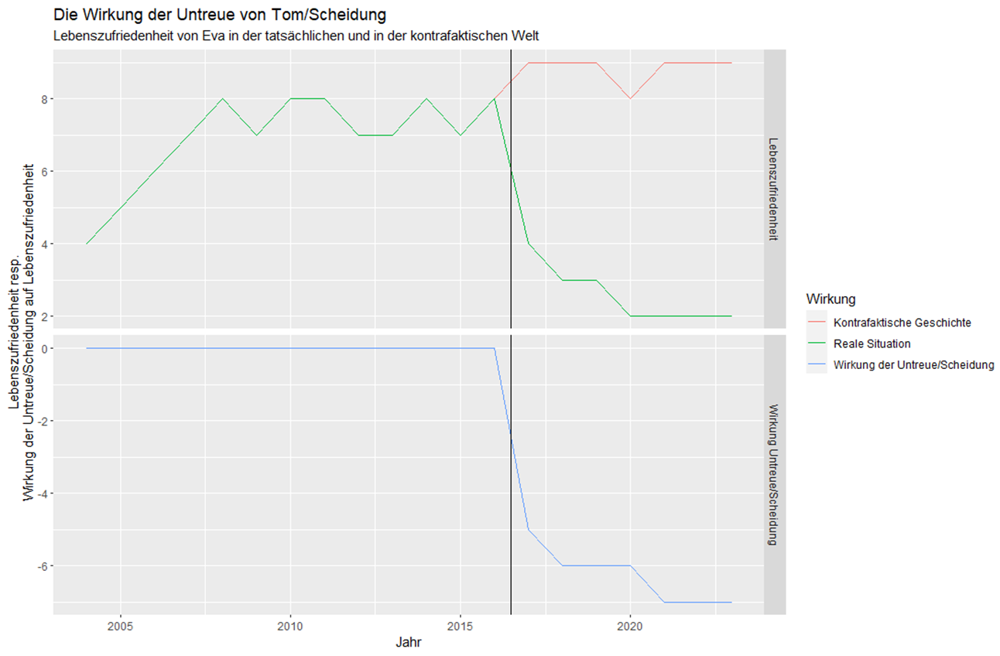

```{=html}
<style type="text/css">
h1 { font-size: 140%; }
h2 { font-size: 130%; }
h3 { font-size: 120%; }
</style>
```
```{r setup, include=FALSE}
knitr::opts_chunk$set(echo = TRUE)
knitr::opts_chunk$set(eval=FALSE)
```

To do:

-   Moodlekurs
-   Struktur inhalte
-   Datensätze beschreiben

# General information

-   Courses take place from 9.15-12 and from 13.15-16 and in in room 136 if not otherwise mentioned

-   [Carefully study the module description](https://moodle.bfh.ch/mod/resource/view.php?id=2165225)

-   [Here you find a list of class members and contact information and groups.](https://drive.switch.ch/index.php/s/nu6AXJAd6SQJo76)

# Introduction

## Learning Goals

-   People learn basic data science tools.
-   People learn how to integrate data science in social work problem solving.
-   People learn how to do data science with R.

## What is data science?

-   Term that emerged ca. 10 years ago. Predecessors: Statistics, Data analysis.

-   The science of creating valuable information from data

-   Practice-oriented science

-   Combines technical and field expertise

## How can data science benefit social work?

-   Use cases in social work

    -   [Identify demand for social work among potential clients](https://arbor.bfh.ch/19212/)

    -   [Measure and prove the effectiveness of social work](https://www.bing.com/ck/a?!&&p=87d6833ec738372fJmltdHM9MTcwMjUxMjAwMCZpZ3VpZD0xYWFkNTE1Yi1mY2I0LTY0MDUtMjllMC00MmJjZmRiZjY1MTYmaW5zaWQ9NTIyMA&ptn=3&ver=2&hsh=3&fclid=1aad515b-fcb4-6405-29e0-42bcfdbf6516&psq=Analyse+zu+den+Auswirkungen+der+Reduktion+der+Fallbelastung+in+der+Sozialberatung+der+Stadt+Winterthur&u=a1aHR0cHM6Ly9zdGFkdC53aW50ZXJ0aHVyLmNoL2dlbWVpbmRlL3ZlcndhbHR1bmcvc296aWFsZXMvc296aWFsZS1kaWVuc3RlL2JlcmljaHRlLXVuZC1zdHVkaWVuL2Jhc3NfcmVkdWt0aW9uX2ZhbGxsYXN0X3dpbnRlcnRodXJfc2NobHVzc2JlcmljaHRfMjAyMV8wNy5wZGYvZG93bmxvYWQ&ntb=1)

    -   [Find the most suited intervention for individual clients](https://www.sciencedirect.com/science/article/pii/S0927537105000564)

    -   [Increase transparency and political support for social work](https://www.knoten-maschen.ch/datenauswertungen-kinderleicht-gemacht/)

    -   [Improve efficiency of workflows with generative AI](https://www.der-paritaetische.de/fileadmin/user_upload/Schwerpunkte/Digitalisierung/doc/ki/KI_Textsammlung_final.pdf)

-   Discuss own examples (ca. 30 minutes)

## Why is data science more important in the future?

[](https://marketsplash.com/data-creation-statistics/)

-   [Data is the new oil](https://www.economist.com/leaders/2017/05/06/the-worlds-most-valuable-resource-is-no-longer-oil-but-data).

-   Data contains information on human behavior = **helps us better understand the human world and solve human problems.**

## Data sources

### Public statistics

-   [BFS - Überblick](https://www.bfs.admin.ch/bfs/de/home/statistiken.html)
-   [Stattab (personalisierte Tabellen)](https://www.pxweb.bfs.admin.ch/pxweb/de/)
-   [Vorhandene Tabellen](https://www.bfs.admin.ch/bfs/de/home/statistiken/kataloge-datenbanken/tabellen.html?dyn_prodima=901046&dyn_publishingyearend=2023)
-   [Kantonale Datenplattformen](https://data.bs.ch/explore/dataset/100226/table/?disjunctive.publikationsjahr&disjunctive.indikator_name&sort=indikator_label)

### Regular social surveys

-   [Swiss household panel](https://www.swissubase.ch/en/catalogue/studies/6097/18255/datasets/932/2358/files/document/19477/11791/physicalFile)
-   [Survey on health, aging and retirement](https://share-eric.eu/)
-   [Survey on income and living conditions](https://www.bfs.admin.ch/bfs/en/home/statistics/economic-social-situation-population/surveys/silc.html)
-   [Swiss Health Survey](https://www.bfs.admin.ch/bfs/de/home/statistiken/gesundheit/erhebungen/sgb.html)
-   [Swiss Mental Health Survey](https://www.obsan.admin.ch/de/publikationen/2023-psychische-gesundheit-erhebung-herbst-2022)
-   [European Social Survey](https://www.europeansocialsurvey.org/)
-   [World Values Survey](https://www.worldvaluessurvey.org/WVSContents.jsp)

### Found data

-   Data not explicitly generated for research
-   Always on
-   Numbers, text, images, audio, video
-   Data from
    -   Online activity (digital communication etc.)
    -   Smartphone usage (calling, filming, walking etc.)
    -   Administrative registries
    -   Payments
    -   Smart devices
    -   Video surveillance


-   Publicly owned individual data

-   Can be linked using social security numbers


## Excercise

-   Think of a social work field

-   What is the goal of social work in that field: What aspects of your clients lives do you want to improve?

-   What existing data could you use to measure these aspects of your clients’ lives? Who owns the data? What specific information would you use to measure this? What are technical and ethical limitations?

-   Post your answers on this [padlet](https://padlet.com/doriank1986/data-skills-2x8f5clm7anao11g)

## Kompetenznachweis

-   [You will analyze one of the following data sets](https://drive.switch.ch/index.php/s/BGjMhyiMXIvMwd4)

-   Structure

    -   Einleitung: Vorstellung der Fragestellung und ihrer Relevanz für die Soziale Arbeit

    -   Methodik: Dokumentation dessen, welche Daten verwendet und wie sie ausgewertet wurden

    -   Resultate: Präsentation der Resultate

    -   Schlussteil: Diskussion und Interpretation der Resultate mit Bezug zum Gegenstand und Auftrag der Sozialen Arbeit

-   Die Studierenden liefern zudem ein R-Code File mit, in welchem die Aufbereitungs- und Auswertungsschritte festgehalten sind. Das Code-File muss reproduzierbar sein und die verwendeten Resultate herstellen.

-   Der Kompetenznachweis (Dokumentation, R-Code) wird in Gruppen von 2-3 Personen verfasst, verfügt jedoch über individuell verantwortete Teile im Text oder im Codefile (z.B. im Text: Einleitung, Methodik, Resultate, Schlussteil; im Code: Aufbereitung und Auswertung). Die individuellen Beiträge sind am Ende der Dokumentation als solche auszuweisen (Angabe der Kapitel; für Code: Angabe der Zeilennummern).

# Introduction to R

[Power-Point-Slides](https://drive.switch.ch/index.php/s/11sUE7IQizlpCfj)

# Descriptive statistics

-   Study designs: descriptive, prediction, evaluation/causal design
    -   Descriptive: Monitoring, Probleme identifizieren, Überblick gewinnen, Entwicklungen beschreiben
    -   Prediction: (ungewünschtes) Vorhersagen
    -   Evaluation/Causal design: Wirkungen messen, Lösungen identifizieren
-   Distributional characteristics/univariate statistics: Frequencies, mean, median, modal value, variance, interquartile range, range of values.
-   Correlations/bi-/multivariate statistics: correlation measures, associations and group comparisons using regression or other statistical techniques.
    -   Einfach halten: Verweis auf Methodenberatungswebseite UZH
-   Uncertainty: statistical significance, p-value and confidence intervals.
    -   Einfach und kurz
-   Results communication: tables with quick_docx huxtable, ggplot2, (shiny; erwähnen)

# Measuring the effects of social work

## Why is it important to measure the effects of social work?

-   Improving practice with better knowledge

    -   Understanding whether and how social work interventions and offers reach their goals (evaluation)

    -   Knowing the most effective interventions and offers

    -   Knowing the most cost-effective interventions and offers

-   Legitimizing social work

    -   Gaining political support for social work (i.e. money!)
    -   Example:
        -   [Winterthur](https://www.buerobass.ch/fileadmin/Files/2021/2021_Reduktion_Falllast_Winterthur_Schlussbericht_DE.pdf)

## What is an effect and what not?

-   Effect = difference in the result with influencing variable versus without influencing variable (= **counterfactual** situation)

-   What is the counterfactual situation?

    -   The story of Tom and Eva

        -   "Eva was a saleswoman in a supermarket in Lucerne, who came from a poor family. She dropped out of school after the ninth grade to financially support her parents. In 2005, she met Tom, a mechanic from St. Gallen who worked in a workshop. They fell in love and got married in 2007. They had two children: a son named Max in 2008 and a daughter named Zoe in 2010.

            Eva and Tom had a loving marriage but also their problems. They had to deal with the low income, high rent, and high cost of living. They sometimes argued, but they always talked it out and found a solution. They valued each other and supported each other's wishes.

            However, in 2017, the relationship between Eva and Tom broke down. Eva discovered that Tom was having an affair with a customer he had met in his workshop. She was angry and hurt and confronted him about it. Tom admitted his infidelity and told her that he no longer loved her. He wanted a divorce and to move out.

            Eva was devastated and agreed to the divorce. They had to arrange custody for their children, who suffered from their parents' separation. They decided on joint custody, with the children alternating between living with each parent. They also had to divide the assets they had accumulated during their marriage. They sold their apartment in Lucerne and split the proceeds.

            Today, Eva and Tom are divorced and live separately. They have both continued their careers but with less success than before. Eva is still a saleswoman in a small supermarket but has no prospects for promotion or salary increase. Tom is still a mechanic in a small workshop but faces a lot of competition from younger colleagues. They earn less money than before and have trouble paying their bills. They also have less time for themselves and for their children, who are unhappy and insecure. Since 2020, Eva has been supported by social welfare."

    -   The counterfactual version

        -   "Eva was a saleswoman in a supermarket in Lucerne, who came from a poor family. She dropped out of school after the ninth grade to financially support her parents. In 2005, she met Tom, a mechanic from St. Gallen who worked in a workshop. They fell in love and got married in 2007. They had two children: a son named Max in 2008 and a daughter named Zoe in 2010.

            Eva and Tom had a loving marriage but also their problems. They had to deal with the low income, high rent, and high cost of living. They sometimes argued, but they always talked it out and found a solution. They valued each other and supported each other's wishes.

            In 2017, Eva found a job as a cashier in a larger supermarket, while Tom continued to work in the workshop. They earned more money and were able to buy their own apartment. They also had more time for themselves and for their children, who were happy and healthy. Today, Eva and Tom are still happily married and looking forward to the future. They plan to take a trip to Spain soon to enjoy the sun. They also hope to become grandparents one day, as their son Max has a lovely girlfriend whom he has been dating for six months. Their daughter Zoe is still at school, but she already has many talents and interests that she wants to pursue."

            

-   Example of measuring the effects of social work

    -   [](https://www.nber.org/papers/w30405)

-   A bad example of the effects of social work

    -   [Federal Council guidelines for the labor market integration of persons with protection status S for cantons: 40% should have a job until the end of 2024](https://www.blick.ch/politik/40-prozent-sollen-stelle-haben-der-bundesrat-will-dass-mehr-ukrainerinnen-arbeiten-id19105587.html)

## How can we measure the effects of social work with quantitative data?

### Asking experts

-   Do you think this course makes you a better social worker?

-   Advantages

    -   Easy to measure

    -   Subjective expertise on

-   Disadvantages

    -   We are unaware of the counterfactual: placebo

    -   Social desirability bias

### Assessing correlations

### Experiments - the gold standard

### Natural experiments

## Exercise in R

## Important references

-   [Wirkungsevaluationen in der Sozialen Arbeit : ein Orientierungsbuch für die Praxis](https://digitalcollection.zhaw.ch/handle/11475/29971)

-   [Experimental Research Designs in Social Work: Theory and Applications](https://www.jstor.org/stable/10.7312/thye20116)

-   [The Power of Experiments](https://mitpress.mit.edu/9780262542272/the-power-of-experiments/)

# Prediction in social work

Evtl. 1/2 Tag oder 3/4 Tag

-   Risk prediction in SW

-   Examples in practice

-   Black et al. - 2003 - Is the Threat of Reemployment Services More Effect.pdfBlack et al. - 2003 - Is the Threat of Reemployment Services More Effect.pdf

-   Gilholm et al. - 2023 - Machine learning to predict poor school performanc.pdf

-   Kleinberg et al. - 2018 - Human Decisions and Machine Predictions.pdfKleinberg et al. - 2018 - Human Decisions and Machine Predictions.pdf

-   Rittenhouse et al. - 2023 - Algorithms, Humans and Racial Disparities in Child.pdfRittenhouse et al. - 2023 - Algorithms, Humans and Racial Disparities in Child.pdf

-   Stevenson and Doleac - 2022 - Algorithmic Risk Assessment in the Hands of Humans.pdfStevenson and Doleac - 2022 - Algorithmic Risk Assessment in the Hands of Humans.pdf

-   Tennakoon et al. - 2023 - Using electronic health record data to predict fut.pdfTennakoon et al. - 2023 - Using electronic health record data to predict fut.pdf

-   Toros and Flaming - 2018 - Prioritizing Homeless Assistance Using Predictive .pdfToros and Flaming - 2018 - Prioritizing Homeless Assistance Using Predictive .pdf

-   OLS, (Machine Learning)

-   Organisation: Gruppenformierung

## Content

Content is structured to alternate between technical aspects (basics, hands-on exercises) and their relation to social work and practice.

#BFH Struktur

-   **Preparation (Samin erstellt Begrüssungsemail)**

    -   Begrüssungsnachricht: Download r/rstudio, videolink, aufgabe
    -   Some video, introduction course (Samin sucht video)
    -   Find examples of how data science can help social work: sie sollen ein Forumsbeitrag erstellen

-   **Introduction (Dorian/Samin, 21.5.)**

    -   What is data science and how can it help social work? What are the limits? (Slide 4 bis 7)
    -   Data that are relevant for social work
        -   Datafication:
            -   data collected for research/official statistics,
            -   found data (uebung: studierende sollen selber überlegen, wo found data entstehen)
            -   
    -   Crash course in R and R Studio: AI supported coding (ChatGPT-4 / Copilot), warum R, R as a calculator/objects/for loops (kurz), reading in data, überblick über datensatz (summary, nrow,...), dplyr, filter/select, mutate, rbind/merge, reshaping (?), umgang mit textdaten (?), saving

-   **Descriptive analyses (Samin, 27.5.)**

-   **Prediction of risks (Dorian, 28.5)**

-   **Evaluation/Causal design/Effects of social work (Dorian, 3.6.)**

    -   Evtl. 1/2 Tag oder 3/4 Tag
    -   Randomized control trials
    -   Natural experiments

-   **Case studies mit Coaching (Dorian, 4.6.)**

-   **Beispieldaten**

    -   Beispieldaten oben einbauen
    -   Richtungswechsel
    -   Swiss Household Panel (Samin lädt herunter)
    -   Data dashboard Wohlen; extension or data analysis of dependency duration (Dorian fragt nach; wir sagen nicht von welcher Gemeinde, Vertragliche Abmachung)
    -   Jugendarbeit Burgdorf (Dorian schreibt Mani)
    -   Fokus Arbeit (?): Wenn andere Daten nicht verfügbar sind
    -   ESS (Samin lädt herunter) ..Daten die relevant sind für die SA
    -   Open data/BFS/...Daten die relevant sind für die SA

-   Struktur KNW

    -   5000-7000 Zeichen
    -   Beschreibung Fragestellung, Daten, Code, Resultate (Tabellen/Grafik), Interpretation (Interpretation der Ergebnisse, Limitation der Daten/Analysen/Schlussfolgerungen)

-   Vorbereitung von Tutorials/Videos/Aufträge etc. im Falle von Krankheit...https://www.theanalysisfactor.com/resources/

#FHNW Struktur - **Introduction (Samin, 3.6.)** - Organisation: Gruppenformierung - What is data science and how can it help social work? What are the limits? (Slide 4 bis 7) - Data that are relevant for social work - Datafication:\
- data collected for research/official statistics, - found data (uebung: studierende sollen selber überlegen, wo found data entstehen) - excercise: measuring social work outcome dimensions with found data (give example) - risks? - Crash course in R and R Studio: AI supported coding (GPT-4/Bing, Copilot), warum R, R as a calculator/objects (kurz), reading in data, überblick über datensatz (summary, nrow,...), dplyr, filter/select, mutate, merging, reshaping, umgang mit textdaten, saving - **Descriptive analyses (Samin, 4.6.)** - Study designs: descriptive, prediction, evaluation/causal design - Descriptive: Monitoring, Probleme identifizieren, Überblick gewinnen, Entwicklungen beschreiben - Prediction: (ungewünschtes) Vorhersagen - Evaluation/Causal design: Wirkungen messen, Lösungen identifizieren - Distributional characteristics/univariate statistics: Frequencies, mean, median, modal value, variance, interquartile range, range of values. - Correlations/bi-/multivariate statistics: correlation measures, associations and group comparisons using regression or other statistical techniques. - Einfach halten: Verweis auf Methodenberatungswebseite UZH - Uncertainty: statistical significance, p-value and confidence intervals. - Einfach und kurz - Results communication: tables with quick_docx huxtable, ggplot2, (shiny; erwähnen) - **Prediction of risks, Evaluation/Causal design/Effects of social work (Dorian, 5.6)** - **Case study work with coaching (Dorian, 6.6)** - **Presentation**

### Technical Part

-   **Study Designs**
    -   Description, prediction, causal inference/evaluation design.
-   **Measurement Theory**
-   **Survey Data**
    -   (Note: This might not be necessary since it is covered in standard curricula.)
-   **Crash Course: Interface of R/Python**
    -   Basic functions, reading in and preparing administrative data, survey data, or data from organisations using R/Python.
    -   Doing simple calculations, creating descriptive tables and simple graphs.
-   **Descriptive Statistics:**
    -   Frequencies.
    -   Mean, median, modal value.
    -   Variance, interquartile range, range of values.
    -   Correlation measures.
    -   Associations and group comparisons using regression or other statistical techniques.
-   **Machine Learning Applications**

### Relation to Social Work (short inputs and discussions?)

-   **Why Should Social Workers Learn About Data Science?**

    -   Monitoring, evaluation, etc.

-   **What We Can Achieve with Quantitative Research in Social Work**

-   **Examples from Quantitative Research Projects in Social Work and Their Impacts**

-   **Practice Examples Using Data Science (from the podcast series Digital-HSA):**

    -   Machine Learning projects in social work?

-   **Potential and Limitations**

# **General Information about R**

-   R is free and open source.
-   R has excellent online documentation.
-   R has a very active user community (forums, blogs, etc.).
-   R is more than just statistical software.
-   R has interfaces to numerous other programs.
-   R is interdisciplinary.
-   R is gaining in importance and popularity! (see [Popularity Statistics](http://r4stats.com/articles/popularity/))
-   With RStudio, there is now a powerful tool for an easy and efficient workflow.

# Working Directory, Objects, and Workspace

-   **Working Directory**
    -   `getwd()`: Displays the working directory.
    -   `setwd()`: Defines a new working directory.
    -   `dir()`: Displays the contents of the current working directory.
    -   **Do not use `\` for path specifications, use `/` or `\\` instead.**
-   **Objects**
    -   "Naming guidelines": meaningful names; no spaces; start with a letter.
    -   `a <- 10` or `a = 10`: Creates or overwrites the object `a` with the content on the right (10).
    -   `a`: Displays the content of the object `a`.
    -   `rm()`: Deletes objects from the workspace.
    -   `save(a, b, file = "example.RData")`: Saves the specified objects (a, b) in the current working directory.
    -   `load("example.RData")`: Loads all objects saved in the specified file.
    -   `#`: Starts a commented line that is not interpreted.
-   **Workspace**
    -   Here are all the objects that have been worked with.
    -   If the workspace was saved when closing (R asks for it), it will be loaded again when R starts.
    -   `ls()`: Displays all objects in the current workspace.
    -   The workspace is saved in the current working directory by default.

## Beispiel: Arbeitsverzeichnis, Objekte und Workspace [↑](#top)

```{r}
# Kommentare beginnen mit #
# Alles in der Zeile nach # wird von R ignoriert

5+5

getwd() # Arbeitsverzeichnis anzeigen
setwd("C:/irgendein/pfad/") # Arbeitsverzeichnis definieren

dir() # Arbeitsverzeichnis anzeigen

a <- 50 # Erzeugt Objekt a (Zahlen-Vektor der Länge 1) mit dem einzelnen Wert 50
a

# Mit c() - concatenate lässt sich auch ein Zahlenvektor mit mehreren Elementen bauen:
b <- c(1, 2, 3, 4)

# oder kürzer
b <- seq(1,4)

# oder noch kürzer
b <- 1:4

# Objekt erzeugen, dass die Vornamen der Beatles enthält
die.beatles <- c("John","Paul","George","Ringo") 
die.beatles # im Vergleich zu a ist das Objekt nun ein String/Charakter


# Objektnamen dürfen keine Leerzeichen haben. Ferner empfiehlt es sich - und _ zu meiden (Google R Style Guide)
# Namen sollten aussagekräftig sein. Namensgebung sollte im ganzen Code-File konsistent sein (Punkte, Gross-/Kleinschreibung)

ls() # Workspace anzeigen
rm(die.beatles) # Objekt löschen


```

# Packages [↑](#top)

-   Viele Objekte (Funktionen, Datensätze, etc.) befinden sich in sogenannten Packages ([see here](http://cran.r-project.org/web/packages/available_packages_by_date.html))
-   Pakete werden von unzähligen freiwilligen Authoren geschrieben und gepflegt. Hierdurch sind auch zahlreiche methodische Nischen gut abgedeckt (v.a. im Vergleich zu anderen Statistiksoftwarepaketen)
-   Manche Pakete gehören zum Kernumfang von R und werden standardmässig beim Start von R geladen. Andere Pakete lassen sich auf Wunsch nachladen.
-   Warnhinweis: Objekte die in Paketen enthalten sind (z.B. Funktionen) können sich namentlich überschneiden ("function is masked")
-   Funktionen im Zusammenhang mit Paketen:
-   `library(packagename)`: installiertes Paket laden
-   `library()`: alle installierten Pakete anzeigen
-   `library(help=packagename)`: Einige Paketinformationen
-   `search()`: aktuell geladene Pakete anzeigen
-   `detach("package:packagename")`: Paket wieder "ausladen"
-   `ls("package:packagename")`: alle Objekte innerhalb einer Pakets zeigen
-   `packagename::bar`: ein einzelnes Objekt aus einem Paket laden statt das ganze Paket
-   `install.packages("packagename")`: Paket installieren
-   `remove.packages("packagename")`: Paket deinstallieren

## Beispiel: Packages und Hilfefunktion [↑](#top)

```{r}
# nehmen wir an wir möchten eine SPSS Datei einlesen:

??spss

# liefert Hinweise auf die Funktionen read.spss und read_por auf den Paketen foreign und haven 

install.packages("foreign") # Install package

?read.spss 
# geht erst wenn das Package auch geladen ist

library(foreign)
?read.spss

# Aber generelle Empfehlung: Google liefert mittlerweile i.d.R. bessere Resultate als die Hilfefunktion

```

# Arithmetische- und logische Operatoren [↑](#top)

-   Arithmetische Operatoren
    -   `+ - * / ^`
-   Vergleichsoperatoren (logische Operatoren)
    -   `& | == != > < >= <=`
-   Mathematische Funktionen (siehe jeweils die Hilfe `?function`)
    -   `exp(x)=e^x log(x) log10(x) sin(x) cos(x) tan(x)`
    -   `abs(x) sqrt(x) ceiling(x) floor(x) trunc(x) round(x, digits=n)`

## Beispiel: Rechnen und Vergleichen [↑](#top)

```{r}
# Rechnen
ergebnis <- (23+24)*11/(18+15)*5
ergebnis

# Funktionen
log(2) 
cos(2)

# Vergleich
x <- -3:3
x

# sind die Elemente von x gleich 0?
x == 0

# grösser 0?
x > 0

# kleiner 0?
x < 0

# grösser gleich 0?
x >= 0

# kleiner gleich 0?
x <= 0

# ungleich 0?
x != 0

# grösser als -1 aber kleiner als 1
x > -1 & x < 1

# grösser als  1 und kleiner als -1
x > 1 & x < -1

# grösser als 1 oder kleiner als -1
x > 1 | x < -1

```

## Übung: Rechnen und Vergleichen [↑](#top)

1.  Berechnen Sie folgende Terme in R
    1.  $((3 + 4 - 5) - 9)^{2}$
    2.  $log(1)$
2.  Prüfen Sie folgende Vergleiche:
    1.  $5 = 7$
    2.  $\sqrt{3} \neq cos(17)$

## Lösung: Rechnen und Vergleichen [↑](#top)

```{r echo=TRUE}
# 1.
((3+4-5)-9)^2
log(1)

# 2.
5==7
sqrt(3)!=cos(17)
```

# Klassen/Datentypen [↑](#top)

-   `class()`: Offenbart die Klasse eines Objekts
-   Homogen (siehe [Wickham](http://adv-r.had.co.nz/Data-structures.html))
    -   Vektoren: numerisch (Integer, Double), logisch (TRUE/FALSE), Character/String (Die Beatles)
    -   Matrix: zweidimensional
    -   Array: mehrere Matrizen
    -   Teilweise lassen sich Datentypen umwandeln, z.B. `as.numeric()` oder `as.character()`
-   Heterogen (kann unterschiedliche Klassen beherbergen)
    -   Liste, z.B. `list(1, "Hallo", TRUE)`
    -   Data frame: "Liste" von Vektoren gleicher Länge
-   Attribute, d.h. Metadaten
    -   Objekte können zusätzliche Attribute haben, z.b. Namen oder Wertelabels
    -   Faktoren
        -   Faktoren bilden kategoriale Daten ab. Diese sind als Zahlenwerte gespeichert aber mit einem Wertelabel verbunden

## Übersicht Datentypen [↑](#top)

```{r}
# Homogen

# Integer Vektor
x <- c(1, 2, 3)
class(x)
x

# Logischer Vektor
x <- -3:3
y <- x >= 0
y
class(y)


# String/Character Vektor
x <- c("a", "b", "c")
class(x)
x


# Matrix
matrix.2mal3 <- matrix(c(1,2,11,12,20,30), nrow = 2, ncol=3)
class(matrix.2mal3)
matrix.2mal3


# Heterogen

# Liste
liste <- list(a= c(4:8), b = c("a", "b", "c"), c = c(TRUE, FALSE))
class(liste)
liste


# Data frame: Kann man anschauen durch Aufruf von swiss
class(swiss)
swiss


# Faktoren
sex <- c(0,0,1,1)
factor(sex,labels=c("Mann","Frau"))

# Funktionen: z.B. cos(); mean()
class(mean)
mean

```

## Sonderwerte [↑](#top)

-   `Inf` und `-Inf`: Positiv und negativ unendlich
-   `NaN`: "*Not a number*", z.B. `0/0`
-   `NA`: fehlender Wert (Missing)

```{r}

# Wichtiger Hinweis zu fehlenden Werten:
x <- c(1,2,NA,4)

#falsch:
x == NA
x == "NA"

#richtig:
is.na(x)
```

## Zugriff auf unterschiedliche Datenbereiche [↑](#top)

```{r}

# Wie kann man direkt auf einzelne Elemente eines Vektors zugreifen?
x <- seq(2, 200, 2)
x
x[1]              # erstes Element von x
x[1:10]           # die ersten 10 Elemente von x

# für zweidimensionale Objekte können sowohl Zeilen als auch Spalten angesprochen werden:

swiss[1:2, c(3, 6)] # liest sich: "erste bis zweite Zeile, dritteund sechste Spalte"

# Eselsbrücke: Zeilen zuerst, Spalten später.


# Abgesehen von der Position, kann auch über den Namen einer Spalte (oder Zeile) referenziert werden:

swiss["Delemont", "Fertility"]

# oder nach einer Bedingung:

swiss[swiss$Catholic > 80, ]

```

### Übung: Vektoren [↑](#top)

1.  Lassen Sie sich aus dem Datensatz `swiss` die zehnte und zwölfte Zeile anzeigen.
2.  Lassen Sie sich die Spalten `Education` und `Catholic` für alle Gemeinden ausgeben die eine Kindersterblichkeit zwischen 20 und 22 haben.

### Lösung: Vektoren [↑](#top)

```{r echo=TRUE}
# 1.

swiss[c(10, 12), ]

# 2. 

swiss[swiss$Infant.Mortality > 20 & swiss$Infant.Mortality < 22, c("Education", "Catholic")]

```

## Faktoren und Listen [↑](#top)

-   Faktoren
    -   Class: `"factor"`
    -   `factor()`: Erzeugt einen Faktor
    -   sind ein Weg, kategoriale Daten (nominal/ordinal) sauber zu speichern
    -   sind Vektoren mit Attributen
    -   `levels()`: Zeigt die Kategorien eines Faktors
    -   `as.numeric()`: Zwingt den Faktor in einen numerischen Vektor
-   Listen
    -   Class: `"list"`
    -   `list()`: Erzeugt eine Liste
    -   Können beliebige Objekte/Objekttypen beinhalten
    -   `list$switzerland`: Greift auf das Element `switzerland` der Liste `list` zu
    -   `list[2]`: Zweites Element von `list`
    -   Listen werden häufig als Rückgabewert von Funktionen verwendet, z.B. als Behältnis für Schätzergebnisse
-   Im Laufe des Kurses werden noch weitere Objektklassen auftauchen

### Beispiel: Faktoren und Listen [↑](#top)

```{r}
# Faktor erzeugen

sex <- factor(c(rep(0,50),rep(1,50)),labels=c("Mann","Frau"))

# Hinweis zu as.numeric(): manchmal hat man folgendes Problem:
jahrgang <- factor(c("2000","2000","2001","2002")) # falscher Datentyp "character"
# umwandeln in numerische Werte liefert aber nicht, was wir wollen
as.numeric(jahrgang)

# besser:
as.numeric(as.character(jahrgang))

# Eine Liste erzeugen:
kursteilnehmer <- list(Kursleiter= "Rudi", 
                    Maenner = c("Simon", "Peter", "usw."),
                    Frauen = c("Daniela","Johanna"))
kursteilnehmer

# Zuriff auf Elemente der Liste
kursteilnehmer$Kursleiter
kursteilnehmer$Maenner
kursteilnehmer[2]
kursteilnehmer[[2]]
kursteilnehmer["Maenner"]
kursteilnehmer[["Maenner"]]

# was ist der Unterschied?
class(kursteilnehmer[["Maenner"]])
class(kursteilnehmer["Maenner"])
# d.h. wenn man mit den Elementen aus einem Listenelement arbeiten will, braucht es doppelte Klammern oder Zugriff über "$"

length(kursteilnehmer)
kursteilnehmer$Frauen[2]
kursteilnehmer[[3]][2]
```

### Übung: Faktoren und Listen [↑](#top)

1.  Erzeugen Sie einen Faktor `obst`, der vier Äpfel und drei Orangen enthält. Erzeugen Sie zudem einen Faktor `gemuese`, der einen Brokkoli und drei Tomaten enthält.
2.  Erzeugen Sie eine Liste `einkaufskorb`, die das Obst und Gemüse beherbergt.

### Lösung: Faktoren und Listen [↑](#top)

```{r echo=TRUE}

# 1.
obst <- factor(c(rep(0,4),rep(1,3)), labels=c("Apfel","Orange"))
gemuese <- factor(c(0,rep(1,3)), labels=c("Brokkoli","Tomate"))


# 2.
einkaufskorb <- list(obst,gemuese)
einkaufskorb

```

## Data Frames [↑](#top)

-   Data frames sind das typische Format für Datensätze
-   ...es handelt sich um eine Liste von Vektoren derselben Länge [siehe Wickham](http://adv-r.had.co.nz/Data-structures.html)
-   ...ähnelt Matrizen aber die Spalten können unterschiedliche Datentypen beinhalten
-   `data.frame()`: erzeugt einen data frame
-   `as.data.frame()`: konvertiert in einen data frame
-   `order()`: sortiert Daten
-   `summary()` und `str()`: Überblick über data frames
-   `head()` and `tail()`: erste/letzte Zeilen inspizieren
-   `names()`: zeigt Spaltennamen
-   `object$var1`: Greift direkt auf die Spalte `var1` im data frame `object` zu
-   `na.omit()`: Zeilenweise Ausschluss von fehlenden Werten, d.h. Zeilen die mindestens 1 Missing beinhalten

### Beispiel: Data Frames [↑](#top)

```{r}
# fertige Daten sind oft data frames:
titanic <- read.dta("http://www.stata-press.com/data/kkd/titanic2.dta")
is.data.frame(titanic)

# man kann sich auch leicht selber einen bauen
obst <- c("Apfel","Apfel","Birne")
gemuese <- c("Tomate","Karotte","Karotte")
id <- 1:3
df <- data.frame(id, obst, gemuese)
df

# Ansteuern von Zeilen und Spaltenpositionen
df$obst
df[,"obst"]
df[3,"gemuese"]
df[3,3]
```

# Kontrollstrukturen und Schleifen [↑](#top)

-   Schleifen sind in vielen Situationen hilfreich, sobald sich Arbeitsschritte mehrfach wiederholen
-   Oftmals gibt es performantere und elegantere Lösungen als Schleifen. Schleifen sich v.a. dann nötig, wenn Arbeitsschritte (teilweise) interdependent sind.
-   If-Argument
    -   `if (bedingung) {anweisung1} else {anweisung2}`
    -   If `argument1` gleich TRUE dann tue `anweisung1`, wenn nicht dann `anweisung2`
    -   auch möglich, v.a. für Wertzuweisungen: \`\`\`variable \<- ifelse(bedingung, wert1, wert2)
-   For-Schleifen
    -   `for(i in Sequenz){anweisungen}`
    -   `i` ist die Zählervariable/Platzhalter
    -   `Sequenz` ist ein Vektor von Werten (muss nicht zwingend ein Zahlenvektor sein)
    -   Die Schleife wird so oft ausgeführt wie der Vektor lang ist. Bei jedem Durchlauf ändert sich der Wert von `i`
-   While-Schleifen
    -   `while(bedingung==TRUE){anweisungen}`
    -   `anweisungen` werden wiederholt ausgeführt, bis die Bedingung FALSE wird, dann wird die Schleife verlassen

## Beispiel: Kontrollstrukturen und Schleifen [↑](#top)

```{r}
# If Argument
x <- -5
x
if(x <= 0) {
  y <- 1
} else {
  y <- 0
}
y

# Kombinierte Bedingungen
x <- 1
if(x == 0 | x == 1) { #oder
  y <- 1
} else {
  y <- 0
}
y


x <- 10
if(x<= -10 &  x>= 10) { #und
  y <- 1 } else {
  y <- 0
  }
y

# For Schleife
for (x in 1:10) print(sqrt(x)) 

# For Schleife
x <- 0
for(i in 1:10) {
  x <- x+i
  print(x)
  }
# x wird immer weiter inkrementiert


# Sequenzen können auch Character sein:
namen <- c("Alfred","Jakob","Peter")
for (name in namen) {
  print(paste("Hallo",name))
}


# While Schleife
x <- 0
while(x<13) {
  x <- x+1
  print(x)
  } # solange x<13=TRUE


# Durch Spalten loopen
for (column in 2:6) { # this loop runs through 2 to 6
        print(names(swiss)[column])
        print(mean(swiss[,column]))
}


#Durch Datensätze loopen
for (dataset in c(data1, data2, data3)) {
  # Anweisungen, 
  # z.B. Datenbereinigung, Appending (rbind), Modellschätzungen, etc.
}


# Aber Achtung: Die meisten Schleifen sind vermeidbar und es gibt effizientere Lösungen, z.B. FUnktionen aus dplyr, sapply()/lapply(), ave() Most loops are avoidable and there are more efficient ways to deal with your specific problem. E.g. with functions from dplyr, sapply(), ave() oder spezielle Funktionen, z.B. rowMeans(), colMeans(), colSums() etc. (z.B. für das Beispiel mit den Spalten aus swiss)

apply(swiss[,2:6],2,mean) 
# die 2 verweist auf "spaltenweise" (1 wäre zeilenweise). D.h. für jede Spalte der Daten wird mean() angewendet

# Überlegen Sie, ob eine Schleife wirklich nötig ist für ihr Problem (sehr komplizierte und interdependente Probleme z.B. können oft nicht vektorisiert werden und Schleifen sind dann ggf. unumgänglich). Fall Sie Schleifen verwenden: Ziehen Sie soviel Code wie möglich aus der Schleife raus (alles statische) um nicht unnötig Performance einzubüssen. Vermeiden Sie innerhalb der Schleifen komplexe Datentypen (data.frames) und Funktionen die damit zusammenhängen, z.B. cbind()/rbind(). Verwenden Sie besser Vektoren, Matrizen oder data.tables (kommt in den folgenden Kapiteln)


```

## Übung: Kontrollstrukturen und Schleifen [↑](#top)

1.  Schreiben Sie eine If-Bedingung die `y` entweder den Wert 10 oder den Wert 0 zuweise, je nachdem, ob `x` kleiner als -50 oder grösser als 50 ist. Testen Sie ihre Bedingung für ein paar selbstgewählte Werte von `x`.
2.  Schreiben Sie eine Schleife die 10 Durchläufe hat. In jedem Durchlauf sollen 100 standardnormalverteilte Zufallszahlen gezogen werden (`rnorm(100)`). Berechnen Sie innerhalb der Schleife Mittelwert und Standardabweichung dieser 100 Werte (`mean()/sd()`) und geben Sie diese aus (`print`).
3.  Schreiben Sie eine While-Schleife, die für ganze Zahlen \``x` (angefangen bei 1, 2, ...) jeweils `x^3` berechnet und das Ergebnis (und die Zahl `x` selbst) ausgibt. Die Schleife soll stoppen, sobald ein Ergebnis 1000 überschreitet.

## Lösung: Kontrollstrukturen und Schleifen [↑](#top)

```{r echo=TRUE}
# 1.
x <- 51
if(x <=- 50 | x>=50) {
  y <- 10 } else {
  y <- 0
  }
y

# 2. 
for (i in 1:10) {
  x <- rnorm(100)
  mittel <- mean(x)
  std <- sd(x)
  print(paste("Mittelwert:",mittel,"Standardabweichung:", std))
}

# 3.
ergebnis <- 1 
x <- 1
while(ergebnis <= 1000) {
  ergebnis <- x^3
  print(c(ergebnis,x))
  x = x+1
}

```

# Funktionen [↑](#top)

-   ...nehmen Input, geben Output
-   ...sind selbst Objekte
-   ...verstecken sich auch hinter speziellen Operatoren (z.B. `+`, `-` oder `%in%`)
-   `meinefunktion <- funktion(argumente) { aktionen }`: Definiert eine Funktion
-   Wird die Funktion als Objekt aufgerufen, wird über `print()` der Inhalt der Funktion ausgeworfen
-   Es gibt in R auch zahlreiche generische Funktionen, deren Verhalten sich durch den Typ des Inputs ändert, z.B. `print()`, `plot()` oder `summary()`)

## Beispiel: Funktionen [↑](#top)

```{r}
print("Hallo")
print

lm

# Beispiel: Definieren einer Funktion
wurzel <- function(x) {
  x^0.5
}


wurzel(4)

# Namen eingeben um Inhalt zu sehen
wurzel

```

## Übung: Funktionen [↑](#top)

1.  Schreiben Sie eine Funktion, die Input gemäss folgender Formel verarbeitet: $(x + 2)^{2}$ und wenden Sie diese Funktion auf einen Vektor von Zahlen (1 bis 10) an.
2.  Schreiben Sie eine Funktion mit zwei Inputvariablen `x` und `w`, die einen gewichteten Mittelwert berechnet (`x` gewichtet mit `w`) und zurückgibt: $\frac{\sum_{i=1}^{N}w_{i}x_{i}}{\sum_{i=1}^{N}w_{i}}$. Testen Sie ihre Funktion mit `x <- 1:5` und `w <-  c(2,4,5,6,7)`.

## Lösung: Funktionen [↑](#top)

```{r echo=TRUE}
# 1.
plus2hoch2 <- function(x) {
  (x+2)^2
}

plus2hoch2(1:10)

# 2. 
w <- c(2,4,5,6,7)
x <- 1:5
gew.mittelwert <- function(x,w) sum(w*x)/sum(w)
gew.mittelwert(x,w)
```

# Kontingenztabellen und einfache Tests [↑](#top)

-   Univariate Statistiken (1 Variable)
    -   `mean(x)`: Mean
    -   `sd(x)`: Standardabweichung
    -   `var(x)`: Varianz
    -   `median(x)`: Median
    -   `min(x)`: Minimum
    -   `max(x)`: Maximum
-   Bivariate Statistik (2 Variablen)
    -   `cov()`: Kovarianz
    -   `cor()`: Korrelation
    -   `cor(x,y,method="spearman")`: Rangkorrelation
    -   `?cor`: mehr Infos im Helpfile
    -   `chisq.test()`: Chi-Quadrat-Test
    -   `t.test()`: t-Test
-   Kontingenz Tabellen
    -   `table(x)`: eindimensionale Kontingenztabelle
    -   `table(x,y)`: zweidimensionale Kontingenztabelle
    -   `prop.table(table(x))`: relative Häufigkeit

## Beispiel: Kontingenztabellen und einfache Tests [↑](#top)

```{r}
# zwei fiktive Vektoren erstellen
x <- c(10,20,30,40,30,10,20,30,40,30,10,20,10)
y <- c(2,5,3,5,3,5,1,6,3,4,5,1,1)

# Tabelle
table(x)
table(x,y)

# Chi2-Test
chisq.test(table(x,y))

# Tabelle in Prozent
100*prop.table(table(x))
100*prop.table(table(x,y))
round(100*prop.table(table(x,y)), 2) # gerundete Werte

# Mean
mean(x)

# Median
median(x) 
sort(x)

# mehrere Statistiken in einem Vektor
c(mean=mean(x), median=median(x), stddev=sd(x), min=min(x), max=max(x))

# gibt es verkürzt über die generische Funktion summary
summary(x)

# Korrelation zwischen Vektoren
cor(x,y)
cor(x,y, method="spearman") #Rangkorrelation
cov(x,y)

# Mittelwertvergleich
t.test(x,y)
```

## Übung: Kontingenztabellen und einfache Tests [↑](#top)

1.  Laden (ggf. vorher installieren) Sie das Paket `foreign`. Laden Sie die Daten über den Untergang der Titanic mit folgendem Befehl: `titanic <- read.dta("http://www.stata-press.com/data/kkd/titanic2.dta")` und machen Sie sich ein bisschen mit den Daten vertraut (z.B. `head()` oder `summary()`).
2.  Erzeugen Sie eine Kreuztabelle mit den Variablen `class` und `survived`.
3.  Berechnen Sie Median und Mittelwert des Alters für Überlebte und Gestorbene. Unterscheiden sich die beiden Gruppen signifikant voneinander?

## Lösung: Kontingenztabellen und einfache Tests [↑](#top)

```{r echo=TRUE}
### 1.
library(foreign)
titanic <- read.dta("http://www.stata-press.com/data/kkd/titanic2.dta")
head(titanic)
summary(titanic)

### 2. 
# survived aus Konvention auf die Y-Achse, class auf die X-Achse (Y ist die abhängige, X die erklärende Variable)
table(titanic$survived,titanic$class) # Faktor crew ist hier nicht sauber gelabelt

### 3.
mean(titanic$age2[titanic$survived=="yes"])
mean(titanic$age2[titanic$survived=="no"])
t.test(titanic$age2[titanic$survived=="yes"],titanic$age2[titanic$survived=="no"])
# ja, die 5 Jahre differenz sind überzufällig, es gibt einen Zusammenhang zwischen Alter und Überleben

```

# **Datenmanagement** [↑](#top)

## *Tidy vs. Messy Data* [↑](#top)

### Generelles

-   Hadley Wickham hat versucht, einige Konventionen zur sauberen Darstellung/Ablage von Daten aufzuschreiben
-   siehe <http://vita.had.co.nz/papers/tidy-data.pdf> und <http://tidyverse.org/>
-   Quintesenzen:
    -   sobald Daten einmal sauber (tidy) sind, können Analysetools (Plotting, Modellfitting) auch sauber und ohne Zusatzaufwand arbeiten (z.B. ggplot2, lm/glm)
    -   **Fälle (Beobachtungseinheiten) in Zeilen, Variablen (Beobachtungsdimensionen) in Spalten**
-   Daten sind Messy, wenn
    -   Spalten nicht beschriftet sind
    -   Eine Spalte mehr als eine Variable beinhaltet
    -   Variablen statt in Spalten auch in Zeilen auftauchen
    -   unterschiedliche Beobachtungseinheiten in derselben Tabelle sind
-   Tools um Daten zu säubern (kleine Auswahl):
    -   `dplyr` / `data.table`
    -   `melt() dcast()` aus `reshape2`
    -   `str_replace()`, `str_sub()` aus dem Package `stringr`
    -   `tolower()`
    -   einige weitere in Paket `tidyr`
    -   auch nützlich: `recode()` von John Fox (Package `car`)

### Beispiel: Tidy vs Messy Data [↑](#top)

```{r,eval=FALSE}
# Wetterdaten
weather <- read.table("https://raw.githubusercontent.com/justmarkham/tidy-data/master/data/weather.txt", header=TRUE)
head(weather) # hier sind Variablen in Zeilen und Spalten

# Daten reshapen (melt) und Missings löschen
library(reshape2) # für melt()/dcast()
weather1 <- melt(weather, id=c("id", "year", "month", "element"), na.rm=TRUE)
head(weather1)

# saubere Spalte für "day"
library(stringr)    # für str_replace(), str_sub()
weather1$day <- as.integer(str_replace(weather1$variable, "d", ""))

# die krude Spalte "variable" brauchen wir nicht
weather1$variable <- NULL

# die Spalte element beherbergt zwei unterschiedliche Variablen tmin und tmax. 
# Diese sollen in zwei Spalten:
weather1$element <- tolower(weather1$element) # Kleinbuchstaben
weather.tidy <- dcast(weather1, ... ~ element) # reshapen auf zwei Spalten
head(weather.tidy)

# das Datum laesst sich zudem in einer Spalte darstellen als echtes Datum:
weather.tidy$date <- as.Date(paste(weather.tidy$year, 
                                   weather.tidy$month, 
                                   weather.tidy$day, sep="-"))
weather.tidy[, c("year", "month", "day")] <- NULL
head(weather.tidy)
```

## *Package dplyr* [↑](#top)

### Generelles

-   Relativ neues Package [dplyr](http://blog.rstudio.org/2014/01/17/introducing-dplyr/) von [Hadley Wickham](https://twitter.com/hadleywickham)/[Romain Francois](https://twitter.com/romain_francois) bietet ein Toolset zur Datenaufbereitung
-   Siehe [die dplyr Vignette](http://cran.rstudio.com/web/packages/dplyr/vignettes/introduction.html) und das [Data Wrangling Cheat Sheet](http://www.rstudio.com/resources/cheatsheets/) für einen sehr guten Überblick
    -   `filter()`: wählt ein Subset von Zeilen (siehe auch `slice()`)
    -   `arrange()`: sortiert
    -   `select()`: wählt Spalten
    -   `mutate()`: erzeugt neue Spalten
    -   `summarise()`: aggregiert (collapses) Daten zu einzelnen Datenpunkten
    -   `distinct()`: entfernt doppelte Werte
    -   `group_by()`: Definiert Untergruppen in den Daten, damit `mutate()` und `summarise()` separat pro Gruppe angewandt werden können.
    -   dplyr kann sehr gut zusammen mit sogenanntem Piping verwendet werden, d.h. das Datenobjekt wird von Funktion zu Funktion weitergereicht durch `%>%` wodurch der Code deutlich besser lesbar und kompakter wird.

### Beispiel: Package dplyr [↑](#top)

```{r,eval=FALSE}
titanic <- read.dta("http://www.stata-press.com/data/kkd/titanic2.dta")

# install.packages("dplyr")
library(dplyr)

filter(titanic, class == "1st class", age2 < 18)

# konventionell wäre das komplizierter:
titanic[titanic$class == "1st class" & titanic$age2 < 18, ]

# zusätzlich Spalten selektieren:
titanic %>%
  filter(class == "1st class", age2 < 18) %>%
  select(sex, age2, survived)

# neue Variable "child" bauen
titanic %>%
  mutate(child = age2 < 18) %>%
  head()

# Auszählen wer gestorben ist nach Geschlecht und Kind (ja/nein)
titanic %>%
  mutate(child = ifelse(age2 < 18, "yes", "no")) %>%
  group_by(sex, child, survived) %>%
  summarise(n=n()) %>%
  arrange(sex, child, survived)

```

### Übung: Package dplyr [↑](#top)

1.  Laden Sie die Daten <http://www.farys.org/daten/allbus2008.dta> (hierfür brauchen Sie die Funktion `read.dta()` aus dem Package `foreign`).
2.  Wir brauchen nur die Variablen v151 (Geschlecht), v154 (Alter) und v386 (Einkommen). Legen Sie einen verkleinerten Datensatz an, der nur diese drei Variablen beinhaltet (und ordentliche Spaltennamen hat).
3.  Die Daten enthalten falsche Werte, die eigentlich als fehlende Werte deklariert sein müssten (z.B. 99997, 99998 und 99999 beim Einkommen und 999 beim Alter). Filtern Sie diese Werte weg (`filter()`).
4.  Berechnen Sie mit summarise() das Durchschnittseinkommen für jede Kombination aus Alter und Geschlecht (`group_by()`, `summarise()`, `mean()`).

### Lösung: Package dplyr [↑](#top)

```{r echo=FALSE}
library(foreign)
library(dplyr)
# Daten laden
allbus <- read.dta("http://www.farys.org/daten/allbus2008.dta")

allbus.agg <- allbus %>%
  select(geschlecht = v151, # die drei Variablen wählen und direkt umbenennen
         alter = v154,
         einkommen = v386) %>%
  filter(einkommen < 99997, alter < 999) %>% # fehlende Werte droppen
  group_by(geschlecht, alter) %>% # gruppieren
  summarise(m_einkommen = mean(einkommen)) # aggregieren

# Zusatz: Das ganze könnte man jetzt grafisch anschauen (müsste man ggf. etwas gröber gruppieren)
library(ggplot2)  
ggplot(allbus.agg, aes(x=alter,y=m_einkommen,color=geschlecht)) +
  geom_line()

```

## *Package data.table* [↑](#top)

### Generelles

-   Versucht dasselbe wie `dplyr`, ist aber stärker auf [Performance und Funktionalität](https://github.com/Rdatatable/data.table/wiki) ausgerichtet während `dplyr` mehr die Lesbarkeit des Codes für den Menschen im Fokus hat
-   `data.table` bringt einen eigenen Objekttyp `data.table` mit, der mit allen `data.frame` Operationen abwärtskompatibel ist aber wesentliche Neuerungen beinhaltet:
-   Performance (schnellstes Paket für Datenoperationen, z.B. Sortieren, Matchen, Mergen, Gruppieren, Reshapen (dcast und melt ohne dass reshape2 geladen werden muss), Umbenennen von Spalten, Doubletten droppen, u.a.)
-   Memory efficient (beim Umbenennen/Umsortieren von Spalten oder Zeilen werden intern keine Kopien der Daten angelegt, die Daten sind lediglich "changed by reference")
-   Generelle Form: `DT[i,j,by]`: "Nimm das `DT` an Zeilen `i` und berechne `j`, gruppiert nach `by`"
-   Kennt einige Konzepte zur eleganten Datenaufbereitung, etwa
    -   `.N`: Anzahl Zeilen im Subset,
    -   `.BY`: Platzhalter für den aktuellen Wert der Gruppierungsvariable vom Typ `list`. z.b. Nützlich, wenn man bei nach numerischen Werten gruppierten Variablenberechnungen auf den Gruppenwert zurückgreifen will. Oder wenn man bei nach kategorisch gruppierten Berechnungen auf den Namen zugreifen will (z.b. um zu [ploten](https://stackoverflow.com/questions/22511301/how-to-benefit-from-by-in-data-table?rq=1)),
    -   `.SD`: Enthält die Daten des Subsets das gerade verarbeitet wird (alle Spalten ausser `by`). Mit `.SDcols` spezifizieren sie, welche Spalten zu `.SD` gehören sollen. Nützlich bei der [Anwendung einer Funktion](http://stackoverflow.com/questions/16846380/how-to-apply-same-function-to-every-specified-column-in-a-data-table) auf mehrere, aber nicht alle Spalten eines `DT`.
    -   `.I`: Index eines Falls innerhalb des Subsets,
    -   `.GRP`: Group-Counter
-   Sehr sehr mächtig, aber Syntax ist etwas schwerer zugänglich und braucht mehr Eingewöhnung.
-   Beim Arbeiten mit grossen Datensätzen unerlässlich!

### Beispiel: Package data.table [↑](#top)

```{r, eval=FALSE, echo=TRUE}

library(dplyr)
library(foreign)
titanic <- read.dta("http://www.stata-press.com/data/kkd/titanic2.dta")


library(data.table)
titanic <- as.data.table(titanic) # als data.table definieren
titanic  # man beachte die andere Darstellung. data.table erlaubt
# sicherheitshalber niemals alle Zeilen auf den Workspace zu knallen


#Beispiel Variablen generieren: Geschwindigkeitsvorteile
# := um Variablen zu kreieren; mehrere Variablen aufeinmal: ":="(name=) anstatt name:=
titanic[, ":="(child = ifelse(age2 < 18, "yes", "no")), ][ # chaining: Äquivalent zum piping
                 ,child.died :=ifelse(child == "yes" &
                                            survived == "no",
                                          "yes", "no")]

titanic[, c("child","child.died") := NULL] # um Spalten zu droppen

# Performancevergleich mit dplyr: neue Variable "child" definieren
a<-Sys.time()
titanica <- titanic%>%
  mutate(child=ifelse(age2<18,"yes","no"))
b<-Sys.time()

c <- Sys.time()
titanic[,child:=ifelse(age2<18,"yes","no")]
d <- Sys.time()

b-a#dplyr
d-c#data.table

# Update by reference: nur an bestimmten Zeilen eine Anpassung
titanic[age2<18,child:="Kind"]

# Alternative zu filter()
titanic[class=="1st class" & age2 < 18]

# Alternative zum Filtern+Selektieren
titanic[class=="1st class" & age2 < 18,
        .(age2,sex,survived)]#'.()' ist kurz für 'list()'

# Alternative zu gruppenspezifischen Variablenberechnung. 
# Z.b.: mittleres Alter nach Überlebensstatus:
titanic[,.("Mittelwert Alter"=mean(age2)),survived]#Wenn nur eine Gruppierungsvariable verwendet wird, braucht es keinen ".(survived)".
           
# Alternative zu Aggregation
#Für Spaltenaggregation, einfach '.()' anstatt ":="
titanic[, .(Gruppengrösse = .N), .(sex, child, survived)]
titanic[, .N, .(sex, child, survived)]

# Anwendung eigener Funktion auf eine Auswahl von Spalten####
# äquivalent zu mutate_at in dplyr
# Z.b. Modusfunktion
Mode <- function(x) {
  val<-max(table(x))
  names(table(x))[table(x)==val]
}

#.SDcols wird als viertes Argument spezifiziert: definiert die zu bearbeitenden Spalten
vars <- c("survived","sex")
titanic[,lapply(.SD, Mode),,.SDcols=vars]

#Wenn man das Resultat in einer Variable behalten möchte: '(namensvektor):=' davor
varsnew <- paste0(vars,".Modus")
titanic[,(varsnew):=lapply(.SD, Mode),,.SDcols=vars]

#Wichtige Tipps und Kniffs--------######

# Vorsicht beim Selektieren######
titanic[,c("sex","class")]#data.table versteht c("name") als Liste
a<-c("sex","class")
titanic[,a] # Charaktervektoren können jedoch nicht als Objekte übergeben werden: 
# data.table sucht immer nach Namen innerhalb des data.table, wenn es sie nicht findet

titanic[,..a] # Wenn Sie '..' vor einen Charactervector setzen funktioniert es.
titanic[,a,with=F] # Besser with=F (nicht within evaluieren). 

# Dies ist nützlich, wenn sie nach Variablen mit bestimmtem Mustern suchen
# (z.b. mit grepl("s",names(titanic))). So versteht data.table auch logische
# Vektoren (oder Spaltennummern) als Selektionskriterien

titanic[,grepl("s",names(titanic)),with=F]

# Vorsicht beim Kopieren von Objekten#####
#Wenn man einen data.table kopiert, copy() verwenden, sonst werden neue Variablen auf das ursprüngliche Objekt geschrieben

titanic.copy <- copy(titanic)

#Beispiel für .I#####
a <- data.table(a = c(0,2,3,1,6,7,8))
a[, b := a[.I+1]]#Alternative zu lead() in dplyr
a[, c := c(NA, a[.I-1])]#Alternative zu lag() in dplyr

#neu auch
a[, b := shift(a, n = 1, type = "lag")]
a[, c := shift(a, n = 1, type = "lead")]
```

### Übung: Package data.table [↑](#top)

1.  Laden Sie die Daten des European Social Survey (Auszug) mit `load(url("http://www.farys.org/daten/ESS.RDATA"))`.
2.  Welches Land hat am meisten Befragte (Tipp: verwenden Sie `.N` und chainen sie die Bedingung `[N==max(N)]` um die Anzahl und den Namen des Landes auszugeben))?
3.  Welches ist das durchschnittlich glücklichste Land? Welches das unglücklichste?
4.  In welchem Land gibt es anteilsmässig am meisten "komplett glückliche Menschen" (d.h. der Anteil der Personen mit angegebener Zufriedenheitswert = 10 ist maximal; Tipp: berechnen Sie den mittleren Anteil pro Land und werfen sie den höcsten Wert aus)?
5.  Welches Land hatte von 2008 bis 2010 den grössten Rückgang im Durchschnittsglück (Tipp: über die eckigen Klammern können sie innerhalb des bearbeiteten Subsets Fälle auswählen, z.b. `mean(happy[year==2008],na.rm=T)`)?
6.  Berechnen sie gleichzeitig den Modus bezüglich Glücklichkeit und Support für Umverteilung pro Land (Variable `gincdiff` 1=agree strongly,5=disagree strongly). Tipp: verwenden Sie dabei die Modusfunktion aus dem Beispiel oben.

### Lösung: Package data.table [↑](#top)

```{r, eval=FALSE, echo=TRUE}
library(data.table)
library(dplyr)
library(ggplot2)
load(url("http://www.farys.org/daten/ESS.RDATA"))
#gincdif: The government should take measures to reduce differences in income levels. 1=agree strongly,5=disagree strongly
#happy: Taking all things together, how happy would you say you are? #10 extremely happy 1 =Extremely unhappy
#uempla: Unemployed, actively seeking

#um Gruppenzähler kennenzulernen
#__________________________________

#2. Welches Land hat am meisten Befragte?#######
ess[,.N,Land][N==max(N)]

#dplyr
ess%>%
  group_by(Land)%>%
  count()%>%
  arrange(-n)

#Base
a<-table(ess$Land)
names(a)[a==max(a)] 
#Um Aggregatsfunktion kennenzulernen
#__________________________________

#3. Welches ist das durchschnittlich glücklichste Land? Welches das unglücklichste?#######
ess[,.(m.happy=mean(happy,na.rm=T)),Land][m.happy==max(m.happy)|m.happy==min(m.happy)]

#Alternativ: ohne order
hap <- ess[,.(m.happy=mean(happy,na.rm=TRUE)),Land]
setorder(hap,m.happy)
hap

#dplyr

ess%>%
  group_by(Land)%>%
  summarise(m.happy=mean(happy,na.rm=T))%>%
  arrange(-m.happy)


#Base R
ess<-ess[!is.na(ess$happy)&!is.na(ess$Land),]
agghapp <- aggregate(ess$happy,list(ess$Land),FUN=mean)
agghapp[order(agghapp$x),] 

#um Variablengenerator kennenzulernen (:=)
#__________________________________

#4. In welchem Land gibt es am meisten komplett glückliche Menschen?#######
ess[,":="(komplett=ifelse(happy==10,1,0))][
  ,.(`Anteil komplett glücklich`=mean(komplett,na.rm = T)),by=Land][order(`Anteil komplett glücklich`)]


#dplyr
ess%>%
  mutate(komplett=happy==10)%>%
  group_by(Land)%>%
  summarise(`Anteil komplett glücklich`=mean(komplett,na.rm=T))%>%
  arrange(-`Anteil komplett glücklich`)

#base R

ess$komplett <- ifelse(ess$happy==10,1,0)
ess <- ess[!is.na(ess$komplett),]
agghapp <- aggregate(ess$komplett,list(ess$Land),FUN=mean)
agghapp[order(agghapp$x),]

#Um die Verwendung von Subsetberechnungen kennenzulernen
#__________________________________

#5. Welches Land hat die grösste Einbusse im Durchschnittsglück gehabt#######
#von 2008 bis 2010?
ess[,.(
  Dif=mean(happy[year==2010],na.rm=T)-
    mean(happy[year==2008],na.rm=T)),
  by=Land][
    order(Dif)][!is.na(Dif)]

##alternativ: m.happy-m.happy[-.N] (eine Zeile vorher)
#bei sample mit nur 2008 und 2010 (geordnet)

#dplyr
rank<-ess%>%
  group_by(Land)%>%
  summarise(Dif=mean(happy[year==2010],na.rm=T)-
              mean(happy[year==2008],na.rm=T))%>%
  arrange(Dif)%>%
  filter(!is.na(Dif))

#Base R
zwei8 <- ess[ess$year==2008&!is.na(ess$happy),]
zwei10 <- ess[ess$year==2010&!is.na(ess$happy),]

agg8<-aggregate(zwei8$happy,list(zwei8$Land),FUN=mean)
names(agg8)<-c("Land","Happy.08")
agg10<-aggregate(zwei10$happy,list(zwei10$Land),FUN=mean)
names(agg10)<-c("Land","Happy.10")

ess.08.10 <- merge(agg8,agg10,by="Land",all.x = F) 
ess.08.10$dif <- ess.08.10$Happy.10-ess.08.10$Happy.08
ess.08.10[order(ess.08.10$dif),c("Land","dif")]


library(ggplot2)
ggplot(rank,aes(reorder(Land, Dif),Dif))+#einfache Art Faktoren nach Grösse einer anderen Dimension zu sortieren
  geom_bar(stat = "identity")+
  theme(axis.text.x = element_text(angle = 90, hjust = 1))+
  labs(x="",y="Glücklichkeitsveränderung 2010-2008")


# 6. Berechnen sie gleichzeitig den Modus bezüglich Glücklichkeit und Support für Umverteilung#####
# Um Funktion kennenzulernen, mit der man mehrere Variablen gleichzeitig modifiziert:
Mode <- function(x) {
  names(which.max(table(x)))
}

ess[,lapply(.SD, Mode),Land, .SDcols=c("happy","gincdif")]

#dplyr
ess %>%
  group_by(Land)%>%
  summarise_at(.vars = vars(happy, gincdif),
            .funs = Mode)

#Base R
aggregate(cbind(happy, gincdif)~Land,FUN = Mode,data = ess)


```

## *Vergleich Base-R, dplyr und data.table* [↑](#top)

```{r, eval=FALSE}
# Beispiel data.frame:
data <- data.frame(A=1:10, B=2:11, C=3:12, D=c("a","b"))

# Beispiel data.table:
library(data.table)
data <- data.table(A=1:10, B=2:11, C=3:12, D=c("a","b"))
```

|                                                                          | Base-R                                                                                                                                                          | dplyr                                                                                                                                                                                              | data.table                                                                                                                     |
|------------------|------------------|------------------|-------------------|
| Auswahl von Zeilen nach Kriterium `B==2`                                 | `data <- data[data$B==2, ]`                                                                                                                                     | `data <- filter(data, B==2)` oder<br /> `data <- data %>% filter(B==2)`                                                                                                                            | `data <- data[B==2]` oder<br /> `data <- data[B==2, ]`                                                                         |
| Auswahl von Spalten B und C                                              | `data <-   data[c("B", "C")]` oder<br /> `data <- data[, 2:3]` oder<br /> `data <- data[, c("B", "C")]` oder<br /> `vars <- c("B", "C")` `data <- data[, vars]` | `data <- select(data, B,   C)` oder<br /> `data <- data %>% select(B,C)`                                                                                                                           | `data <- data[, .(B, C)]` oder<br /> `data <- data[, c("B", "C")]` oder<br /> `vars <- c("B", "C")     data <- data[, ..vars]` |
| Erstellen neuer Variablen E (A/B)                                        | `data$E <- data$A/data$B`                                                                                                                                       | `data$E <- mutate(data, A/B)` oder<br /> `data <- data %>% mutate(E = A/B)`                                                                                                                        | `data[,E := A/B]` oder<br /> `data[, E:=A/B, ]` oder<br /> `data[, ":="(E=A/B)]`                                               |
| Erstellen neuer, gruppierter Variablen E (Mittelwert A gruppiert nach D) | `data$E <- ave(data$A,data$D,FUN=mean)`                                                                                                                         | `data <- group_by(data,D)` <br /> `data <- mutate(data,E = mean(A))` oder<br /> `data <- data %>%` <br />   `group_by(D) %>%` <br />  `mutate(E = mean(A))`                                        | `data[,E := mean(A),D]` oder<br /> `data[,E := mean(A),by=D]` oder<br /> `data[, ":="(E=mean(A)),by=D]`                        |
| Aggregieren Mittelwert von A und B                                       | `sapply(data[c("A", "B")], mean)`                                                                                                                               | `data %>%`<br />  `summarise_at(vars=vars(A, B), .funs = mean)`                                                                                                                                    | `data[, .(meanB = mean(B),   meanA = mean(A))]` oder<br /> `data[, lapply(.SD, mean), , .SDcols = c("A", "B")]`                |
| Nach B gruppiert Aggregieren durch Mittelwert von A und C                | `aggregate(data$A,data$B,mean)` `aggregate(data$C,data$B, mean)`                                                                                                | `data <- group_by(data,B)` <br /> `data <- summarise_at(data,vars = vars(A,C), .funs = mean)` oder<br /> `data %>%`<br />  `group_by(B) %>%`<br />  `summarise_at(vars = vars(A,C), .funs = mean)` | `data[, .(meanC = mean(C),   meanD=mean(A)), B]` oder<br /> `data[, lapply(.SD, mean),B, .SDcols=c("C", "A")]`                 |

<hr />

## *Reshapen von Daten*

### Generelles

-   Braucht man häufig wenn wiederholte Messungen vorhanden sind (siehe Beispiel messy data)
-   Long: Werte sind untereinander aufgeführt
-   Wide: Werte sind nebeneinander aufgeführt
-   Long zu wide: dcast
-   Wide zu long: melt

### Beispiel: Daten reshapen [↑](#top)

```{r,echo=TRUE,eval=FALSE}
library(reshape2)
long.Daten <- data.frame(Person=rep(1:5,each=3),
                         Jahr=2016:2018,
                         Einkommen=sample(10000:20000,15))
 
wide.Daten<-dcast(long.Daten,Person~Jahr)
 
long.Daten <- melt(wide.Daten,
                   id.vars = "Person",
                   variable.name="Jahr",
                   value.name = "Einkommen")
```

### Übung: Daten reshapen [↑](#top)

1.  Laden Sie die Daten "Satisfaction.RData" in ihren Workspace. Es sind (nicht reale) Daten die das Alter (age) und die Zufriedenheit (c44) von 100 Personen über die Jahre 2000 bis 2014 enthalten. Verschaffen Sie sich einen Überblick über die Datenstruktur (z.b. mit head()). Sie sehen: es gibt für jedes Beobachtungsjahr und jede Beobachtungsdimension (Alter und Zufriedenheit) eine Variable. Das Beobachtungsjahr ist in den Variablennamen enthalten (bei der Lebenszufriedenheit steckt das Jahr an 2. und 3. Stelle,bei age an 4. und 5. Stelle).
2.  Erstellen sie einen "tidy" Datensatz. Dieser soll vier Spalten und für jede Person und jedes Jahr eine Zeile enthalten: eine Personenid, eine Variable zum Jahr, eine Variable zum Alter und zur Zufriedenheit. Tipps: Erstellen sie zuerst einen "very long" Datensatz mit drei Variablen (idpers, Variablenname und Wert; z.b. mit melt()). So können sie die Jahresinformation aus der Variablen, welche die beobachtete Dimension enthält extrahieren (z.B. mit substr()). Erstellen sie eine Variable Jahr und eine Variable Dimension (Alter oder Zufriedenheit) mit grepl()). Überführen sie den Datensatz ins tidy-Format (für jede Dimension eine Spalte, mit dcast()).

### Lösung: Daten reshapen [↑](#top)

```{r echo=FALSE,eval=FALSE}
load(url("http://www.farys.org/daten/Satisfaction.RDATA"))
library(reshape2)
library(dplyr)

data1<-data%>%
  melt(id.vars = "idpers")%>%
  mutate(dimension=ifelse(grepl("c44",variable),"Lebenszufriedenheit","Alter"))%>%
  mutate(jahr=ifelse(dimension=="Lebenszufriedenheit",
                     2000+as.numeric(substr(variable,2,3)),
                  2000+as.numeric(substr(variable,4,5))))%>%
  dcast(idpers+jahr~dimension,value.var = "value")

```

## *Mergen von Daten* [↑](#top)

### Generelles

-   Wird in der Praxis sehr häufig gebraucht. Klassisch gibt es `merge()` (siehe [Quick R](http://www.statmethods.net/management/merging.html))
-   Die Join Funktionen in `dplyr` sind allerdings schneller
-   `inner_join(x, y, by = NULL, copy = FALSE, ...) # behält alle Fälle die zwischen den Daten x und y überlappen; häufigster Fall`
-   `left_join(x, y, by = NULL, copy = FALSE, ...) # behält alle Fälle von x. Missing falls in y nicht vorhanden`
-   `semi_join(x, y, by = NULL, copy = FALSE, ...) # behält alle Fälle von x und behält nur die Spalten von x`\
-   `anti_join(x, y, by = NULL, copy = FALSE, ...) # alle Fälle, für die es keinen Match gibt`
    -   `x` = Datensatz 1, `y` = Datensatz 2
    -   `by` = "Matchingvariable (z.B. ID, Name, Countrycodes, etc.)"
    -   `?join`: Das Hilfefile ist sehr zu empfehlen!
-   ebenfalls häufig gebraucht: `rbind()` um `data.frames` mit gleichen Spalten zeilenweise zusammenzukleben, oder `cbind()` um `data.frames` mit gleichen Zeilen spaltenweise zusammenzukleben

### Beispiel: Mergen von Daten [↑](#top)

```{r,eval=FALSE}
name <- c("Rudi","Simon","Daniela","Viktor")
geschlecht <- c("Mann", "Mann", "Frau","Mann")
daten1 <- data.frame(name, geschlecht)

name <- c("Johanna","Rudi","Simon","Daniela")
alter <- c(33,32,38,45)
daten2 <- data.frame(name, alter)

daten1
daten2

# klassisch
merge(daten1, daten2, by="name") # entspricht inner_join)

# oder über match()
# daten1$alter <- daten2$alter[match(daten1$name,daten2$name)] # entspricht left_join

# mit dplyr
inner_join(daten1,daten2,by="name")
left_join(daten1,daten2,by="name")
right_join(daten1,daten2,by="name")
full_join(daten1,daten2,by="name")

# mit data.table
name <- c("Rudi","Simon","Daniela","Viktor")
geschlecht <- c("Mann", "Mann", "Frau","Mann")
daten1 <- data.table(name, geschlecht)

name <- c("Johanna","Rudi","Simon","Daniela")
alter <- c(33,32,38,45)
daten2 <- data.table(name, alter)
setkey(daten1, name)
setkey(daten2, name)

#Inner join
daten1[daten2,nomatch=0]

#Right-join
daten1[daten2]

#Left-join
daten2[daten1]

#Full outer-join
unique_keys <- unique(c(daten1[,name], daten2[,name]))
daten1[daten2[.(unique_keys)]]
#data.table kennt auch eine verbesserte Version von merge
merge(daten1,daten2,all = T)

# rbind / zeilenweise verknüpfen von Daten
name <- c("Rudi","Simon","Daniela","Viktor")
geschlecht <- c("Mann", "Mann", "Frau","Mann")
daten1 <- data.frame(name, geschlecht)

name <- c("Johanna","Ralf")
geschlecht <- c("Frau","Mann")
daten2 <- data.frame(name, geschlecht)

rbind(daten1,daten2)

# rbind() ist sehr langsam. Besser ist rbindlist() aus data.table
rbindlist(list(daten1,daten2))
```

## *Datenimport und -export* [↑](#top)

### Generelles

-   Grundsätzliches zum Umgang mit Daten [↑](#top) + Speichern Sie Daten, so dass diese nicht abhanden kommen können (z.B. einmal lokal, einmal remote). Vertrauen Sie nicht (ausschliesslich) auf die Bereitstellung der Daten durch die Originalquelle + Speichern Sie die Information über die Herkunft der Daten (Weblink, Quelle, Datum), z.B. als Code-Kommentar + Ihre Analysen sollten in alle Ewigkeit reproduzierbar sein

### Lokale Daten [↑](#top)

-   `read.table()` und `write.table()`: für Textformate (`.txt, .csv`)
    -   `read.table("meinedaten.csv", header = TRUE, sep = ",", dec = ".")`
        -   `header = TRUE`: wenn die erste Zeile Spaltennamen enthält
        -   `sep = ","`: Textseparator
        -   `dec = "."`: Dezimalzeichen (Default ist `.`)
        -   Für mehr siehe die Hilfe `?read.table` resp. `?write.table`
-   Text (`.csv` oder `.txt`) ist der kleinste Gemeinsame Nenner zwischen Softwarepaketen und empfiehlt sich, wenn mit vielen verschiedenen Programmen gearbeitet wird
-   Für sehr grosse Textdateien empfehlen sich die Funktionen `fread()` resp. `fwrite()` aus `data.table` (Geschwindigkeit ca. Faktor 10)
-   Für die Zwischenspeicherung sehr grosser Datensätze ideal: `write.fst()` und `read.fst()` aus dem package `fst` ("Lightning Fast Serialization of Data Frames for R"")
-   Oft liegen andere Formate vor weil primär eine bestimmte Software eingesetzt wird, z.B. STATA, SPSS, SAS
    -   `foreign`: kann entsprechende Formate lesen, z.B. (`.dta`, `.por`)
    -   `haven`: neueres Package, das versucht `foreign` abzulösen
-   Ebenfalls verbreitet ist xls/xlsx. Hier gibt es mehrere Möglichkeiten, die sinnigsten sind:
    -   `read.xlsx()` und `read.xlsx2()` aus Package `xlsx`; kann auch bestimmte Zeilen-/Spaltenbereiche auslesen statt komplette Sheets, benötigt jedoch Java; ggf. Java installieren und sicherstellen, dass R und Java dieselbe Architektur (32 oder 64bit) haben. Für Probleme bei Mac-Usern: <http://stackoverflow.com/questions/28796108/r-rstudio-yosemite-and-java>
    -   `read_excel()` aus Package `readxl`: baut auf C. Ebenfalls sehr unproblematisch und versteht exceltypische Sheet-/Zellennotation zur Bereichsauswahl (keine Spaltenauswahl).

## Datenimport aus HTML/XML [↑](#top)

-   Wichtig ist hier das Package `XML`, das die grundsätzlichen Funktionen zum Einlesen von URLs enthält und teilweise Funktionen zur Aufbereitung/Darstellung von XML/HTML:
-   `xmlParse()/htmlParse()` lesen URLs/HTML/XML-Files ein
-   `readHTMLTable()` versucht aus den so eingelesenen HTML-Files Tabellen zu extrahieren
-   `xmlToDataFrame()/xmlToList()` machen die verschachtelte XML-Struktur lesbar als Dataframe (vorsicht! macht nicht immer das richtige) oder als Liste.
-   Andere Pakete in diesem Zusammenhang: `RCurl` (Wrapper für libcurl; z.B. nützlich für HTTPS/FTPS oder wenn Cookies oder Authentifizierungen notwendig sind, um Daten zu laden)
-   `rvest`: ebenfalls zum Downloaden und aufbereiten von HTML/XML, baut jedoch auf `httr` und `xml2` (in C implementiert)

### Beispiel: Datenimport aus HTML/XML

```{r}
# XML Beispiel
library(XML)
download.file("https://www.w3schools.com/xml/simple.xml", "simple.xml")
roh <- xmlParse("simple.xml")
liste <- xmlToList(roh)
df <- xmlToDataFrame(roh)

# Alternativ mit rvest:
library(rvest)
roh<-read_html("http://www.switzerland.org/schweiz/kantone/index.de")
tabelle <- html_table(roh,fill=TRUE,header=TRUE)[[6]]

```

### Übung: Datenimport aus HTML/XML

1.  Betrachten Sie den Wikipedia-Eintrag zum Klima in Bern: <https://de.wikipedia.org/wiki/Bern#Klima>. Lesen Sie die Tabelle "Monatliche Durchschnittstemperaturen und -niederschläge für Bern 1981-2010" ein. Verwenden Sie hierfür die Tools aus Kapitel 16.3. (Datenimport aus HTML/XML), z.B. das Package `rvest`.

2.  Konzentrieren Sie sich auf die ersten drei Zeilen (Monat, Max. Temperatur, Min. Temperatur) und säubern Sie die Daten (vgl. Kapitel "Tidy Data"), um auf folgende (oder hübschere) Tabelle zu kommen:

<center>31b8e172-b470-440e-83d8-e6b185028602:dAB5AHAAZQA6AE8AQQBCAGwAQQBHAFkAQQBOAFEAQgBoAEEARABjAEEATgB3AEEAeQBBAEMAMABBAFoAQQBCAGsAQQBEAFkAQQBNAHcAQQB0AEEARABRAEEATgBnAEEAeQBBAEQASQBBAEwAUQBBADQAQQBEAFEAQQBZAGcAQgBtAEEAQwAwAEEAWQBRAEIAbQBBAEQARQBBAE8AUQBBADUAQQBEAFUAQQBZAFEAQQB4AEEARwBJAEEATQBnAEIAaQBBAEQAawBBAAoAcABvAHMAaQB0AGkAbwBuADoATgBnAEEAdwBBAEQAWQBBAE0AQQBBAHoAQQBBAD0APQAKAHAAcgBlAGYAaQB4ADoACgBzAG8AdQByAGMAZQA6AFAAQQBCADAAQQBHAEUAQQBZAGcAQgBzAEEARwBVAEEASQBBAEIAegBBAEgAUQBBAGUAUQBCAHMAQQBHAFUAQQBQAFEAQQBpAEEASABRAEEAWgBRAEIANABBAEgAUQBBAEwAUQBCAGgAQQBHAHcAQQBhAFEAQgBuAEEARwA0AEEATwBnAEIAagBBAEcAVQBBAGIAZwBCADAAQQBHAFUAQQBjAGcAQQBpAEEARAA0AEEAUABBAEIAMABBAEgASQBBAFAAZwBBADgAQQBIAFEAQQBaAEEAQQBnAEEARwBNAEEAYgB3AEIAcwBBAEgATQBBAGMAQQBCAGgAQQBHADQAQQBQAFEAQQBpAEEARABRAEEASQBnAEEAZwBBAEgATQBBAGQAQQBCADUAQQBHAHcAQQBaAFEAQQA5AEEAQwBJAEEAWQBnAEIAdgBBAEgASQBBAFoAQQBCAGwAQQBIAEkAQQBMAFEAQgBpAEEARwA4AEEAZABBAEIAMABBAEcAOABBAGIAUQBBADYAQQBDAEEAQQBNAFEAQgB3AEEASABnAEEASQBBAEIAegBBAEcAOABBAGIAQQBCAHAAQQBHAFEAQQBJAEEAQgBpAEEARwB3AEEAWQBRAEIAagBBAEcAcwBBAEkAZwBBACsAQQBEAHcAQQBMAHcAQgAwAEEARwBRAEEAUABnAEEAOABBAEMAOABBAGQAQQBCAHkAQQBEADQAQQBQAEEAQgAwAEEASABJAEEAUABnAEEAOABBAEgAUQBBAFoAQQBBAGcAQQBIAE0AQQBkAEEAQgA1AEEARwB3AEEAWgBRAEEAOQBBAEMASQBBAGQAQQBCAGwAQQBIAGcAQQBkAEEAQQB0AEEARwBFAEEAYgBBAEIAcABBAEcAYwBBAGIAZwBBADYAQQBHAHcAQQBaAFEAQgBtAEEASABRAEEASQBnAEEAKwBBAEQAdwBBAEwAdwBCADAAQQBHAFEAQQBQAGcAQQA4AEEASABRAEEAWgBBAEEAKwBBAEUAMABBAGIAdwBCAHUAQQBHAEUAQQBkAEEAQQA4AEEAQwA4AEEAZABBAEIAawBBAEQANABBAFAAQQBCADAAQQBHAFEAQQBQAGcAQgBOAEEARwBFAEEAZQBBAEEAOABBAEMAOABBAGQAQQBCAGsAQQBEADQAQQBQAEEAQgAwAEEARwBRAEEAUABnAEIATgBBAEcAawBBAGIAZwBBADgAQQBDADgAQQBkAEEAQgBrAEEARAA0AEEAUABBAEEAdgBBAEgAUQBBAGMAZwBBACsAQQBBAG8AQQBQAEEAQgAwAEEASABJAEEAUABnAEEAOABBAEgAUQBBAFoAQQBBAGcAQQBHAE0AQQBiAHcAQgBzAEEASABNAEEAYwBBAEIAaABBAEcANABBAFAAUQBBAGkAQQBEAFEAQQBJAGcAQQBnAEEASABNAEEAZABBAEIANQBBAEcAdwBBAFoAUQBBADkAQQBDAEkAQQBZAGcAQgB2AEEASABJAEEAWgBBAEIAbABBAEgASQBBAEwAUQBCAGkAQQBHADgAQQBkAEEAQgAwAEEARwA4AEEAYgBRAEEANgBBAEMAQQBBAE0AUQBCAHcAQQBIAGcAQQBJAEEAQgB6AEEARwA4AEEAYgBBAEIAcABBAEcAUQBBAEkAQQBCAGkAQQBHAHcAQQBZAFEAQgBqAEEARwBzAEEASQBnAEEAKwBBAEQAdwBBAEwAdwBCADAAQQBHAFEAQQBQAGcAQQA4AEEAQwA4AEEAZABBAEIAeQBBAEQANABBAFAAQQBCADAAQQBIAEkAQQBQAGcAQQA4AEEASABRAEEAWgBBAEEAZwBBAEgATQBBAGQAQQBCADUAQQBHAHcAQQBaAFEAQQA5AEEAQwBJAEEAZABBAEIAbABBAEgAZwBBAGQAQQBBAHQAQQBHAEUAQQBiAEEAQgBwAEEARwBjAEEAYgBnAEEANgBBAEcAdwBBAFoAUQBCAG0AQQBIAFEAQQBJAGcAQQArAEEARABFAEEAUABBAEEAdgBBAEgAUQBBAFoAQQBBACsAQQBEAHcAQQBkAEEAQgBrAEEARAA0AEEAUwBnAEIAaABBAEcANABBAFAAQQBBAHYAQQBIAFEAQQBaAEEAQQArAEEARAB3AEEAZABBAEIAawBBAEQANABBAE0AZwBBAHUAQQBEAGcAQQBNAEEAQQB3AEEARAB3AEEATAB3AEIAMABBAEcAUQBBAFAAZwBBADgAQQBIAFEAQQBaAEEAQQArAEEAQwAwAEEATQB3AEEAdQBBAEQAWQBBAE0AQQBBAHcAQQBEAHcAQQBMAHcAQgAwAEEARwBRAEEAUABnAEEAOABBAEMAOABBAGQAQQBCAHkAQQBEADQAQQBDAGcAQQA4AEEASABRAEEAYwBnAEEAKwBBAEQAdwBBAGQAQQBCAGsAQQBDAEEAQQBjAHcAQgAwAEEASABrAEEAYgBBAEIAbABBAEQAMABBAEkAZwBCADAAQQBHAFUAQQBlAEEAQgAwAEEAQwAwAEEAWQBRAEIAcwBBAEcAawBBAFoAdwBCAHUAQQBEAG8AQQBiAEEAQgBsAEEARwBZAEEAZABBAEEAaQBBAEQANABBAE0AZwBBADgAQQBDADgAQQBkAEEAQgBrAEEARAA0AEEAUABBAEIAMABBAEcAUQBBAFAAZwBCAEcAQQBHAFUAQQBZAGcAQQA4AEEAQwA4AEEAZABBAEIAawBBAEQANABBAFAAQQBCADAAQQBHAFEAQQBQAGcAQQAwAEEAQwA0AEEATgB3AEEAdwBBAEQAQQBBAFAAQQBBAHYAQQBIAFEAQQBaAEEAQQArAEEARAB3AEEAZABBAEIAawBBAEQANABBAEwAUQBBAHoAQQBDADQAQQBNAFEAQQB3AEEARABBAEEAUABBAEEAdgBBAEgAUQBBAFoAQQBBACsAQQBEAHcAQQBMAHcAQgAwAEEASABJAEEAUABnAEEASwBBAEQAdwBBAGQAQQBCAHkAQQBEADQAQQBQAEEAQgAwAEEARwBRAEEASQBBAEIAegBBAEgAUQBBAGUAUQBCAHMAQQBHAFUAQQBQAFEAQQBpAEEASABRAEEAWgBRAEIANABBAEgAUQBBAEwAUQBCAGgAQQBHAHcAQQBhAFEAQgBuAEEARwA0AEEATwBnAEIAcwBBAEcAVQBBAFoAZwBCADAAQQBDAEkAQQBQAGcAQQB6AEEARAB3AEEATAB3AEIAMABBAEcAUQBBAFAAZwBBADgAQQBIAFEAQQBaAEEAQQArAEEARQAwAEEANQBBAEIAeQBBAEQAdwBBAEwAdwBCADAAQQBHAFEAQQBQAGcAQQA4AEEASABRAEEAWgBBAEEAKwBBAEQAawBBAEwAZwBBADEAQQBEAEEAQQBNAEEAQQA4AEEAQwA4AEEAZABBAEIAawBBAEQANABBAFAAQQBCADAAQQBHAFEAQQBQAGcAQQB3AEEAQwA0AEEATQBnAEEAdwBBAEQAQQBBAFAAQQBBAHYAQQBIAFEAQQBaAEEAQQArAEEARAB3AEEATAB3AEIAMABBAEgASQBBAFAAZwBBAEsAQQBEAHcAQQBkAEEAQgB5AEEARAA0AEEAUABBAEIAMABBAEcAUQBBAEkAQQBCAHoAQQBIAFEAQQBlAFEAQgBzAEEARwBVAEEAUABRAEEAaQBBAEgAUQBBAFoAUQBCADQAQQBIAFEAQQBMAFEAQgBoAEEARwB3AEEAYQBRAEIAbgBBAEcANABBAE8AZwBCAHMAQQBHAFUAQQBaAGcAQgAwAEEAQwBJAEEAUABnAEEAMABBAEQAdwBBAEwAdwBCADAAQQBHAFEAQQBQAGcAQQA4AEEASABRAEEAWgBBAEEAKwBBAEUARQBBAGMAQQBCAHkAQQBEAHcAQQBMAHcAQgAwAEEARwBRAEEAUABnAEEAOABBAEgAUQBBAFoAQQBBACsAQQBEAEUAQQBNAHcAQQB1AEEARABRAEEATQBBAEEAdwBBAEQAdwBBAEwAdwBCADAAQQBHAFEAQQBQAGcAQQA4AEEASABRAEEAWgBBAEEAKwBBAEQATQBBAFAAQQBBAHYAQQBIAFEAQQBaAEEAQQArAEEARAB3AEEATAB3AEIAMABBAEgASQBBAFAAZwBBAEsAQQBEAHcAQQBkAEEAQgB5AEEARAA0AEEAUABBAEIAMABBAEcAUQBBAEkAQQBCAHoAQQBIAFEAQQBlAFEAQgBzAEEARwBVAEEAUABRAEEAaQBBAEgAUQBBAFoAUQBCADQAQQBIAFEAQQBMAFEAQgBoAEEARwB3AEEAYQBRAEIAbgBBAEcANABBAE8AZwBCAHMAQQBHAFUAQQBaAGcAQgAwAEEAQwBJAEEAUABnAEEAMQBBAEQAdwBBAEwAdwBCADAAQQBHAFEAQQBQAGcAQQA4AEEASABRAEEAWgBBAEEAKwBBAEUAMABBAFkAUQBCAHAAQQBEAHcAQQBMAHcAQgAwAEEARwBRAEEAUABnAEEAOABBAEgAUQBBAFoAQQBBACsAQQBEAEUAQQBPAEEAQQB1AEEARABJAEEATQBBAEEAdwBBAEQAdwBBAEwAdwBCADAAQQBHAFEAQQBQAGcAQQA4AEEASABRAEEAWgBBAEEAKwBBAEQAYwBBAEwAZwBBADAAQQBEAEEAQQBNAEEAQQA4AEEAQwA4AEEAZABBAEIAawBBAEQANABBAFAAQQBBAHYAQQBIAFEAQQBjAGcAQQArAEEAQQBvAEEAUABBAEIAMABBAEgASQBBAFAAZwBBADgAQQBIAFEAQQBaAEEAQQBnAEEASABNAEEAZABBAEIANQBBAEcAdwBBAFoAUQBBADkAQQBDAEkAQQBkAEEAQgBsAEEASABnAEEAZABBAEEAdABBAEcARQBBAGIAQQBCAHAAQQBHAGMAQQBiAGcAQQA2AEEARwB3AEEAWgBRAEIAbQBBAEgAUQBBAEkAZwBBACsAQQBEAFkAQQBQAEEAQQB2AEEASABRAEEAWgBBAEEAKwBBAEQAdwBBAGQAQQBCAGsAQQBEADQAQQBTAGcAQgAxAEEARwA0AEEAUABBAEEAdgBBAEgAUQBBAFoAQQBBACsAQQBEAHcAQQBkAEEAQgBrAEEARAA0AEEATQBnAEEAeABBAEMANABBAE4AZwBBAHcAQQBEAEEAQQBQAEEAQQB2AEEASABRAEEAWgBBAEEAKwBBAEQAdwBBAGQAQQBCAGsAQQBEADQAQQBNAFEAQQB3AEEAQwA0AEEATgBRAEEAdwBBAEQAQQBBAFAAQQBBAHYAQQBIAFEAQQBaAEEAQQArAEEARAB3AEEATAB3AEIAMABBAEgASQBBAFAAZwBBAEsAQQBEAHcAQQBkAEEAQgB5AEEARAA0AEEAUABBAEIAMABBAEcAUQBBAEkAQQBCAHoAQQBIAFEAQQBlAFEAQgBzAEEARwBVAEEAUABRAEEAaQBBAEgAUQBBAFoAUQBCADQAQQBIAFEAQQBMAFEAQgBoAEEARwB3AEEAYQBRAEIAbgBBAEcANABBAE8AZwBCAHMAQQBHAFUAQQBaAGcAQgAwAEEAQwBJAEEAUABnAEEAMwBBAEQAdwBBAEwAdwBCADAAQQBHAFEAQQBQAGcAQQA4AEEASABRAEEAWgBBAEEAKwBBAEUAbwBBAGQAUQBCAHMAQQBEAHcAQQBMAHcAQgAwAEEARwBRAEEAUABnAEEAOABBAEgAUQBBAFoAQQBBACsAQQBEAEkAQQBOAEEAQQB1AEEARABNAEEATQBBAEEAdwBBAEQAdwBBAEwAdwBCADAAQQBHAFEAQQBQAGcAQQA4AEEASABRAEEAWgBBAEEAKwBBAEQARQBBAE0AZwBBAHUAQQBEAFUAQQBNAEEAQQB3AEEARAB3AEEATAB3AEIAMABBAEcAUQBBAFAAZwBBADgAQQBDADgAQQBkAEEAQgB5AEEARAA0AEEAQwBnAEEAOABBAEgAUQBBAGMAZwBBACsAQQBEAHcAQQBkAEEAQgBrAEEAQwBBAEEAYwB3AEIAMABBAEgAawBBAGIAQQBCAGwAQQBEADAAQQBJAGcAQgAwAEEARwBVAEEAZQBBAEIAMABBAEMAMABBAFkAUQBCAHMAQQBHAGsAQQBaAHcAQgB1AEEARABvAEEAYgBBAEIAbABBAEcAWQBBAGQAQQBBAGkAQQBEADQAQQBPAEEAQQA4AEEAQwA4AEEAZABBAEIAawBBAEQANABBAFAAQQBCADAAQQBHAFEAQQBQAGcAQgBCAEEASABVAEEAWgB3AEEAOABBAEMAOABBAGQAQQBCAGsAQQBEADQAQQBQAEEAQgAwAEEARwBRAEEAUABnAEEAeQBBAEQATQBBAEwAZwBBADMAQQBEAEEAQQBNAEEAQQA4AEEAQwA4AEEAZABBAEIAawBBAEQANABBAFAAQQBCADAAQQBHAFEAQQBQAGcAQQB4AEEARABJAEEATABnAEEAegBBAEQAQQBBAE0AQQBBADgAQQBDADgAQQBkAEEAQgBrAEEARAA0AEEAUABBAEEAdgBBAEgAUQBBAGMAZwBBACsAQQBBAG8AQQBQAEEAQgAwAEEASABJAEEAUABnAEEAOABBAEgAUQBBAFoAQQBBAGcAQQBIAE0AQQBkAEEAQgA1AEEARwB3AEEAWgBRAEEAOQBBAEMASQBBAGQAQQBCAGwAQQBIAGcAQQBkAEEAQQB0AEEARwBFAEEAYgBBAEIAcABBAEcAYwBBAGIAZwBBADYAQQBHAHcAQQBaAFEAQgBtAEEASABRAEEASQBnAEEAKwBBAEQAawBBAFAAQQBBAHYAQQBIAFEAQQBaAEEAQQArAEEARAB3AEEAZABBAEIAawBBAEQANABBAFUAdwBCAGwAQQBIAEEAQQBQAEEAQQB2AEEASABRAEEAWgBBAEEAKwBBAEQAdwBBAGQAQQBCAGsAQQBEADQAQQBNAFEAQQA1AEEAQwA0AEEATQBRAEEAdwBBAEQAQQBBAFAAQQBBAHYAQQBIAFEAQQBaAEEAQQArAEEARAB3AEEAZABBAEIAawBBAEQANABBAE8AQQBBAHUAQQBEAGsAQQBNAEEAQQB3AEEARAB3AEEATAB3AEIAMABBAEcAUQBBAFAAZwBBADgAQQBDADgAQQBkAEEAQgB5AEEARAA0AEEAQwBnAEEAOABBAEgAUQBBAGMAZwBBACsAQQBEAHcAQQBkAEEAQgBrAEEAQwBBAEEAYwB3AEIAMABBAEgAawBBAGIAQQBCAGwAQQBEADAAQQBJAGcAQgAwAEEARwBVAEEAZQBBAEIAMABBAEMAMABBAFkAUQBCAHMAQQBHAGsAQQBaAHcAQgB1AEEARABvAEEAYgBBAEIAbABBAEcAWQBBAGQAQQBBAGkAQQBEADQAQQBNAFEAQQB3AEEARAB3AEEATAB3AEIAMABBAEcAUQBBAFAAZwBBADgAQQBIAFEAQQBaAEEAQQArAEEARQA4AEEAYQB3AEIAMABBAEQAdwBBAEwAdwBCADAAQQBHAFEAQQBQAGcAQQA4AEEASABRAEEAWgBBAEEAKwBBAEQARQBBAE0AdwBBAHUAQQBEAGcAQQBNAEEAQQB3AEEARAB3AEEATAB3AEIAMABBAEcAUQBBAFAAZwBBADgAQQBIAFEAQQBaAEEAQQArAEEARABVAEEATABnAEEAMABBAEQAQQBBAE0AQQBBADgAQQBDADgAQQBkAEEAQgBrAEEARAA0AEEAUABBAEEAdgBBAEgAUQBBAGMAZwBBACsAQQBBAG8AQQBQAEEAQgAwAEEASABJAEEAUABnAEEAOABBAEgAUQBBAFoAQQBBAGcAQQBIAE0AQQBkAEEAQgA1AEEARwB3AEEAWgBRAEEAOQBBAEMASQBBAGQAQQBCAGwAQQBIAGcAQQBkAEEAQQB0AEEARwBFAEEAYgBBAEIAcABBAEcAYwBBAGIAZwBBADYAQQBHAHcAQQBaAFEAQgBtAEEASABRAEEASQBnAEEAKwBBAEQARQBBAE0AUQBBADgAQQBDADgAQQBkAEEAQgBrAEEARAA0AEEAUABBAEIAMABBAEcAUQBBAFAAZwBCAE8AQQBHADgAQQBkAGcAQQA4AEEAQwA4AEEAZABBAEIAawBBAEQANABBAFAAQQBCADAAQQBHAFEAQQBQAGcAQQAzAEEAQwA0AEEATQB3AEEAdwBBAEQAQQBBAFAAQQBBAHYAQQBIAFEAQQBaAEEAQQArAEEARAB3AEEAZABBAEIAawBBAEQANABBAE0AQQBBAHUAQQBEAFEAQQBNAEEAQQB3AEEARAB3AEEATAB3AEIAMABBAEcAUQBBAFAAZwBBADgAQQBDADgAQQBkAEEAQgB5AEEARAA0AEEAQwBnAEEAOABBAEgAUQBBAGMAZwBBACsAQQBEAHcAQQBkAEEAQgBrAEEAQwBBAEEAYwB3AEIAMABBAEgAawBBAGIAQQBCAGwAQQBEADAAQQBJAGcAQgAwAEEARwBVAEEAZQBBAEIAMABBAEMAMABBAFkAUQBCAHMAQQBHAGsAQQBaAHcAQgB1AEEARABvAEEAYgBBAEIAbABBAEcAWQBBAGQAQQBBAGkAQQBEADQAQQBNAFEAQQB5AEEARAB3AEEATAB3AEIAMABBAEcAUQBBAFAAZwBBADgAQQBIAFEAQQBaAEEAQQArAEEARQBRAEEAWgBRAEIANgBBAEQAdwBBAEwAdwBCADAAQQBHAFEAQQBQAGcAQQA4AEEASABRAEEAWgBBAEEAKwBBAEQATQBBAEwAZwBBADEAQQBEAEEAQQBNAEEAQQA4AEEAQwA4AEEAZABBAEIAawBBAEQANABBAFAAQQBCADAAQQBHAFEAQQBQAGcAQQB0AEEARABJAEEATABnAEEAegBBAEQAQQBBAE0AQQBBADgAQQBDADgAQQBkAEEAQgBrAEEARAA0AEEAUABBAEEAdgBBAEgAUQBBAGMAZwBBACsAQQBBAG8AQQBQAEEAQgAwAEEASABJAEEAUABnAEEAOABBAEgAUQBBAFoAQQBBAGcAQQBHAE0AQQBiAHcAQgBzAEEASABNAEEAYwBBAEIAaABBAEcANABBAFAAUQBBAGkAQQBEAFEAQQBJAGcAQQBnAEEASABNAEEAZABBAEIANQBBAEcAdwBBAFoAUQBBADkAQQBDAEkAQQBZAGcAQgB2AEEASABJAEEAWgBBAEIAbABBAEgASQBBAEwAUQBCAGkAQQBHADgAQQBkAEEAQgAwAEEARwA4AEEAYgBRAEEANgBBAEMAQQBBAE0AUQBCAHcAQQBIAGcAQQBJAEEAQgB6AEEARwA4AEEAYgBBAEIAcABBAEcAUQBBAEkAQQBCAGkAQQBHAHcAQQBZAFEAQgBqAEEARwBzAEEASQBnAEEAKwBBAEQAdwBBAEwAdwBCADAAQQBHAFEAQQBQAGcAQQA4AEEAQwA4AEEAZABBAEIAeQBBAEQANABBAFAAQQBBAHYAQQBIAFEAQQBZAFEAQgBpAEEARwB3AEEAWgBRAEEAKwBBAEEAPQA9AAoAcwB1AGYAZgBpAHgAOgA=:31b8e172-b470-440e-83d8-e6b185028602</center>

3.  Tipps: Zeilen und Spalten lassen sich mit `t()` vertauschen.

    <p>

    </p>

## Lösung: Webscraping / Tidying [↑](#top)

```{r echo=FALSE}

library(rvest)
roh<-read_html("https://de.wikipedia.org/wiki/Bern")
tabelle <- html_table(roh,fill=TRUE,header=TRUE,dec=",")[[6]]
tabelle <- data.frame(t(tabelle[1:2,2:13]))
names(tabelle) <- c("Max", "Min")
tabelle

# Alternativ mit reshape
tabelle <- html_table(roh,fill=TRUE,header=TRUE,dec=",")[[6]]
tabelle <- tabelle[1:2,1:13]

library(dplyr)
library(reshape2)
names(tabelle)[1]<-"t"
tabelle <- melt(tabelle)
tabelle$t <- substr(tabelle$t,1,3)
tabelle <- dcast(tabelle,...~t)
names(tabelle)[1] <- "Monat"
tabelle$Monat<-format(ISOdate(2000, 1:12, 1), "%B")
library(stargazer)
stargazer(tabelle,summary=FALSE,type="text")


```

### Datenimport aus JSON [↑](#top)

-   Neben XML ist JSON zunehmend beliebt. Es gibt mehrere Packages aber das State-of-the-art Package ist `jsonlite`

```{r}
library(jsonlite)

# Mini Beispiel aus dem Package
json <-
'[
  {"Name" : "Mario", "Age" : 32, "Occupation" : "Plumber"}, 
  {"Name" : "Peach", "Age" : 21, "Occupation" : "Princess"},
  {},
  {"Name" : "Bowser", "Occupation" : "Koopa"}
]'
mydf <- fromJSON(json)
mydf

# editieren wir die Daten ein bisschen
mydf$Ranking <- c(3, 1, 2, 4)

# und wandeln es zurück nach JSON
toJSON(mydf, pretty=TRUE)


# Beispiel aus dem "echten Leben"
library(httr)
data.json <- fromJSON("http://maps.googleapis.com/maps/api/directions/json?origin=Bern,Fabrikstrasse&destination=Bern,Wankdorffeldstrasse&mode=walking")
data.json <- unlist(data.json)
  lat1 <- data.json["routes.legs.start_location.lat"]
  lon1 <- data.json["routes.legs.start_location.lng"]
  lat2 <- data.json["routes.legs.end_location.lat"]
  lon2 <- data.json["routes.legs.end_location.lng"]
  distanz <- data.json["routes.legs.distance.value"]
c(lat1,lon1,lat2,lon2,distanz)

```

-   Viele APIs verwenden JSON, so z.B. alle Google APIs. Hier ein Fun Beispiel mit den JSON Daten aus meiner [Location History](https://maps.google.com/locationhistory/b/0). Die eigenen Rohdaten kann man über Google Takeout kriegen.


### APIs [↑](#top)

-   Für R sind bereits einige Packages geschrieben worden, die den Umgang mit einzelnen APIs (application programming interface) erleichtern.
-   Siehe <http://www.programmableweb.com/apis/directory> für eine kleine Auswahl
-   Beispiele: World development indicators (Worldbank), OECD, IMF Daten etc.

```{r,eval=FALSE}
# install.packages("WDI") 
library(WDI)
WDIsearch(string="gdp", field="name", cache=NULL)
DF <- WDI(country="all", 
          indicator="NY.GDP.PCAP.PP.CD", # GDP per Capita kaufkraftbereinigt
          start=2010, end=2015) 

# was sind die reichsten Länder 2010?
library(dplyr)
filter(DF, year==2010) %>%
arrange(-NY.GDP.PCAP.PP.CD) %>%
  head()

# und wie sieht es 2015 aus?
filter(DF, year==2015) %>%
arrange(-NY.GDP.PCAP.PP.CD) %>%
  head()
```

-   es gibt allerdings noch viele potentielle Beispiele mehr, z.B. `quantmod`, `Rbbg`, `pwt`, `fImport`.

####Übung 1. Installieren Sie das OECD Package, welches Zugriff auf die OECD-API ermöglicht. 2. Laden Sie das Package und sehen Sie sich die Hilfe zur Funktion `get_dataset` an. 3. Beschaffen Sie sich die Spalte `G_XGDP` (Anteil F&E am GDP) für die Schweiz, Deutschland und die USA für die Jahre 2015-2016 (schauen Sie sich die Beispiele im Helpfile zu `get_dataset` an). Diese sind im Datensatz `MSTI_PUB` enthalten. Weisen sie die Daten einem Objekt zu.

####Lösung

```{r,eval=FALSE, echo=FALSE}

# 1. Installieren Sie das OECD Package, welches Zugriff auf die OECD-API ermöglicht.
install.packages("OECD")
# 2. Laden Sie das Package und sehen Sie sich die Hilfe zur Funktion ```get_dataset``` an.
library(OECD)
?get_dataset
# 3. Beschaffen Sie sich die Spalte `G_XGDP` (Anteil F&E am GDP) für die Schweiz, Deutschland und die USA für die Jahre 2015-2016 (schauen Sie sich die Beispiele im Helpfile zu `get_dataset` an). Diese sind im Datensatz `MSTI_PUB` enthalten. Weisen sie die Daten einem Objekt zu.
daten <- get_dataset("MSTI_PUB",
                      filter=list("G_XGDP",c("DEU","CHE", "USA")),
                      start_time=2015,
                      end_time=2016)
```

### Daten aus Datenbanken lesen [↑](#top)

-   relevante Packages: `RODBC`, `RJDBC`, `RMySQL`, `RPostgreSQL`, `DBI`
-   ein kleines Beispiel:

```{r, eval=FALSE}
library(DBI)
library(RMySQL)

# Verbindung definieren
con <-  dbConnect(MySQL(), 
                  username = "dataviz", 
                  password = "CASdataviz2016",
                  host = "db4free.net", 
                  port = 3306,
                  dbname = "cas_dataviz"
)

# Get-Anfrage schicken
dbGetQuery(con, "show databases")

# neue Tabelle erstellen
dbSendQuery(con, "CREATE TABLE anmeldungen (id INT(6) UNSIGNED AUTO_INCREMENT PRIMARY KEY, 
  vorname VARCHAR(30) NOT NULL,
  nachname VARCHAR(30) NOT NULL,
  email VARCHAR(50),
  reg_date TIMESTAMP)"
) 

# schauen welche Tabellen es gibt
dbGetQuery(con, "show tables")

#   Tables_in_cas_dataviz
# 1           anmeldungen

# Alle Zeilen der Tabelle löschen
# dbSendQuery(con, "DELETE from anmeldungen")

dbSendQuery(con, "INSERT into anmeldungen (vorname, nachname) values ('Rudi', 'Farys')")
dbSendQuery(con, "INSERT into anmeldungen (vorname, nachname,email) values ('Test', 'Test','test@test.de')")

# einfache Abfrage
daten <- data.frame(dbGetQuery(con, "SELECT * FROM anmeldungen"))

daten

dbDisconnect(con)
```

## *Übung: Datenimport und -export / Mergen / Tidy Data* [↑](#top)

1.  Beim BfS [gibt es Daten](https://www.bfs.admin.ch/bfs/de/home/statistiken/bevoelkerung/stand-entwicklung.assetdetail.3222015.html) zur ständigen Wohnbevölkerung der Schweizer Kantone. Lesen Sie Daten über die Population (Spalte B) der 26 Schweizer Kantone (Spalte A) ein. Diese Befinden sich in Sheet "2016" des Excel-Sheets ["Bilanz der ständigen Wohnbevölkerung nach Kantonen"](https://www.bfs.admin.ch/bfsstatic/dam/assets/3222015/master) (Zeilen 8 bis 33). Hinweis: Einlesen direkt via URL ist nicht möglich, da xlsx kein Plaintext ist sondern ein "binary zip". Laden Sie die Datei entweder manuell herunter oder (besser) mit Hilfe von `download.file(..., mode="wb")` (write binary mode). Hinweis 2: Achten Sie auf das File-Encoding der Daten.
2.  Gehen Sie wie in 1. vor und besorgen Sie von der [Website des BfS zum Thema Forstwirtschaft](https://www.bfs.admin.ch/bfs/de/home/statistiken/land-forstwirtschaft.assetdetail.2381852.html) das Excel Sheet ["Waldflächen nach Kantonen"](https://www.bfs.admin.ch/bfsstatic/dam/assets/2381852/master) und lesen Sie Kantonsnamen und die Gesamtwaldfläche in Hektar ein. Hinweis: Der Mensch, der die Daten zusammengestellt hat, hat eine konfuse Anzahl Leerzeichen hinter die Kantonsnamen gehängt. Säubern Sie die Daten, damit die Kantonsnamen mit denen aus 2. korrespondiert (z.B. `str_trim` aus `stringr`)
3.  Verknüpfen (mergen) Sie die beiden Datensätze über die Kantonsnamen. Können alle Kantone gematcht werden?
4.  Berechnen Sie für alle Kantone die Anzahl Bäume pro Person (1 Hektar = 400 Bäume) und geben Sie eine Rangliste aus (z.B. mit `arrange()` aus `dplyr`).
5.  Speichern Sie diese Rangliste als csv (z.B. mit `write.table()`).

### Lösung: Datenimport und -export / Mergen / Tidy Data [↑](#top)

```{r echo=FALSE,eval=FALSE}
# 1.
library(xlsx)

# Datei runterladen als binary
download.file("https://www.bfs.admin.ch/bfsstatic/dam/assets/3222015/master", 
              "bevoelkerung.xlsx", 
              mode="wb")

# einlesen als UTF-8 kodiertes File. Sheet 2014, Zeile 8-33, 
# ohne Header (den setzen wir besser manuell). über colIndex 
# nehmen wir nur die Spalten 1 (A) und 2 (B)

bevoelkerung <- read.xlsx("bevoelkerung.xlsx", 
                          sheetName = "2016", 
                          colIndex = c(1,2), 
                          startRow = 8, endRow = 33, 
                          encoding = "UTF-8", 
                          header=FALSE)

# ein bisschen labeln
names(bevoelkerung) <- c("Kanton", "Einwohner")

# 2.
download.file("https://www.bfs.admin.ch/bfsstatic/dam/assets/2381852/master",
              "wald.xls", 
              mode="wb")
wald <- read.xlsx("wald.xls", 
                  sheetName = "2016", 
                  colIndex = c(1,3), 
                  startRow = 13, endRow = 48, 
                  encoding = "UTF-8", 
                  header=FALSE)

names(wald) <- c("Kanton", "Waldflaeche")

# säubern
library(stringr)
wald$Kanton <- str_trim(wald$Kanton, side="both")

# 3. / 4.
# z.B. über dplyr
library(dplyr)
left_join(bevoelkerung,wald,by="Kanton")

# St.Gallen und die beiden Appenzells werden nicht gematcht 
# da die Schreibweise minimal anders ist, fix:

wald$Kanton <- str_replace(wald$Kanton, pattern = "\\. ", replacement = ".") 

# der Punkt wird hier escaped, da es sich normal um einen
# Platzhalter für reguläre Ausdrücke handelt
# besser ist normalerweise über das Kantonskürzel oder
# Nummer zu matchen, dann stört die unterschiedliche Schreibweise nicht.

waldranking <- left_join(bevoelkerung,wald,by="Kanton") %>%
  mutate(bpp = Waldflaeche*400/Einwohner) %>%
  arrange(-bpp)

waldranking

# 5. 
write.csv(waldranking, "waldranking.csv")


# alternativ mit library(readxl)
library(readxl)

bevoelkerung <- read_excel("bevoelkerung.xlsx", sheet = "2016", range = "A8:B33",col_names=FALSE)
names(bevoelkerung) <- c("Kanton", "Einwohner")

wald <- read_excel("wald.xls", sheet = "2016", range = "A13:C48",col_names=FALSE)[,c(1,3)]
names(wald) <- c("Kanton", "Waldflaeche")

# ...

```

# **Kommunikation von Resultaten**

## Generelles [↑](#top)

-   Möglichkeiten: + Direkter Export von Tabellen und Grafiken + [R Markdown](https://bookdown.org/yihui/rmarkdown/), siehe auch [R Markdown Cheatsheet](https://www.rstudio.com/wp-content/uploads/2015/02/rmarkdown-cheatsheet.pdf): - verweben von Code, Resultaten und Text - mit Pandoc: direkt in .docx, PDF oder html File kompilieren - PDF: basiert auf Latex, was auch komplexere Formatierungen ermöglich + [Office Dokumente](https://davidgohel.github.io/officer/index.html) (.docx, .pptx): package `officer` und `flextable` (Tabellen) resp. `devEMF` (Grafiken) + [Shiny](https://shiny.rstudio.com/)

## *Erstellen und Export von Tabellen* [↑](#top)

### Office Software, Latex und R [↑](#top)

-   Es gibt zahlreiche Funktionen und Pakete. Aktuell brauchbare Pakete sind:
    -   `kable` aus dem [Package `knitr / kableExtra`](https://cran.r-project.org/web/packages/kableExtra/vignettes/awesome_table_in_html.html)
    -   Summary-Statistiken: `stargazer()` aus Package `stargazer` (HTML/Tex)
    -   (Kreuz-)tabellen: `stargazer()` (HTML/Tex), Package `flextable` zusammen mit `officer` (Möglichkeit direkt docx und pptx zu schreiben). Neues Package: `huxtable`
    -   Regressionstabellen: `htmlreg()/texreg()` aus `texreg`, `stargazer()` (HTML/Tex) oder `huxtable`

### Beispiel: Export von Tabellen [↑](#top)

```{r, echo=TRUE, eval=TRUE,warning=F,message=F}
#Schöne Tabellen für R-Markdown und Latex
library(dplyr)
library(knitr)
library(kableExtra)
mtcars %>%
  mutate(car = row.names(.),
    mpg = cell_spec(mpg, color = ifelse(mpg > 20, "red", "blue"))) %>%
  dplyr::select(car, mpg) %>%
  slice(1:10)%>%
  kable(escape = F, format="html") %>%
kable_styling("striped", full_width = F)
```

```{r, echo=TRUE,eval=FALSE,warning=F,message=F}
# Summary Statistiken und einfache Tabellen

library(stargazer)
Prestige <- read.csv("http://farys.org/daten/Prestige.csv")
stargazer(Prestige) #tex
stargazer(Prestige,type="text") #ascii
stargazer(head(Prestige),type="text", summary=FALSE) # blanke Inhalte ausgeben
stargazer(Prestige,type="html") #  html
# Datei schreiben über Option out="path/file"


#Schöne Tabellen in Word

library(data.table)
library(officer)
library(flextable)
#https://davidgohel.github.io/flextable/articles/overview.html

#Beispiel: Durchschnittliche Anzahl PS und Sekunden für die 1/4 Meile nach Zylinder und Anzahl Gängen

#Rohdaten mit data.table
tab.raw <- as.data.table(mtcars)[,.("HP"=round(mean(hp)),
                                "Qsec"=round(mean(qsec))),.(cyl,gear)][order(cyl,gear)]

#Horzontale Darstellung (Zeilennamen müssen nochmals geschrieben werden)
tab.raw <- as.data.table(cbind(c("Zylinder","Gänge","PS","Sek. 1/4 Meile"),t(tab.raw)))

#Die Berechnungsergebnisse sind die darzustellenden Zahlen
tab<-flextable(tab.raw[3:4])
tab
#Die Anzahl Zylinder und Gänge sind die Titelinfos: diese werden in ein data.frame gepackt
header <- data.frame(
  col_keys = c(paste0("V",1:9)),#Mit welchen Spaltennamen ist der Tabellenkopf verbunden?
  Zylinder = as.character(tab.raw[1,]),
  Gaenge= as.character(tab.raw[2,]),stringsAsFactors = F)

#Und dann mit den Spalten verbunden
tab <- set_header_df(tab, mapping = header, key = "col_keys" ) #Col_keys sind die Variablennamen

#Unnötige Wiederholungen mergen (Vertikal)
tab <- merge_h(tab, part = "header")


#Den Tabellenkopf noch Fett gestalten
tab <- bold(tab, part = "header")

#theme_box zentriert die Werte und legt Rahmen um die Headerzellen
tab <- theme_box(tab)

read_docx() %>% 
  body_add_flextable(tab) %>% 
  print(target = "C:/Users/Dorian/Desktop/OfficerTab.docx") %>% 
  invisible()

# Regressionstabellen:

# Ein paar Zufallszahlen
x1 <- rnorm(100)
x2 <- rnorm(100)
y <- rnorm(100) + 2*x1 + 1*x2

fit1 <- lm(y~x1)
fit2 <- lm(y~x2)

library(texreg)
htmlreg(list(fit1, fit2), file = "meinetabelle.doc") # fake doc file
htmlreg(list(fit1, fit2), file = "meinetabelle.html") # html
texreg(list(fit1, fit2), booktabs = FALSE, dcolumn= FALSE) # tex

```

-   Weitere Infos:
    -   <http://www.princeton.edu/~otorres/NiceOutputR.pdf> für einen guten Überblick zu `stargazer`
    -   mehr Beispiele zu ReporteRs/FlexTable: <http://davidgohel.github.io/ReporteRs/index.html>
    -   mehr Beispiele zu officer: <https://davidgohel.github.io/officer/>

### Übung: Export von Tabellen[↑](#top)

1.  Öffnen Sie die Daten <http://www.farys.org/daten/bmi.dta>. Diese enthalten (unter anderem) Alter, Geschlecht und den BMI (Body-Mass-Index) aus einer Befragung.

2.  Verwenden Sie `stargazer` und erzeugen Sie eine Summary-Statistik für die Variablen BMI, Alter und Einkommen.

3.  Hübschen Sie die Tabelle noch etwas auf, indem Sie nur Mittelwert, Median und die Fallzahl ausgeben und zusätzlich die Zeilen besser beschriften.

4.  Exportieren Sie die Tabelle als Word/HTML, Latex oder Ascii

5.  Erzeugen/exportieren Sie eine Tabelle, die alle Variablen der fünf höchsten und der fünf niedrigsten BMI-Werte zeigt.

### Lösung: Export von Tabellen [↑](#top)

```{r echo=TRUE}
# 1.
library(foreign)
bmi <- read.dta("http://www.farys.org/daten/bmi.dta")

# 2.
library(dplyr)
library(stargazer)

stargazer(select(bmi, bmi, alter, einkommen), type="text")

# 3. / 4.
stargazer(select(bmi, bmi, alter, einkommen), 
          type="text", 
          covariate.labels=c("Body-Mass-Index","Alter","Einkommen"), 
          summary.stat=c("mean","median","n"), out="meinetabelle.txt")

# 5. Es gibt viele Wege, Vorschlag:
topbottom <- rbind(arrange(bmi, -bmi) %>% head(n=5), 
      arrange(bmi, bmi) %>% head(n=5))
stargazer(topbottom, summary=FALSE,
          type="text",
          covariate.labels=c("","Body-Mass-Index","Alter","Geschlecht","Einkommen","Bildungsjahre","ID"))

```

## *Erstellen und Export von Grafiken* [↑](#top)

### Generelles [↑](#top)

-   Generische Funktion in R-base: `plot()`: Öffnet ein Fenster, fügt Achsen hinzu, einen Frame und zeichnet Daten ein
-   Exportieren von Plots `pdf()` (oder andere Formate) und `dev.off()` danach
-   Zum Export gibt es in r-base zudem `bmp()`, `jpeg()`, `png()`, `svg()` und `tiff()`
-   auch nützlich sind `emf()` aus Package `devEMF` (Vektorgrafik für Word/Powerpoint) und `tikz()` aus Package `tikzDevice` (XML-basierte Plots die von Latex gesetzt werden können)
-   Generelle Empfehlung:
    -   PDF (standalone Grafiken) und Latex-Dokumente
    -   SVG (fürs Web)
    -   EMF (für Word/Powerpoint)
    -   BMP/TIFF (verlustfreie Pixelgrafik) für Plots mit vielen Datenpunkten (File-Size!)
-   Das aktuell [beliebstete und umfangreicheste Package](https://www.r-graph-gallery.com/) zur Erstellung von Grafiken ist `ggplot2`:
    -   basiert auf der [grammar of graphics](http://vita.had.co.nz/papers/layered-grammar.html)
    -   Kennt alle möglichen Arten Datenvisualisierungen: Dichtefunktionen, Histogramme, Karten etc.
    -   Siehe Unterkapitel zu Ggplot
-   Weitere Packages zum Erstellen von Grafiken:
    -   lattice/xyplot(): Trellis Plots
    -   Direkt in docx: Package `devEMF` zusammen mit `officer` (Möglichkeit direkt docx und pptx zu schreiben).
    -   rgl: OpenGL Objekte
    -   sp: Spatial Maps
    -   uvm., siehe CRAN Task View: <https://cran.r-project.org/web/views/Graphics.html>

### Beispiele [↑](#top)

```{r}

#Abspeichern der Grafiken
# Histogramm von 100 Zufallszahlen erstellen
p <- hist(rnorm(n=100,sd=.8))

# Exportieren
pdf("myhistogram.pdf")
hist(rnorm(n=100,sd=.8))
dev.off()

# andere einfache Plots
boxplot(count ~ spray, data = InsectSprays, col = "lightgray")
plot(cars) # Scatterplot

#In Word Dokument
library(officer)
library(devEMF)

filename <- tempfile(fileext = ".emf")
emf(file = filename, width = 6, height = 7)
print(boxplot(count ~ spray, data = InsectSprays, col = "lightgray"))
dev.off()

read_docx() %>% 
  body_add_img(src = filename, width = 6, height = 7) %>% 
  print(target = "test.docx") %>% 
  invisible()
```

### Ggplot2

Hadley Wickhams `ggplot2` Package hat sich im Laufe der letzten Jahre zu einer besonders brauchbaren Alternative zu `plot()` entwickelt. V.a. komplizierte Plots sind mit ggplot einfacher umzusetzen, optisch ansprechend und der Code gut zugänglich. Bzgl. der technischen Features ahmt es das lattice Package (`xyplot()`) nach, ist jedoch moderner im Aussehen und einfacher in der Syntax. ggplot verfügt zudem über eine sehr gute Dokumentation: <http://docs.ggplot2.org/current/>. Wichtigste Grundstrukturen: Daten (auf welches data.frame bezieht sich der Plot), Aesthetics (welche Variablen werden geplotet?), Geoms (Wie werden die Daten geometrisch transformiert?).

#### Beispiele: ein- und zweidimensionale Plots [↑](#top)

```{r,eval=FALSE}
# Eindimensionale Plots 
library(foreign)
bmi <- read.dta("http://www.farys.org/daten/bmi.dta")

#Histogram
library(ggplot2)

ggplot(bmi, aes(x=bmi)) + 
  geom_histogram() 

#Dichteschätzung
ggplot(bmi, aes(x=bmi)) + 
  geom_density() 


# Zweidimensionale Plots

ggplot(bmi, aes(x=alter,y=einkommen))+
  geom_point()+
  geom_smooth()

# Säulendiagramm
anteil <- c(16.4,11.6,18.8,29.4,4.6,4.1,7.1,8)
partei <- c("FDP","CVP","SP","SVP","GLP","BDP","Grüne","Sonstige")
daten <- data.frame(partei, anteil)

ggplot(daten,aes(y=anteil,x=partei)) + 
  geom_bar(stat="identity") +
  ggtitle("Säulendiagramm")

# Balkendiagramm
ggplot(daten,aes(y=anteil,x=partei)) + 
  geom_bar(stat="identity") + 
  ggtitle("Balkendiagramm") + 
  coord_flip()

# Kreisdiagramm
ggplot(daten,aes(x="", y=anteil,fill=partei)) + 
  geom_bar(stat="identity",width=1) + 
  coord_polar(theta="y")+
  ggtitle("Kreisdiagramm")

# Liniendiagramm
svp.anteil <- c(11.1,9.9,11.6,11.1,11,11.9,14.9,22.5,26.7,28.9,26.6,29.4)
jahr <- seq(1971,2015,4)
daten <- data.frame(svp.anteil,jahr)
ggplot(daten, aes(x=jahr, y=svp.anteil)) + 
  geom_line() + 
  ggtitle("Liniendiagramm")


```

#### Übung: Grafiken mit ggplot2 [↑](#top)

1.  Laden Sie die BMI-Daten aus den Beispielen oben.
2.  Erstellen Sie ein Histogram für das Einkommen. Geben sie der Grafik einen Titel. Tipp: ergänzen Sie die Grafik mit einem `labs()` Argument.
3.  Erstellen Sie einen Boxplot, der die Einkommensverteilung nach Anzahl Bildungsjahren unterteilt aufzeigt. Damit die Boxplots separat für jedes Bildungsjahr erstellt werden, müssen sie die Bildungsvariable vorausgehend als Faktor abspeichern (die generelle Form lautet: `daten$variable <- as.factor(daten$variable)`).
4.  Zeigen Sie den Zusammenhang zwischen Alter und BMI anhand eines Scatterplots mit einem LOESS-Fit auf. Spezifizieren Sie dann in den Aesthetics, dass die Daten farblich geschichtet dargestellt werden. Zusatzaufgabe: nehmen Sie die Schichtung nach Geschlecht anhand von `facet_grid` vor. Schauen Sie in die Hilfefiles, um die Befehle anhand von Beispielen besser zu verstehen.
5.  Als fortgeschrittene Übung: Beschaffen Sie einige OECD Daten mit folgendem Code:

```{r, echo=TRUE, eval=FALSE}
root <- "http://stats.oecd.org/restsdmx/sdmx.ashx/GetData/MSTI_PUB/"
indicators <- c("TP_TTXLF", "TP_RSXEM","G_XGDP","G_XEB","G_XEH","G_XEG","G_XEI", "P_TRIAD","P_XTRIAD","P_BIOPCT","P_ICTPCT","P_PCT")
sDate <- 2000
eDate <- 2018
lCountries <- "AUS+AUT+BEL+CAN+CHL+CZE+DNK+EST+FIN+FRA+DEU+GRC+HUN+ISL+IRL+ISR+ITA+JPN+KOR+LVA+LUX+MEX+NLD+NZL+NOR+POL+PRT+SVK+SVN+ESP+SWE+CHE+TUR+GBR+USA+EU28+EU15+OECD+NMEC+ARG+CHN+ROU+RUS+SGP+ZAF+TWN"
 
#Create url link
library(rsdmx)
 
datenladen<-function(x){
  url <- paste(root, x,".",lCountries, "/all?startTime=",sDate,"&endTime=",eDate,sep="")
  tab<-as.data.table(readSDMX(url))
  return(tab)
}
 
alledaten <- do.call(rbind, lapply(indicators, datenladen))
write.csv(alledaten,"OECD_MSTI_PUB.csv",row.names = F)
```

Wählen Sie ein Jahr aus und einen Indikator ihrer Wahl (`filter`). Erzeugen Sie einen barplot (`geom_bar`) für diesen Indikator.

#### Lösung: Grafiken mit ggplot [↑](#top)

```{r,eval=FALSE, echo=FALSE}
# 1. Laden Sie die BMI-Daten aus den Beispielen oben.
library(foreign)
bmi <- read.dta("http://www.farys.org/daten/bmi.dta")

# 2. Erstellen Sie ein Histogram für das Einkommen.
library(ggplot2)
ggplot(bmi,aes(x=einkommen))+
     geom_histogram()+
     labs(title="Histogramm zum Einkommens")

# 3. Erstellen Sie einen Boxplot, der die Einkommensverteilung nach Anzahl Bildungsjahren unterteilt aufzeigt.

bmi$Bildung <- as.factor(bmi$bjahre)
ggplot(bmi,aes(x=Bildung,y=einkommen))+
     geom_boxplot()+
     labs(title="Boxplot Einkommen")

# 4. Zeigen Sie den Zusammenhang zwischen Alter und BMI anhand eines Scatterplots mit einem LOESS-Fit auf. Spezifizieren Sie dann in den Aesthetics, dass die Daten farblich geschichtet dargestellt werden. Zusatzaufgabe: nehmen Sie die Schichtung nach Geschlecht anhand von ```facet_grid``` vor. Schauen Sie in die Hilfefiles, um die Befehle anhand von Beispielen besser zu verstehen.

ggplot(bmi,aes(x=alter,y=bmi, color=sex))+
    geom_point()+
    geom_smooth()+
    scale_color_manual(values = c("blue","green"))
    

# Alternativ Männer und Frauen in einer separaten Grafik:

ggplot(bmi,aes(x=alter,y=bmi))+
  geom_point()+
  geom_smooth()+
  facet_grid(~sex)

# 5. 
df <- read.csv("OECD_MSTI_PUB.csv") # Daten laden
sub <- filter(df, MSTI_VAR == "G_XGDP", obsTime == 2016)

ggplot(sub, aes(x=reorder(COU, obsValue), y=obsValue))+
  geom_bar(stat="identity") + coord_flip()


```

## *Shiny-Apps* [↑](#top)

### Generelles [↑](#top)

-   [Shiny-Apps](https://shiny.rstudio.com/gallery/) sind reaktive Webapplikationen, die es erlauben, Komponenten einer Berechnung und/oder ihrer Visualisierung zu modifizieren, ohne selbst R Code schreiben zu müssen: sehr nützlich für Kommunikation von Resultaten
-   Shiny-Apps bestehen aus einer Website (user interface) und einem Computer, auf dem R läuft (R-server): `Input()` vom User, geht zum R-Server, R-Server schickt `Output()` zurück
-   Grundstruktur: R-Skript (mit dem Namen app.R; resp. ui.R und server.R) mit
    -   `library(shiny)`
    -   `ui<-fluidPage()` mit Input- und Outputfunktionen. Mögliche Input und Output Funktionen sind [hier](https://shiny.rstudio.com/reference/shiny/1.0.5/) ersichtlich
    -   `server<-function(input,output){}`
    -   `shinyApp(ui= ui, server=server)` (wenn ui und server in einem Skript)
-   [Die R-Studio Einführung in Shiny](https://shiny.rstudio.com/tutorial/)
-   R-Studio stellt verschiedene [Lösungen](https://www.rstudio.com/products/shiny/shiny-server/) zur Verfügung um Shiny-Apps online zu stellen (kostenlos: Shiny Server Open Source, Shinyapps.io)

### Beispiel: Package shiny [↑](#top)

```{r,eval=FALSE}

# Ensure shiny and ggplot2 are installed
# install.packages("shiny")
# install.packages("ggplot2")

library(shiny)
library(ggplot2)

# Example data: a simple dataset related to social work
data <- data.frame(
  age = sample(18:65, 100, replace = TRUE), # Ages between 18 and 65
  satisfaction = sample(1:10, 100, replace = TRUE) # Satisfaction levels from 1 to 10
)

# Define the UI
ui <- fluidPage(
  titlePanel("Data Visualization for Social Work"),
  sidebarLayout(
    sidebarPanel(
      sliderInput("ageRange", 
                  "Select Age Range:", 
                  min = min(data$age), 
                  max = max(data$age), 
                  value = c(25, 40)),
      sliderInput("satisfactionRange", 
                  "Select Satisfaction Range:", 
                  min = min(data$satisfaction), 
                  max = max(data$satisfaction), 
                  value = c(4, 7))
    ),
    mainPanel(
      textOutput("countOutput"),
      plotOutput("ageDistributionPlot") # Add this line to output the plot
    )
  )
)

# Define server logic
server <- function(input, output) {
  output$countOutput <- renderText({
    filteredData <- data[data$age >= input$ageRange[1] & data$age <= input$ageRange[2] & 
                           data$satisfaction >= input$satisfactionRange[1] & data$satisfaction <= input$satisfactionRange[2], ]
    paste("Number of cases within selected range:", nrow(filteredData))
  })
  
  output$ageDistributionPlot <- renderPlot({
    filteredData <- data[data$age >= input$ageRange[1] & data$age <= input$ageRange[2] & 
                           data$satisfaction >= input$satisfactionRange[1] & data$satisfaction <= input$satisfactionRange[2], ]
    ggplot(filteredData, aes(x = age)) +
      geom_histogram(binwidth = 5, fill = "skyblue", color = "black") +
      theme_minimal() +
      labs(title = "Age Distribution of Selected Cases",
           x = "Age",
           y = "Frequency")
  })
}

# Run the app
shinyApp(ui = ui, server = server)


#Videoeinführung: https://vimeo.com/rstudioinc/review/131218530/212d8a5a7a/#t=0m0s
  

```

### Übung: Package shiny [↑](#top)

1.  Erstellen Sie ein ui.R und ein server.R. Laden Sie jeweils zu Beginn der Files das Shiny package.
2.  Kopieren Sie das Beispiel von oben in die relevanten Files. Starten Sie die Shiny-App und verändern Sie den Input.
3.  Aufgabe: Ergänzen sie die App mit einer [Auswahlliste](https://shiny.rstudio.com/reference/shiny/1.0.5/), mit der die Farbe (`"green"`, `"red"`, `"blue"`) für die Balken des Histogramms angepasst werden können. Tipp: rufen sie die Hilfefunktion von hist() auf, um herauszufinden, wie das Argument für die Farbanpassung lautet.
4.  Aufgabe: Ergänzen sie die App mit einer Tabelle, welche die visualisierten Daten enthält (Tipp: ergänzen Sie das Userinterface mit `dataTableOutput("name")`). Damit die Tabelle und Grafik auf dieselben Daten zurückgreifen, müssen sie die Daten vorausgehend mit einer `reactive()`-Funktion einem Objekt zuweisen. Für die Erstellung des Histograms können Sie dann mit `Objektnamen()$Variablenname` auf einzelne Spalten eines Datensatzes referenzieren , resp. in der Tabellenfunktion mit `Objektnamen()` auf den gesamten Datensatz referenzieren.
5.  Aufgabe: Bringen Sie die OECD App zum Laufen. Dafür müssen Sie zuerst das File 2018-11-23_OECD-Data.R laufen lassen. Stellen Sie dafür sicher, dass die working directory auf den Ordner gesetzt ist, in dem sich 2018-11-23_OECD-Data.R befindet.
6.  Aufgabe: Überlegen Sie sich eine Erneuerung, die Sie an der App anbringen möchten (z.b. ein zusätzliches Auswahl-Menu). Wir würden Sie vorgehen? Welche Funktionen der Shiny-App würden Sie verwenden? Falls Sie ausserhalb der Schulung an der App arbeiten und nicht weiterkommen, können sie Rudi Farys ([rudolf.farys\@soz.unibe.ch](mailto:rudolf.farys@soz.unibe.ch){.email}) kontaktieren um Unterstützung zu erhalten.

### Lösung: Package shiny [↑](#top)

```{r,eval=FALSE, echo=FALSE}

#Ui
library(shiny)

fluidPage(
  sliderInput(inputId = "num",#die interne Bezeichnung für den Input
      label="Wähle eine Zahl",#die Beschriftung
          value=25,min=1,max=100),#Input-typ-spezifische Argumente
  selectInput(inputId="farbe",
              label="Wähle eine Farbe (für den Boxplot)",
              choices=c("Rot" = "red",
                "Blau" = "blue",
                "Grün" = "green")),
  plotOutput(outputId = "plot"),
  dataTableOutput("table")#interne Beschriftung für den Output
)

#Server
library(shiny)

function(input,output){
  data<-reactive({
    data.frame(Zahlen=rnorm(input$num))
  })
    
  output$plot<-renderPlot({# Zuweisung einer reaktiven Funktion an den Output; { um Funktionen über mehrere Zeilen laufen zu lassen
    hist(data()$Zahlen, col=input$farbe)#Mit Bezug Werte aus dem Input
  })
  output$table <- renderDataTable(data())
}


#Aufgabe 5

#User interface

fluidPage(
 
  # Application title
  titlePanel("Data Rich"),
  
  # Sidebar with a slider input for number of bins
  sidebarLayout(
    sidebarPanel(
      selectInput(inputId="laender",
                  label="Pays:",
                  multiple=TRUE,
                  choices=c( "Australia" ="AUS",     "Austria"= "AUT","Belgium"= "BEL","Canada"= "CAN", "Czechia"= "CZE","Denmark"= "DNK","Finland" ="FIN",      
                             "France"= "FRA", "Germany"= "DEU","Greece"= "GRC", "Hungary"="HUN" ,"Iceland"= "ISL","Ireland"= "IRL","Italy"="ITA" , 
                             "Japan"="JPN",  "South Korea" ="KOR",   "Luxembourg"  ="LUX",   "Mexico"= "MEX", "Netherlands" ="NLD",   "New Zealand"  ="NZL",  "Norway"= "NOR",
                             "Poland"= "POL", "Portugal"  ="PRT", "Slovakia"   ="SVK"  ,  "Spain"= "ESP",  "Sweden"= "SWE", "Switzerland"  ="CHE",  "Turkey"= "TUR",
                             "United Kingdom"="GBR", "Argentina"   ="ARG", "Chile"= "CHL",  "China"= "CHN",  "Estonia"= "EST","Romania"= "ROU","Russia"= "RUS",
                             "Singapore"  ="SGP",    "Slovenia" ="SVN"  ,"South Africa" ="ZAF" , "Taiwan"= "TWN", "EU15"= "EU15",       "EU28"= "EU28",       "Israel"="ISR" ,
                             "Latvia"= "LVA" , "United States"="USA","OECD"="OECD" ),
                  selected = c("USA","SWE","NLD","KOR","JPN","ITA","GBR","FRA","FIN","DNK","DEU","CHN","CHE","AUT")),
      selectInput(inputId = "variable", 
                  label = "Variable:",
                  choices = c ("B4_1:G_XGDP" = "G_XGDP", "B4_21:G_XEB" = "G_XEB", "B4_22:G_XEH" = "G_XEH", "B4_23:G_XEG" = "G_XEG", "B4_24:G_XEI" = "G_XEI", "B8_2:P_TRIAD" = "P_TRIAD", "B8_3:P_XTRIAD" = "P_XTRIAD", "B8_41:P_BIOPCT" = "P_BIOPCT", "B8_1:P_ICTPCT" = "P_ICTPCT", "B8_43:P_PCT" = "P_PCT"),
                  selected = "G_XEB")
    ),
    
    # Show a plot of the generated distribution
    mainPanel(
      # Output: Formatted text for caption ----
      h3(textOutput("caption", container = span)),
      plotOutput("Plot"),
      dataTableOutput("view")
    )
  )
)


#Aufgabe 6

library(ggplot2)

function(input, output) {
  output$caption <- renderText({
    as.character(input$variable)
  })
  df<-read.csv("OECD_MSTI_PUB.csv")
  df$obsTime<-as.factor(df$obsTime)
  newData <- reactive({
    sub<-df[,c("MSTI_VAR","COU","obsTime","obsValue")]
    sub<-sub[sub$obsTime%in%c(2005,2013,2016),]
    sub<-sub[sub$MSTI_VAR==input$variable & sub$COU%in%input$laender,]
    return(sub)
  })
  output$Plot <- renderPlot({
    ggplot(newData())+
      geom_bar(aes(y=obsValue,x=COU,fill=obsTime),stat="identity",position = "dodge")+
      coord_flip()
  })
  output$view <- renderDataTable({newData()})
}


```

# Troubleshooting

## Allgemeines Vorgehen bei einem Error:

-   Die meisten Fehlermeldungen haben eigentlich damit zu tun, dass irgendetwas nicht da ist: Library, Funktion, Objekt, Pfad. D.h. etwas ist nicht installiert, nicht geladen, nicht erzeugt worden, oder falsch geschrieben. Prüfen Sie, ob es Tippfehler gibt und alles geladen/erzeugt ist.
-   Fragen Sie ihren Nachbarn, ob er einen augenscheinlichen Fehler sieht. Oft ist man blind für die eigenen Tippfehler.
-   Googlen Sie den allgemeinen Teil der Fehlermeldung. I.d.R. hatte jemand vor Ihnen dasselbe Problem. Google Treffer führen häufig zu stackoverflow.com oder anderen Programmier-Hilfeforen. Dort macht es meistens Sinn:
    -   Die Frage/Situation die ins Forum gepostet wurde kurz mit der eigenen Frage/Situation abzugleichen und wenn das Problem ähnlich gelagert scheint,
    -   die bestbewertete Antwort zu lesen
-   Immer noch keine Lösung: Gerne eine Email an mich, inklusive Code mit dem ich den Fehler reproduzieren kann, Wortlaut der Fehlermeldung und Verweis auf die Zeile, die den Fehler erzeugt

## Häufigste Fehlermeldungen

1.  <font color="red">could not find function</font>

Hat meistens eine dieser zwei Ursachen:

-   das Paket, das die Funktion enthält wurde nicht geladen. mit `??funktionsname` kann man suchen, in welchem Paket die Funktion steckt
-   Falsch geschrieben

2.  <font color="red">Error in library</font>

-   entweder falsch geschrieben oder
-   nicht installiert: `install.packages("paketname")`. Anführungszeichen nicht vergessen!!

3.  <font color="red">Error: object '...' not found</font>

-   falsch geschrieben oder
-   objekt wurde noch nicht erzeugt (Codezeile vergessen auszuführen; R wurde neu gestartet und das Objekt nicht neu erstellt).
-   überlegen, ob das Objekt direkt im Workspace liegt, oder ob es ein Objekt innerhalb eines Datensatzes ist: `income` -\> <font color="red">"not found"</font>. `daten$income` -\> <font color="green">funktioniert</font>

4.  <font color="red">cannot open the connection</font>

-   Pfad/Dateiname oder Ähnliches falsch geschrieben
-   Anführungszeichen um die Pfadangabe vergessen
-   R sucht im falschen Pfad. Prüfen mit `getwd()`. Beim Eingeben des Pfads hilft das Drücken von `TAB` bei der Autovervollständigung des Pfads, was Fehler vermeidet
-   Falls der Pfad nicht bekannt ist: Den Pfad einer Datei kann man i.d.R. heruasfinden indem man die Eigenschaften der Datei (Windows: Rechtsklick; Apple: Apfel+Click) betrachtet (schauen nach "Ort" oder "Pfad" oder Ähnliches).

5.  <font color="red">... is not a ...</font>

R erwartet einen anderen Datentyp/Klasse als man ihm gibt.

-   prüfen ob der Vektor vom richtigen Typ ist (werden Zahlen und Buchstaben zusammengerechnet? Ist ein Vektor z.B. ein Faktor und der andere ein String?

6.  <font color="red">items to replace is not a multiple of / replacement has ...</font>

-   I.d.R.: Die Länge von zwei Vektoren passt nicht zusammen.
-   Prüfen, ob das was man zuweist die erwartete Länge hat, z.B. mit `length()` oder `nrow()`.

7.  <font color="red">Error in if</font>

-   im if-Statement steht vermutlich etwas das nicht vom Typ "logical" (d.h. `TRUE` oder `FALSE`) ist.
-   Prüfen, was genau für Daten im if-Statement verwendet werden.
-   ggf. sind Missings (`NA`, `NaN`) innerhalb der Daten.

8.  <b>Es kommt keine Meldung aber es passiert einfach nichts</b>

R ist nicht bereit für neue Eingaben!

-   Wenn beispielsweise ein Anführungszeichen oder eine Klammer geöffnet wurde aber nie geschlossen, dann wartet R, bis das schliessende Symbol (Klammer, Anführungszeichen) kommt. Selbst wenn man Enter drückt wird der Befehl dann nicht abgebrochen. Das erkennt man daran, dass die Konsole ein "+" zeigt statt ein "\>", d.h. das vorherige Kommandos um weitere Eingaben ergänzen will, bis das fehlende Zeichen kommt.


-   Evtl "hängt" die Session. Eine komplizierte Rechnung kann auch mal eine Weile dauern. Erkennbar i.d.R. daran, dass in der Konsole das Zeichen "\>" nicht da ist sondern nur ein blinkender Coursor. Zudem erscheint rechts oben in der Konsole ein rotes Stopschild.


-   überlegen, ob R etwas sinnvolles rechnet: fertig rechnen lassen oder abbrechen mit Klick aufs Stopschild oder Escape-Taste
-   evtl. haben Sie etwas programmiert, was niemals endet (z.B. eine Endlosschleife) oder anderweitig die Ressourcen des Arbeitsgeräts in die Knie zwingt. In dem Fall abbrechen mit Escape und den Code überprüfen.
