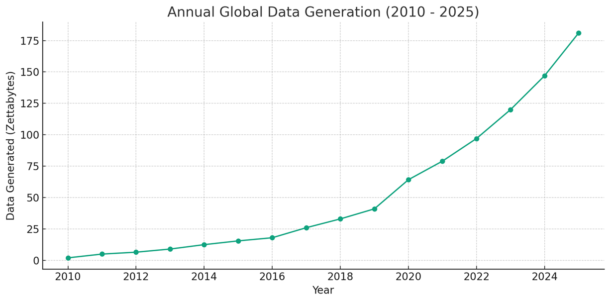
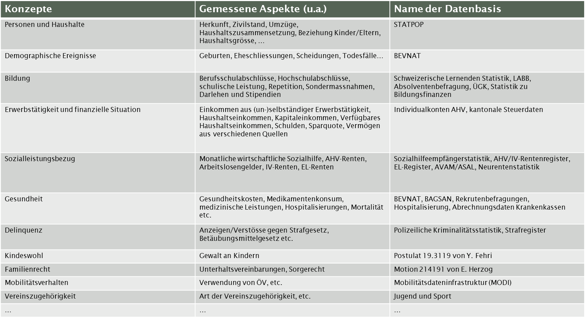
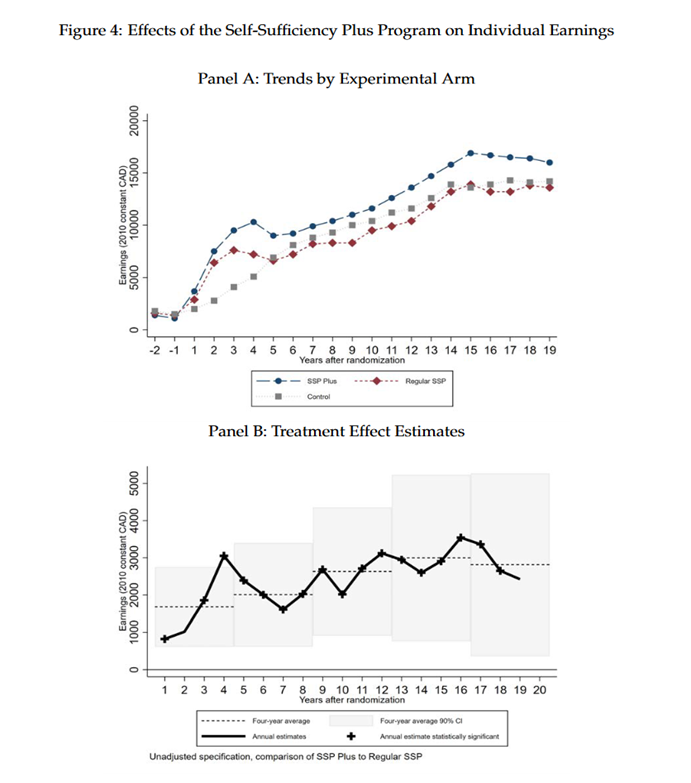

```{=html}
<style type="text/css">
h1 { font-size: 140%; }
h2 { font-size: 130%; }
h3 { font-size: 120%; }
</style>
```
```{r setup, include=FALSE}
knitr::opts_chunk$set(echo = TRUE)
knitr::opts_chunk$set(eval=TRUE)
```

To do:

-   Moodlekurs
-   Struktur inhalte
-   Datensätze beschreiben

# General information

-   Courses take place from 9.15-12 and from 13.15-16 and in in room 136 if not otherwise mentioned

-   [Carefully study the module description](https://moodle.bfh.ch/mod/resource/view.php?id=2165225)

-   [Here you find a list of class members and contact information and groups.](https://drive.switch.ch/index.php/s/nu6AXJAd6SQJo76)

# Welcome Email

Dear students,

A warm welcome to the module Data skills for social work professionals!

As the first Monday of our class falls away (Pfingsten), we would like you to complete a few preparation tasks before the first meeting on Tuesday 21st.

1.  Enroll on the moodle page ([[https://moodle.bfh.ch/course/view.php?id=37097]{.underline}](https://moodle.bfh.ch/course/view.php?id=37097 "https://moodle.bfh.ch/course/view.php?id=37097")) with the following key: FS24-bsc.

2.  It is essential that you have R and R-Studio installed and running on your computer before the first classroom session. Please follow the instructions in the "Installation of R and R-Studio" guide ([[https://drive.switch.ch/index.php/s/ktNsnWxwkJ3olWG]{.underline}](https://drive.switch.ch/index.php/s/ktNsnWxwkJ3olWG "https://drive.switch.ch/index.php/s/ktNsnWxwkJ3olWG") ), and if necessary, refer to the linked instructions on YouTube. If you have any questions, please feel free to contact us via email.

3.  Familiarize yourself with R. We want you to take the opportunity of new AI tools and ask Copilot to take you through a tour in R ([[https://www.bing.com/chat?q=Microsoft+Copilot&FORM=hpcodx]{.underline}](https://www.bing.com/chat?q=Microsoft+Copilot&FORM=hpcodx "https://www.bing.com/chat?q=Microsoft+Copilot&FORM=hpcodx")). Instruct Copilot on its task with the text below.

4.  Finally, we invite you to familiarize yourself with the topic of "Data Science" and its application in social work. Create a forum post [[https://moodle.bfh.ch/mod/forum/view.php?id=2165224]{.underline}](https://moodle.bfh.ch/mod/forum/view.php?id=2165224 "https://moodle.bfh.ch/mod/forum/view.php?id=2165224") , where you provide a concrete example of how data science can help improve the effectiveness of social work or promote the well-being of clients. What are the potential benefits and challenges of applying data science in this field? We look forward to reading your perspectives and ideas on this topic.

We wish you a successful preparation period and look forward to meeting you in person soon. Please let us know should you have any questions.

Kind regards

Dorian Kessler, Samin Sepahniya

------------------------------------------------------------------------

Text to enter into Co-Pilot ein ([[Microsoft Copilot in Bing]{.underline}](https://www.bing.com/chat?q=Bing+AI&FORM=hpcodx "https://www.bing.com/chat?q=Bing+AI&FORM=hpcodx"); important: verwenden Sie den Unterhaltungsstil «im höheren Masse kreativ/creative mode» (Schaltfläche in der Mitte des Bildschirms)):

Als Studierende(r) der Sozialen Arbeit möchte ich die Grundlagen der Programmiersprache R lernen, um statistische Datenanalysen für Projekte in der Sozialen Arbeit durchführen zu können. Ich habe keine Vorkenntnisse in Statistik oder Programmierung. Kannst du mir bitte eine schrittweise Einführung geben? Bitte beginne mit der Frage ob ich R und Rstudio installiert habe und wenn nein, unterstütze mich bei der Installation von R und RStudio. Zeige mir dann die grundlegenden Befehle und Funktionen von R. Ich würde ich gerne lernen, wie man einfache Datenanalysen durchführt (mit dplyr), Daten visualisiert (mit ggplot2) und Ergebnisse interpretiert. Folgende Dinge sind zu beachten:

-   Wähle ein schrittweises Vorgehen. Erzähle mir erst von dem nächsten Schritt, wenn ein Schritt abgeschlossen ist. Frage nach jedem Schritt nach, ob ich diesen erfolgreich abschliessen konnte, um sicherzustellen, dass ich alles richtig gemacht habe.

-   Sage mir als ersten Schritt genau wie ich mich visuell in RStudio orientieren kann und wo ich Eingaben machen muss. Wo befindet sich die Konsole/Skript/Datenübersicht/Dateienübersicht in RStudio?

-   Erkläre mir, was die Konsole ist und was ein R-Skript ist, wie man ein R-Skript erstellt und abspeichert und was der Zweck von Skripten ist. Arbeite mit mir mit einem R-Skript und sage mir, wie ich Befehle ausführen kann.

-   Bitte führe mich durch praktische Übungen und gebe mir Aufgaben, um das Gelernte zu festigen.

-   Biete mir Unterstützung bei Unklarheiten.

-   Arbeite mit Beispielen, welche für die Soziale Arbeit relevant sind. Erfinde relevante Daten aus den Bereichen Sozialhilfe oder Kindes- und Erwachsenenschutz.

-   Kommentiere den Code Zeile-für-Zeile detailliert aus, so dass ich ihn genau verstehe.

-   Biete mir am Schluss weitere Übungen an, falls ich Lust habe. Mache Vorschläge für Übungen.

-   Du bist eine R-Expert:in, weisst aber auch, dass angehende Sozialarbeiter:in in Sachen Programmierung wenig Wissen haben und das nicht technische Begriffe eine alltagssprachliche Erklärung benötigen.

-   Danke für deine motivierte Unterstützung und Hilfsbereitschaft! Du hilfst mir R zu lernen und dieses Wissen für Klient:innen einzusetzen.

-   Wichtige Details:

-   Bitte lasse das «print()» weg, falls nicht nötig.

-   Ergänze bei Strg jeweils Ctrl, falls gewisse Personen englische Windows Tastaturen haben.

# Introduction

## Learning Goals

-   People learn basic data science tools.
-   People learn how to integrate data science in social work problem solving.
-   People learn how to do data science with R.

## What is data science?

-   Term that emerged ca. 10 years ago. Predecessors: Statistics, Data analysis.

-   The science of creating valuable information from data

-   Practice-oriented science

-   Combines technical and field expertise

## How can data science benefit social work?

-   Use cases in social work

    -   [Identify demand for social work among potential clients](https://arbor.bfh.ch/19212/)

    -   [Measure and prove the effectiveness of social work](https://www.bing.com/ck/a?!&&p=87d6833ec738372fJmltdHM9MTcwMjUxMjAwMCZpZ3VpZD0xYWFkNTE1Yi1mY2I0LTY0MDUtMjllMC00MmJjZmRiZjY1MTYmaW5zaWQ9NTIyMA&ptn=3&ver=2&hsh=3&fclid=1aad515b-fcb4-6405-29e0-42bcfdbf6516&psq=Analyse+zu+den+Auswirkungen+der+Reduktion+der+Fallbelastung+in+der+Sozialberatung+der+Stadt+Winterthur&u=a1aHR0cHM6Ly9zdGFkdC53aW50ZXJ0aHVyLmNoL2dlbWVpbmRlL3ZlcndhbHR1bmcvc296aWFsZXMvc296aWFsZS1kaWVuc3RlL2JlcmljaHRlLXVuZC1zdHVkaWVuL2Jhc3NfcmVkdWt0aW9uX2ZhbGxsYXN0X3dpbnRlcnRodXJfc2NobHVzc2JlcmljaHRfMjAyMV8wNy5wZGYvZG93bmxvYWQ&ntb=1)

    -   [Find the most suited intervention for individual clients](https://www.sciencedirect.com/science/article/pii/S0927537105000564)

    -   [Increase transparency and political support for social work](https://www.knoten-maschen.ch/datenauswertungen-kinderleicht-gemacht/)

    -   [Improve efficiency of workflows with generative AI](https://www.der-paritaetische.de/fileadmin/user_upload/Schwerpunkte/Digitalisierung/doc/ki/KI_Textsammlung_final.pdf)

-   Discuss own examples (ca. 30 minutes)

## Why is data science more important in the future?

[](https://marketsplash.com/data-creation-statistics/)

-   [Data is the new oil](https://www.economist.com/leaders/2017/05/06/the-worlds-most-valuable-resource-is-no-longer-oil-but-data).

-   Data contains information on human behavior = **helps us better understand the human world and solve human problems.**

## Data sources

### Public statistics

-   [BFS - Überblick](https://www.bfs.admin.ch/bfs/de/home/statistiken.html)
-   [Stattab (personalisierte Tabellen)](https://www.pxweb.bfs.admin.ch/pxweb/de/)
-   [Vorhandene Tabellen](https://www.bfs.admin.ch/bfs/de/home/statistiken/kataloge-datenbanken/tabellen.html?dyn_prodima=901046&dyn_publishingyearend=2023)
-   [Kantonale Datenplattformen](https://data.bs.ch/explore/dataset/100226/table/?disjunctive.publikationsjahr&disjunctive.indikator_name&sort=indikator_label)

### Regular social surveys

-   [Swiss household panel](https://www.swissubase.ch/en/catalogue/studies/6097/18255/datasets/932/2358/files/document/19477/11791/physicalFile)
-   [Survey on health, aging and retirement](https://share-eric.eu/)
-   [Survey on income and living conditions](https://www.bfs.admin.ch/bfs/en/home/statistics/economic-social-situation-population/surveys/silc.html)
-   [Swiss Health Survey](https://www.bfs.admin.ch/bfs/de/home/statistiken/gesundheit/erhebungen/sgb.html)
-   [Swiss Mental Health Survey](https://www.obsan.admin.ch/de/publikationen/2023-psychische-gesundheit-erhebung-herbst-2022)
-   [European Social Survey](https://www.europeansocialsurvey.org/)
-   [World Values Survey](https://www.worldvaluessurvey.org/WVSContents.jsp)

### Found data

-   Data not explicitly generated for research
-   Always on
-   Numbers, text, images, audio, video
-   Data from
    -   Online activity (digital communication etc.)
    -   Smartphone usage (calling, filming, walking etc.)
    -   Administrative registries
    -   Payments
    -   Smart devices
    -   Video surveillance


-   Publicly owned individual data

-   Can be linked using social security numbers



## Excercise

-   Think of a social work field

-   What is the goal of social work in that field: What aspects of your clients lives do you want to improve?

-   What existing data could you use to measure these aspects of your clients’ lives? Who owns the data? What specific information would you use to measure this? What are technical and ethical limitations?

-   Post your answers on this [padlet](https://padlet.com/doriank1986/data-skills-2x8f5clm7anao11g)

## Kompetenznachweis

-   [You will analyze one of the following data sets](https://drive.switch.ch/index.php/s/BGjMhyiMXIvMwd4)

-   Structure

    -   Einleitung: Vorstellung der Fragestellung und ihrer Relevanz für die Soziale Arbeit

    -   Methodik: Dokumentation dessen, welche Daten verwendet und wie sie ausgewertet wurden

    -   Resultate: Präsentation der Resultate

    -   Schlussteil: Diskussion und Interpretation der Resultate mit Bezug zum Gegenstand und Auftrag der Sozialen Arbeit

-   Die Studierenden liefern zudem ein R-Code File mit, in welchem die Aufbereitungs- und Auswertungsschritte festgehalten sind. Das Code-File muss reproduzierbar sein und die verwendeten Resultate herstellen.

-   Der Kompetenznachweis (Dokumentation, R-Code) wird in Gruppen von 2-3 Personen verfasst, verfügt jedoch über individuell verantwortete Teile im Text oder im Codefile (z.B. im Text: Einleitung, Methodik, Resultate, Schlussteil; im Code: Aufbereitung und Auswertung). Die individuellen Beiträge sind am Ende der Dokumentation als solche auszuweisen (Angabe der Kapitel; für Code: Angabe der Zeilennummern).

# Introduction to R

[Power-Point-Slides](https://drive.switch.ch/index.php/s/11sUE7IQizlpCfj)

## General Information about R

-   R is free and open source.

-   R has excellent online documentation.

-   R has a very active user community (forums, blogs, etc.).

-   R is more than just statistical software.

-   R has interfaces to numerous other programs.

-   R is interdisciplinary.

-   R is gaining in importance and popularity! (see [Popularity Statistics](http://r4stats.com/articles/popularity/))

-   With RStudio, there is now a powerful tool for an easy and efficient workflow.

-   Advantages

    -   Free of charge
    -   Active community
    -   New methods are implemented faster
    -   More flexible/customizable: more than just statistical software
    -   Everyone can contribute

-   Disadvantages

    -   No centralized support
    -   Somewhat more difficult to learn (uses command line inputs instead of pull-down menus)
    -   Less consistency between procedures
    -   Anyone can contribute

-   Which organizations are behind R?

    -   General R information: <https://www.r-project.org/about.html>
    -   R source code contributors: <https://www.r-project.org/contributors.html>
    -   Comprehensive R Archive Network (CRAN) download and install R: <https://cran.r-project.org/>
    -   About RStudio: <https://www.rstudio.com/about/>
    -   Download RStudio: <https://posit.co/downloads/>

-   RStudio Environment

    -   Console Window
    -   Source Editor (Syntax window)
    -   File Window, Plot Window
    -   Environment Window, History Window

-   First steps

    -   R Studio Environment
    -   Working Directory
    -   R Base Package
    -   Install & load packages
    -   Simple calculations
    -   Data import
    -   Execute basic functions such as summary(), help()
    -   Comment codes with \#

## Working Directory, Objects, and Workspace

-   **Working Directory**
    -   `getwd()`: Displays the working directory.
    -   `setwd()`: Defines a new working directory.
    -   `dir()`: Displays the contents of the current working directory.
    -   **Do not use `\` for path specifications, use `/` or `\\` instead.**
-   **Objects**
    -   "Naming guidelines": meaningful names; no spaces; start with a letter.
    -   `a <- 10` or `a = 10`: Creates or overwrites the object `a` with the content on the right (10).
    -   `a`: Displays the content of the object `a`.
    -   `rm()`: Deletes objects from the workspace.
    -   `save(a, b, file = "example.RData")`: Saves the specified objects (a, b) in the current working directory.
    -   `load("example.RData")`: Loads all objects saved in the specified file.
    -   `#`: Starts a commented line that is not interpreted.
-   **Workspace**
    -   Here are all the objects that have been worked with.
    -   If the workspace was saved when closing (R asks for it), it will be loaded again when R starts.
    -   `ls()`: Displays all objects in the current workspace.
    -   The workspace is saved in the current working directory by default.

## Example: Working Directory, Objects, and Workspace

```{r echo=FALSE}
# Kommentare beginnen mit #
# Alles in der Zeile nach # wird von R ignoriert

5+5

getwd() # Arbeitsverzeichnis anzeigen
# Arbeitsverzeichnis definieren
# setwd("C:/irgendein/pfad/") 

dir() # Arbeitsverzeichnis anzeigen

a <- 50 # Erzeugt Objekt a (Zahlen-Vektor der Länge 1) mit dem einzelnen Wert 50
a

# Mit c() - concatenate lässt sich auch ein Zahlenvektor mit mehreren Elementen bauen:
b <- c(1, 2, 3, 4)

# oder kürzer
b <- seq(1,4)

# oder noch kürzer
b <- 1:4

# Objekt erzeugen, dass die Vornamen der Beatles enthält
die.beatles <- c("John","Paul","George","Ringo") 
die.beatles # im Vergleich zu a ist das Objekt nun ein String/Charakter


# Objektnamen dürfen keine Leerzeichen haben. Ferner empfiehlt es sich - und _ zu meiden (Google R Style Guide)
# Namen sollten aussagekräftig sein. Namensgebung sollte im ganzen Code-File konsistent sein (Punkte, Gross-/Kleinschreibung)

ls() # Workspace anzeigen
rm(die.beatles) # Objekt löschen


```

# Packages

-   Viele Objekte (Funktionen, Datensätze, etc.) befinden sich in sogenannten Packages ([see here](http://cran.r-project.org/web/packages/available_packages_by_date.html))

-   Pakete werden von unzähligen freiwilligen Authoren geschrieben und gepflegt. Hierdurch sind auch zahlreiche methodische Nischen gut abgedeckt (v.a. im Vergleich zu anderen Statistiksoftwarepaketen)

-   Manche Pakete gehören zum Kernumfang von R und werden standardmässig beim Start von R geladen. Andere Pakete lassen sich auf Wunsch nachladen.

-   Warnhinweis: Objekte die in Paketen enthalten sind (z.B. Funktionen) können sich namentlich überschneiden ("function is masked")

-   Funktionen im Zusammenhang mit Paketen:

    -   `library(packagename)`: installiertes Paket laden
    -   `library()`: alle installierten Pakete anzeigen
    -   `library(help=packagename)`: Einige Paketinformationen
    -   `search()`: aktuell geladene Pakete anzeigen
    -   `detach("package:packagename")`: Paket wieder "ausladen"
    -   `ls("package:packagename")`: alle Objekte innerhalb einer Pakets zeigen
    -   `packagename::bar`: ein einzelnes Objekt aus einem Paket laden statt das ganze Paket
    -   `install.packages("packagename")`: Paket installieren
    -   `remove.packages("packagename")`: Paket deinstallieren

## Example: Packages and help function

```{r Example: Packages and help function}
# nehmen wir an wir möchten eine SPSS Datei einlesen:
??spss

# liefert Hinweise auf die Funktionen read.spss und read_por auf den Paketen foreign und haven 
# Install package
# install.packages("foreign") 

# Funktioniert erst, wenn das Package auch geladen ist
library(foreign)
?read.spss

# Aber generelle Empfehlung: Google oder AI liefern mittlerweile i.d.R. bessere Resultate als die Hilfefunktion

```

## Exercise: Installieren und laden Sie die folgenden Packages.

-   dplyr: zum Arbeiten mit Datensätzen / Datenbereinigung
-   ggplot2: zur Datenvisualisierung
-   haven_ erleichtert das Lesen von SPSS-, SAS- und Stata-Dateien in R.
-   readxl: Excel-Dateien (.xls und .xlsx) in R eingelesen
-   officer: ermöglicht die Erstellung und Bearbeitung von Microsoft Word-Dokumenten (.docx) direkt in R

# Arithmetische- und logische Operatoren

-   Arithmetische Operatoren
    -   `+ - * / ^`
-   Vergleichsoperatoren (logische Operatoren)
    -   `& | == != > < >= <=`
-   Mathematische Funktionen (siehe jeweils die Hilfe `?function`)
    -   `exp(x)=e^x log(x) log10(x) sin(x) cos(x) tan(x)`
    -   `abs(x) sqrt(x) ceiling(x) floor(x) trunc(x) round(x, digits=n)`

## Example: Rechnen und Vergleichen

```{r Example:Rechnen und Vergleichen}
# Rechnen
ergebnis <- (23+24)*11/(18+15)*5
ergebnis

# Funktionen
log(2) 
cos(2)

# Vergleich
x <- -3:3
x

# sind die Elemente von x gleich 0?
x == 0

# grösser 0?
x > 0

# kleiner 0?
x < 0

# grösser gleich 0?
x >= 0

# kleiner gleich 0?
x <= 0

# ungleich 0?
x != 0

# grösser als -1 aber kleiner als 1
x > -1 & x < 1

# grösser als  1 und kleiner als -1
x > 1 & x < -1

# grösser als 1 oder kleiner als -1
x > 1 | x < -1

```

## Exercise: Rechnen und Vergleichen

1.  Berechnen Sie folgende Terme in R
    1.  $((3 + 4 - 5) - 9)^{2}$
    2.  $log(1)$
2.  Prüfen Sie folgende Vergleiche:
    1.  $5 = 7$
    2.  $\sqrt{3} \neq cos(17)$

## Solution: Rechnen und Vergleichen

```{r Solution: Rechnen und Vergleichen, echo=FALSE}
# 1.
((3+4-5)-9)^2
log(1)

# 2.
5==7
sqrt(3)!=cos(17)
```

# Klassen/Datentypen

-   `class()`: Offenbart die Klasse eines Objekts

-   numerisch

-   logisch (TRUE/FALSE)

-   Character/String (Die Beatles)

-   Teilweise lassen sich Datentypen umwandeln, z.B. `as.numeric()` oder `as.character()`

-   Liste, z.B. `list(1, "Hallo", TRUE)`

-   Data frame: "Liste" von Vektoren gleicher Länge

-   Faktoren: bilden kategoriale Daten ab. Diese sind als Zahlenwerte gespeichert aber mit einem Wertelabel verbunden

## Übersicht Datentypen

```{r Übersicht Datentypen}
# Integer Vektor
x <- c(1, 2, 3)
class(x)
x

# Logischer Vektor
x <- -3:3
y <- x >= 0
y
class(y)

# String/Character Vektor
x <- c("a", "b", "c")
class(x)
x

# Liste
liste <- list(a= c(4:8), b = c("a", "b", "c"), c = c(TRUE, FALSE))
class(liste)
liste

# Data frame: Kann man anschauen durch Aufruf von swiss
class(swiss)
swiss

# Faktoren
sex <- c(0,0,1,1)
factor(sex,labels=c("Mann","Frau"))

# Funktionen: z.B. cos(); mean()
class(mean)
mean

```

## Sonderwerte

-   `Inf` und `-Inf`: Positiv und negativ unendlich
-   `NaN`: "*Not a number*", z.B. `0/0`
-   `NA`: fehlender Wert (Missing)

```{r Sonderwerte}

# Wichtiger Hinweis zu fehlenden Werten:
x <- c(1,2,NA,4)

#falsch:
x == NA
x == "NA"

#richtig:
is.na(x)
```

## Zugriff auf unterschiedliche Datenbereiche

```{r Zugriff}

# Wie kann man direkt auf einzelne Elemente eines Vektors zugreifen?
x <- seq(2, 200, 2)
x
x[1]              # erstes Element von x
x[1:10]           # die ersten 10 Elemente von x

# für zweidimensionale Objekte können sowohl Zeilen als auch Spalten angesprochen werden:

swiss[1:2, c(3, 6)] # liest sich: "erste bis zweite Zeile, dritte und sechste Spalte"

# Eselsbrücke: Zeilen zuerst, Spalten später.


# Abgesehen von der Position, kann auch über den Namen einer Spalte (oder Zeile) referenziert werden:

swiss["Delemont", "Fertility"]

# oder nach einer Bedingung:

swiss[swiss$Catholic > 80, ]

```

### Exercise

1.  Lassen Sie sich aus dem Datensatz `swiss` die zehnte und zwölfte Zeile anzeigen.
2.  Lassen Sie sich die Spalten `Education` und `Catholic` für alle Gemeinden ausgeben die eine Kindersterblichkeit zwischen 20 und 22 haben.

### Solution

```{r Solution: Zugriff, echo=FALSE}
# 1.

swiss[c(10, 12), ]

# 2. 
swiss[swiss$Infant.Mortality > 20 & swiss$Infant.Mortality < 22, c("Education", "Catholic")]

```

## Data Frames

-   Data frames sind das typische Format für Datensätze
-   ...es handelt sich um eine Liste von Vektoren derselben Länge [siehe Wickham](http://adv-r.had.co.nz/Data-structures.html)
-   ...ähnelt Matrizen aber die Spalten können unterschiedliche Datentypen beinhalten
-   `data.frame()`: erzeugt einen data frame
-   `as.data.frame()`: konvertiert in einen data frame
-   `order()`: sortiert Daten
-   `summary()` und `str()`: Überblick über data frames
-   `head()` and `tail()`: erste/letzte Zeilen inspizieren
-   `names()`: zeigt Spaltennamen
-   `object$var1`: Greift direkt auf die Spalte `var1` im data frame `object` zu
-   `na.omit()`: Zeilenweise Ausschluss von fehlenden Werten, d.h. Zeilen die mindestens 1 Missing beinhalten

### Example: Data Frames

```{r Data frames}
# fertige Daten sind oft data frames:
titanic <- read.dta("http://www.stata-press.com/data/kkd/titanic2.dta")
is.data.frame(titanic)

# man kann sich auch leicht selber einen bauen
obst <- c("Apfel", "Apfel", "Birne")
gemuese <- c("Tomate", "Karotte", "Karotte")
id <- 1:3
df <- data.frame(id, obst, gemuese)
df

# Ansteuern von Zeilen und Spaltenpositionen
df$obst
df[, "obst"]
df[3, "gemuese"]
df[3, 3]
```

# Datenmanagement

## Tidy vs. Messy Data

### Generelles

-   Hadley Wickham hat versucht, einige Konventionen zur sauberen Darstellung/Ablage von Daten aufzuschreiben
-   siehe <http://vita.had.co.nz/papers/tidy-data.pdf> und <http://tidyverse.org/>
-   Quintesenzen:
    -   sobald Daten einmal sauber (tidy) sind, können Analysetools (Plotting, Modellfitting) auch sauber und ohne Zusatzaufwand arbeiten (z.B. ggplot2, lm/glm)
    -   **Fälle (Beobachtungseinheiten) in Zeilen, Variablen (Beobachtungsdimensionen) in Spalten**
-   Daten sind Messy, wenn
    -   Spalten nicht beschriftet sind
    -   Eine Spalte mehr als eine Variable beinhaltet
    -   Variablen statt in Spalten auch in Zeilen auftauchen
    -   unterschiedliche Beobachtungseinheiten in derselben Tabelle sind
-   Tools um Daten zu säubern (kleine Auswahl):
    -   `dplyr` / `data.table`
    -   `melt() dcast()` aus `reshape2`
    -   `str_replace()`, `str_sub()` aus dem Package `stringr`
    -   `tolower()`
    -   einige weitere in Paket `tidyr`
    -   auch nützlich: `recode()` von John Fox (Package `car`)

### Example: Tidy vs Messy Data

```{r Example: Tidy vs Messy Data, eval=FALSE}
# Wetterdaten
weather <- read.table("https://raw.githubusercontent.com/justmarkham/tidy-data/master/data/weather.txt", header=TRUE)
head(weather) # hier sind Variablen in Zeilen und Spalten

# Daten reshapen (melt) und Missings löschen
library(reshape2) # für melt()/dcast()
weather1 <- melt(weather, id=c("id", "year", "month", "element"), na.rm=TRUE)
head(weather1)

# saubere Spalte für "day"
library(stringr)    # für str_replace(), str_sub()
weather1$day <- as.integer(str_replace(weather1$variable, "d", ""))

# die krude Spalte "variable" brauchen wir nicht
weather1$variable <- NULL

# die Spalte element beherbergt zwei unterschiedliche Variablen tmin und tmax. 
# Diese sollen in zwei Spalten:
weather1$element <- tolower(weather1$element) # Kleinbuchstaben
weather.tidy <- dcast(weather1, ... ~ element) # reshapen auf zwei Spalten
head(weather.tidy)

# das Datum laesst sich zudem in einer Spalte darstellen als echtes Datum:
weather.tidy$date <- as.Date(paste(weather.tidy$year, 
                                   weather.tidy$month, 
                                   weather.tidy$day, sep="-"))
weather.tidy[, c("year", "month", "day")] <- NULL
head(weather.tidy)
```

# Descriptive statistics

-   Univariate statistics (1 variable)
    -   `mean(x)`: Mean
    -   `sd(x)`: Standard deviation
    -   `var(x)`: Variance
    -   `median(x)`: Median
    -   `min(x)`: minimum
    -   `max(x)`: Maximum
-   Bivariate statistics (2 variables)
    -   `cov()`: covariance
    -   `cor()`: Correlation
    -   `cor(x,y,method="spearman")`: Rank correlation
    -   `?cor`: more information in the helpfile
    -   `chisq.test()`: Chi-square test
    -   `t.test()`: t-test
-   Contingency tables
    -   `table(x)`: one-dimensional contingency table
    -   `table(x,y)`: two-dimensional contingency table
    -   `prop.table(table(x))`: relative frequency

## Example: Kontingenztabellen

```{r Kontingenztabellen}
# zwei fiktive Vektoren erstellen
x <- c(10,20,30,40,30,10,20,30,40,30,10,20,10)
y <- c(2,5,3,5,3,5,1,6,3,4,5,1,1)

# Tabelle
table(x)
table(x,y)

# Tabelle in Prozent
100*prop.table(table(x))
100*prop.table(table(x,y))
round(100*prop.table(table(x,y)), 2) # gerundete Werte

# Mean
mean(x)

# Median
median(x) 
sort(x)

# mehrere Statistiken in einem Vektor
c(mean=mean(x), median=median(x), stddev=sd(x), min=min(x), max=max(x))

# gibt es verkürzt über die generische Funktion summary
summary(x)

```

## Exercise: Kontingenztabellen

1.  Laden (ggf. vorher installieren) Sie das Paket `foreign`. Laden Sie die Daten über den Untergang der Titanic mit folgendem Befehl: `titanic <- read.dta("http://www.stata-press.com/data/kkd/titanic2.dta")` und machen Sie sich ein bisschen mit den Daten vertraut (z.B. `head()` oder `summary()`).
2.  Erzeugen Sie eine Kreuztabelle mit den Variablen `class` und `survived`.
3.  Berechnen Sie Median und Mittelwert des Alters für Überlebte und Gestorbene.

## Solution: Kontingenztabellen

```{r Solution: Kontingenztabellen, echo=FALSE}
### 1.
library(foreign)
titanic <- read.dta("http://www.stata-press.com/data/kkd/titanic2.dta")
head(titanic)
summary(titanic)

### 2. 
# survived aus Konvention auf die Y-Achse, class auf die X-Achse (Y ist die abhängige, X die erklärende Variable)
table(titanic$survived,titanic$class) # Faktor crew ist hier nicht sauber gelabelt

### 3.
mean(titanic$age2[titanic$survived=="yes"])
mean(titanic$age2[titanic$survived=="no"])

```

## Package dplyr

### Generelles

-   Relativ neues Package [dplyr](http://blog.rstudio.org/2014/01/17/introducing-dplyr/) von [Hadley Wickham](https://twitter.com/hadleywickham)/[Romain Francois](https://twitter.com/romain_francois) bietet ein Toolset zur Datenaufbereitung
-   Siehe [die dplyr Vignette](http://cran.rstudio.com/web/packages/dplyr/vignettes/introduction.html) und das [Data Wrangling Cheat Sheet](http://www.rstudio.com/resources/cheatsheets/) für einen sehr guten Überblick
    -   `filter()`: wählt ein Subset von Zeilen (siehe auch `slice()`)
    -   `arrange()`: sortiert
    -   `select()`: wählt Spalten
    -   `mutate()`: erzeugt neue Spalten
    -   `summarise()`: aggregiert (collapses) Daten zu einzelnen Datenpunkten
    -   `distinct()`: entfernt doppelte Werte
    -   `group_by()`: Definiert Untergruppen in den Daten, damit `mutate()` und `summarise()` separat pro Gruppe angewandt werden können.
    -   dplyr kann sehr gut zusammen mit sogenanntem Piping verwendet werden, d.h. das Datenobjekt wird von Funktion zu Funktion weitergereicht durch `%>%` wodurch der Code deutlich besser lesbar und kompakter wird.

### Example: Package dplyr

```{r Example: Package dplyr,eval=FALSE}
library(dplyr)
titanic <- read.dta("http://www.stata-press.com/data/kkd/titanic2.dta")

# filtern und zusätzlich Spalten selektieren:
titanic %>%
  filter(class == "1st class", age2 < 18) %>%
  select(sex, age2, survived)

# neue Variable "child" bauen
titanic %>%
  mutate(child = age2 < 18) %>%
  head()

# Auszählen wer gestorben ist nach Geschlecht und Kind (ja/nein)
titanic %>%
  mutate(child = ifelse(age2 < 18, "yes", "no")) %>%
  group_by(sex, child, survived) %>%
  summarise(n=n()) %>%
  arrange(sex, child, survived)

```

## Exercise: Package dplyr

Lesen Sie die SHP-Daten in RStudio ein. Beschränken Sie den Datensatz für das Jahr 2022 auf Personen, die 25 Jahre oder älter sind. Betrachten Sie die Variablen mit den Informationen zum Alter (Variable AGE), zum Geschlecht (Variable SEX), zu den Ausbildungsjahren (Variable EDYEAR) und zur ersten Nationalität (NAT_1_). Verschaffen Sie sich einen Überblick über das Sampling mit Hilfe der beiden Funktionen `summary` und `table`.

## Solution: Package dplyr

```{r Solution: Package dplyr, echo=FALSE}
### read SHP Daten 
library(haven)
library(dplyr)
shp <- read_sav("S:/MA1082973/_FHNW/BA472/data sets/SHP/SHPLONG_P_USER.sav")

# Datensatz für das Jahr 2022 & Personen, die 25 oder älter sind
shp2022 <- shp %>% filter(YEAR == 2022) %>% filter(AGE > 24) %>% select(AGE, SEX, EDYEAR, NAT_1_)

summary(shp2022)

table(shp2022$AGE)
table(shp2022$SEX)
table(shp2022$EDYEAR)
table(shp2022$NAT_1_)

```

# Data visualization

-   Why is data visualization important?

-   Data exploration vs. data presentation

-   Simple diagrams

-   Histograms

-   Scatter charts

-   Bar charts

## Visualization with ggplot2

-   ggplot2 is the most important package to create visualizations in R
-   see also cheatsheet: <https://rstudio.github.io/cheatsheets/data-visualization.pdf>

Hadley Wickham's `ggplot2` package has developed into a particularly useful alternative to `plot()` over the last few years. Especially complicated plots are easier to implement with ggplot, visually appealing and the code is easily accessible. Most important basic structures: - Data that we want to visualize - Geometries to define the shapes we want to use for visualization (e.g. a scatter plot, line chart, bar chart) - Modify aesthetics to convey different meanings (e.g. colors, size, thickness of a line) - Define mappings between geometries and aesthetics (e.g. how big should the data points be)

#### Example: ggplot2

```{r Example: ggplot2, eval=FALSE}
library(ggplot2)
library(dplyr)
library(haven)

# set working directory
setwd("S:/MA1082973/_FHNW/BA472")
# load data
shp <- read_sav("data sets/SHP/SHPLONG_P_USER.sav")

# Scatterplot (einfach)
shp2022 <- shp %>%
  filter(YEAR==2022) %>% filter(AGE > 24)

ggplot(data=shp2022, aes(x = PC46, y =PC45)) +
  geom_point() +
  labs(title = "Streudiagramm",
       x = "Weight in kg",
       y = "Height in cm")

#
ggplot(data=shp2022, aes(x = PC46, y =PC45, color=factor(SEX))) +
  geom_point() +
  labs(title = "Streudiagramm",
       x = "Weight in kg",
       y = "Height in cm",
       color = "Geschlecht") +
  scale_color_manual(values=c("lightgreen", "darkviolet", "red"),
                    labels=c("Männlich", "Weiblich", "Andere"))

# Erstelle ein Säulendiagramm
# Entfernen der NA-Werte für die Variable SEX
shp2022 <- shp2022 %>% filter(!is.na(SEX)) %>% filter(!is.na(PC44))

ggplot(shp2022, aes(x=factor(PC44), y=..count.., fill=factor(SEX))) +
  geom_bar(stat="count", position="dodge") +
  labs(x="Zufriedenheit mit dem Leben", y="Anzahl", fill="Geschlecht") +
  #Beschriftung für Legende
  scale_fill_manual(values=c("lightgreen", "violet", "red"),
                  labels=c("Männlich", "Weiblich", "Andere")) +
  ggtitle("Zufriedenheit mit dem Leben nach Geschlecht")
```

#### Exercise: Grafiken mit ggplot2

1.  Laden Sie die SHP-Daten.
2.  Erstellen Sie ein Histogramm für das Einkommen (Variable: IPTOTN) für das Jahr 2022. Geben Sie der Grafik einen Titel. Tipp: Fügen Sie dem Diagramm ein `labs()` Argument hinzu.
3.  Erstellen Sie einen Boxplot, der die Einkommensverteilung nach Bildungsniveau (Variable: ISCED) darstellt. Damit die Boxplots für jede Bildungsstufe separat erstellt werden, müssen Sie die Bildungsvariable vorher als Faktor speichern (die allgemeine Form ist: `daten$variable <- as.factor(daten$variable)`). Schränken Sie auch das Einkommen ein (Ausreisser, z.B. alle Einkommen über 200'000 ausschliessen).

#### Solution: Grafiken mit ggplot2

```{r Solution: Grafiken mit ggplot2, eval=FALSE, echo=FALSE}
# 1. Laden Sie die SHP-Daten.

# 2. Erstellen Sie ein Histogram für das Einkommen.
library(ggplot2)
ggplot(shp2022,aes(x=IPTOTN))+
     geom_histogram()+
     labs(title="Histogramm zum Einkommens")

# 3. Erstellen Sie einen Boxplot, der die Einkommensverteilung nach Bildungsstand unterteilt aufzeigt.

shp2022$ISCED <- as.factor(shp2022$ISCED)     # Bildungsstand als factor abspeichern
shp2022 <- shp2022 %>% filter(IPTOTN<200000)  # Die Ausreisser beim Einkommen rausnehmen

ggplot(shp2022,aes(x=ISCED,y=IPTOTN))+
     geom_boxplot()+
     labs(title="Boxplot Einkommen")

```

# Measuring the effects of social work

## Why is it important to measure the effects of social work?

-   Improving practice with better knowledge

    -   Understanding whether and how social work interventions and offers reach their goals (evaluation)

    -   Knowing the most effective interventions and offers

    -   Knowing the most cost-effective interventions and offers

-   Legitimizing social work

    -   Gaining political support for social work (i.e. money!)
    -   Example:
        -   [Winterthur](https://www.buerobass.ch/fileadmin/Files/2021/2021_Reduktion_Falllast_Winterthur_Schlussbericht_DE.pdf)

## What is an effect and what not?

-   Effect = difference in the result with influencing variable versus without influencing variable (= **counterfactual** situation)

-   What is the counterfactual situation?

    -   The story of Tom and Eva

        -   "Eva was a saleswoman in a supermarket in Lucerne, who came from a poor family. She dropped out of school after the ninth grade to financially support her parents. In 2005, she met Tom, a mechanic from St. Gallen who worked in a workshop. They fell in love and got married in 2007. They had two children: a son named Max in 2008 and a daughter named Zoe in 2010.

            Eva and Tom had a loving marriage but also their problems. They had to deal with the low income, high rent, and high cost of living. They sometimes argued, but they always talked it out and found a solution. They valued each other and supported each other's wishes.

            However, in 2017, the relationship between Eva and Tom broke down. Eva discovered that Tom was having an affair with a customer he had met in his workshop. She was angry and hurt and confronted him about it. Tom admitted his infidelity and told her that he no longer loved her. He wanted a divorce and to move out.

            Eva was devastated and agreed to the divorce. They had to arrange custody for their children, who suffered from their parents' separation. They decided on joint custody, with the children alternating between living with each parent. They also had to divide the assets they had accumulated during their marriage. They sold their apartment in Lucerne and split the proceeds.

            Today, Eva and Tom are divorced and live separately. They have both continued their careers but with less success than before. Eva is still a saleswoman in a small supermarket but has no prospects for promotion or salary increase. Tom is still a mechanic in a small workshop but faces a lot of competition from younger colleagues. They earn less money than before and have trouble paying their bills. They also have less time for themselves and for their children, who are unhappy and insecure. Since 2020, Eva has been supported by social welfare."

    -   The counterfactual version

        -   "Eva was a saleswoman in a supermarket in Lucerne, who came from a poor family. She dropped out of school after the ninth grade to financially support her parents. In 2005, she met Tom, a mechanic from St. Gallen who worked in a workshop. They fell in love and got married in 2007. They had two children: a son named Max in 2008 and a daughter named Zoe in 2010.

            Eva and Tom had a loving marriage but also their problems. They had to deal with the low income, high rent, and high cost of living. They sometimes argued, but they always talked it out and found a solution. They valued each other and supported each other's wishes.

            In 2017, Eva found a job as a cashier in a larger supermarket, while Tom continued to work in the workshop. They earned more money and were able to buy their own apartment. They also had more time for themselves and for their children, who were happy and healthy. Today, Eva and Tom are still happily married and looking forward to the future. They plan to take a trip to Spain soon to enjoy the sun. They also hope to become grandparents one day, as their son Max has a lovely girlfriend whom he has been dating for six months. Their daughter Zoe is still at school, but she already has many talents and interests that she wants to pursue."

```{r grafik}
# Create two vectors with the years and the estimates for Version 1
year <- c(2004:2023)
est <- c(4, 5, 6, 7, 8, 7, 8, 8, 7, 7, 8, 7, 8, 4, 3, 3, 2, 2, 2, 2)

# Create a table with the vectors as columns
tab1 <- data.frame(year, est, type = "Life Satisfaction")
save <- est

year <- c(2004:2023)
est <- c(4, 5, 6, 7, 8, 7, 8, 8, 7, 7, 8, 7, 8, 9, 9, 9, 8, 9, 9, 9)

# Create a table with the vectors as columns
tab2 <- data.frame(year, est, type = "Life Satisfaction")

tab3 <- data.frame(year, est = save - est, type = "Effect of Divorce", version = "Effect of Divorce")

library(ggplot2)

# Add a new column indicating the version
tab1$version <- "Real Situation"
tab2$version <- "Counterfactual Scenario"

# Combine the two tables
tab <- rbind(tab1, tab2, tab3)

# Create a line plot with ggplot
ggplot(tab, aes(x = year, y = est, color = version)) +  
  geom_line() +  
  facet_grid(type ~ ., scales = "free_y") + 
  labs(
    title = "The Effect of Eva's Divorce", 
    subtitle = "Eva's Life Satisfaction in the Actual and Counterfactual World", 
    x = "Year", 
    color = "Effect", 
    y = "Life Satisfaction resp.\nEffect of Divorce on Life Satisfaction"
  ) +  
  geom_vline(xintercept = 2016.5)


```

-   Example of measuring the effects of social work

    -   [](https://www.nber.org/papers/w30405)

-   A bad example of the effects of social work

    -   [Federal Council guidelines for the labor market integration of persons with protection status S for cantons: 40% should have a job until the end of 2024](https://www.blick.ch/politik/40-prozent-sollen-stelle-haben-der-bundesrat-will-dass-mehr-ukrainerinnen-arbeiten-id19105587.html)

## How can we measure the effects of social work with quantitative data?

### Asking experts

-   "Do you think this course makes you a better social worker?"

-   Advantages

    -   Easy to measure

    -   Subjective expertise: we know a lot about effects (e.g. pain killers)

-   Disadvantages

    -   We are unaware of the counterfactual

    -   Social desirability bias

### Assessing correlations

### Experiments - the gold standard

### Natural experiments

## Exercise in R

## Important references

-   [Wirkungsevaluationen in der Sozialen Arbeit : ein Orientierungsbuch für die Praxis](https://digitalcollection.zhaw.ch/handle/11475/29971)

-   [Experimental Research Designs in Social Work: Theory and Applications](https://www.jstor.org/stable/10.7312/thye20116)

-   [The Power of Experiments](https://mitpress.mit.edu/9780262542272/the-power-of-experiments/)

# Prediction in social work

Evtl. 1/2 Tag oder 3/4 Tag

-   Risk prediction in SW

-   Examples in practice

-   Black et al. - 2003 - Is the Threat of Reemployment Services More Effect.pdfBlack et al. - 2003 - Is the Threat of Reemployment Services More Effect.pdf

-   Gilholm et al. - 2023 - Machine learning to predict poor school performanc.pdf

-   Kleinberg et al. - 2018 - Human Decisions and Machine Predictions.pdfKleinberg et al. - 2018 - Human Decisions and Machine Predictions.pdf

-   Rittenhouse et al. - 2023 - Algorithms, Humans and Racial Disparities in Child.pdfRittenhouse et al. - 2023 - Algorithms, Humans and Racial Disparities in Child.pdf

-   Stevenson and Doleac - 2022 - Algorithmic Risk Assessment in the Hands of Humans.pdfStevenson and Doleac - 2022 - Algorithmic Risk Assessment in the Hands of Humans.pdf

-   Tennakoon et al. - 2023 - Using electronic health record data to predict fut.pdfTennakoon et al. - 2023 - Using electronic health record data to predict fut.pdf

-   Toros and Flaming - 2018 - Prioritizing Homeless Assistance Using Predictive .pdfToros and Flaming - 2018 - Prioritizing Homeless Assistance Using Predictive .pdf

-   OLS, (Machine Learning)

-   Organisation: Gruppenformierung

## Content

Content is structured to alternate between technical aspects (basics, hands-on exercises) and their relation to social work and practice.

#BFH Struktur

-   **Preparation (Samin erstellt Begrüssungsemail)**

    -   Begrüssungsnachricht: Download r/rstudio, videolink, aufgabe
    -   Some video, introduction course (Samin sucht video)
    -   Find examples of how data science can help social work: sie sollen ein Forumsbeitrag erstellen

-   **Introduction (Dorian/Samin, 21.5.)**

    -   What is data science and how can it help social work? What are the limits? (Slide 4 bis 7)
    -   Data that are relevant for social work
        -   Datafication:
            -   data collected for research/official statistics,
            -   found data (uebung: studierende sollen selber überlegen, wo found data entstehen)
            -   
    -   Crash course in R and R Studio: AI supported coding (ChatGPT-4 / Copilot), warum R, R as a calculator/objects/for loops (kurz), reading in data, überblick über datensatz (summary, nrow,...), dplyr, filter/select, mutate, rbind/merge, reshaping (?), umgang mit textdaten (?), saving

-   **Descriptive analyses (Samin, 27.5.)**

-   **Prediction of risks (Dorian, 28.5)**

-   **Evaluation/Causal design/Effects of social work (Dorian, 3.6.)**

    -   Evtl. 1/2 Tag oder 3/4 Tag
    -   Randomized control trials
    -   Natural experiments

-   **Case studies mit Coaching (Dorian, 4.6.)**

-   **Beispieldaten**

    -   Beispieldaten oben einbauen
    -   Richtungswechsel
    -   Swiss Household Panel (Samin lädt herunter)
    -   Data dashboard Wohlen; extension or data analysis of dependency duration (Dorian fragt nach; wir sagen nicht von welcher Gemeinde, Vertragliche Abmachung)
    -   Jugendarbeit Burgdorf (Dorian schreibt Mani)
    -   Fokus Arbeit (?): Wenn andere Daten nicht verfügbar sind
    -   ESS (Samin lädt herunter) ..Daten die relevant sind für die SA
    -   Open data/BFS/...Daten die relevant sind für die SA

-   Struktur KNW

    -   5000-7000 Zeichen
    -   Beschreibung Fragestellung, Daten, Code, Resultate (Tabellen/Grafik), Interpretation (Interpretation der Ergebnisse, Limitation der Daten/Analysen/Schlussfolgerungen)

-   Vorbereitung von Tutorials/Videos/Aufträge etc. im Falle von Krankheit...https://www.theanalysisfactor.com/resources/

#FHNW Struktur - **Introduction (Samin, 3.6.)** - Organisation: Gruppenformierung - What is data science and how can it help social work? What are the limits? (Slide 4 bis 7) - Data that are relevant for social work - Datafication:\
- data collected for research/official statistics, - found data (uebung: studierende sollen selber überlegen, wo found data entstehen) - excercise: measuring social work outcome dimensions with found data (give example) - risks? - Crash course in R and R Studio: AI supported coding (GPT-4/Bing, Copilot), warum R, R as a calculator/objects (kurz), reading in data, überblick über datensatz (summary, nrow,...), dplyr, filter/select, mutate, merging, reshaping, umgang mit textdaten, saving - **Descriptive analyses (Samin, 4.6.)** - Study designs: descriptive, prediction, evaluation/causal design - Descriptive: Monitoring, Probleme identifizieren, Überblick gewinnen, Entwicklungen beschreiben - Prediction: (ungewünschtes) Vorhersagen - Evaluation/Causal design: Wirkungen messen, Lösungen identifizieren - Distributional characteristics/univariate statistics: Frequencies, mean, median, modal value, variance, interquartile range, range of values. - Correlations/bi-/multivariate statistics: correlation measures, associations and group comparisons using regression or other statistical techniques. - Einfach halten: Verweis auf Methodenberatungswebseite UZH - Uncertainty: statistical significance, p-value and confidence intervals. - Einfach und kurz - Results communication: tables with quick_docx huxtable, ggplot2, (shiny; erwähnen) - **Prediction of risks, Evaluation/Causal design/Effects of social work (Dorian, 5.6)** - **Case study work with coaching (Dorian, 6.6)** - **Presentation**

### Technical Part

-   **Study Designs**
    -   Description, prediction, causal inference/evaluation design.
-   **Measurement Theory**
-   **Survey Data**
    -   (Note: This might not be necessary since it is covered in standard curricula.)
-   **Crash Course: Interface of R/Python**
    -   Basic functions, reading in and preparing administrative data, survey data, or data from organisations using R/Python.
    -   Doing simple calculations, creating descriptive tables and simple graphs.
-   **Descriptive Statistics:**
    -   Frequencies.
    -   Mean, median, modal value.
    -   Variance, interquartile range, range of values.
    -   Correlation measures.
    -   Associations and group comparisons using regression or other statistical techniques.
-   **Machine Learning Applications**

### Relation to Social Work (short inputs and discussions?)

-   **Why Should Social Workers Learn About Data Science?**

    -   Monitoring, evaluation, etc.

-   **What We Can Achieve with Quantitative Research in Social Work**

-   **Examples from Quantitative Research Projects in Social Work and Their Impacts**

-   **Practice Examples Using Data Science (from the podcast series Digital-HSA):**

    -   Machine Learning projects in social work?

-   **Potential and Limitations**
