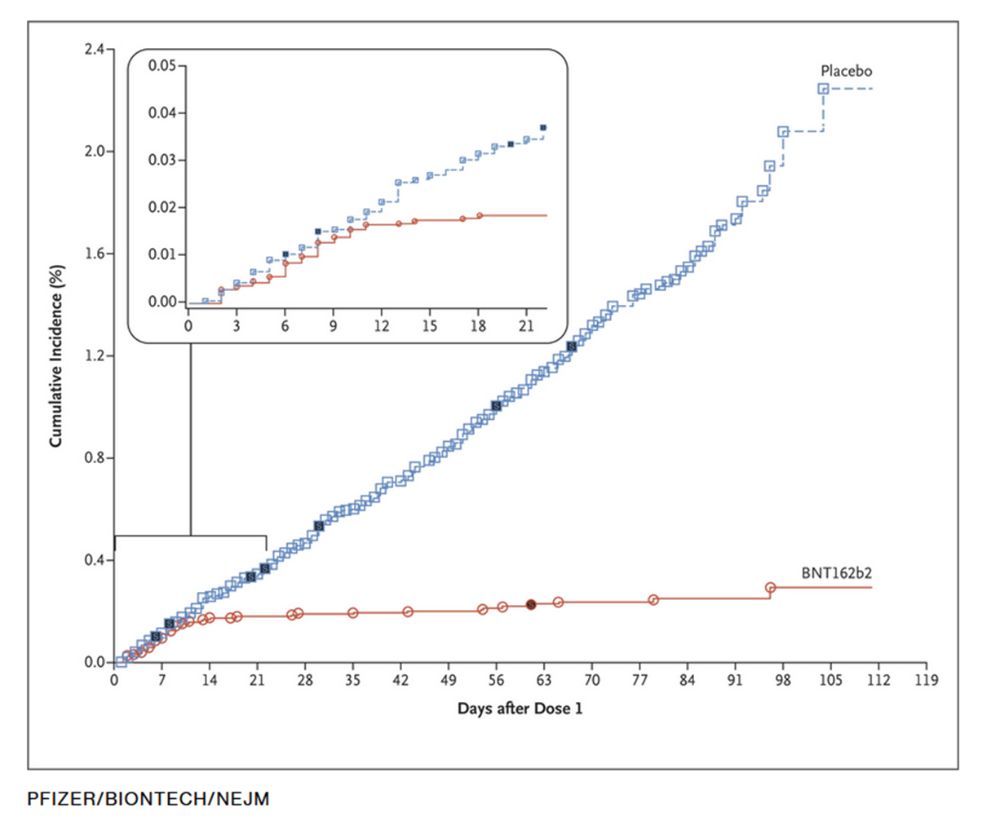

```{=html}
<style type="text/css">
h1 { font-size: 140%; }
h2 { font-size: 130%; }
h3 { font-size: 120%; }
</style>
```
```{r setup, include=FALSE}
knitr::opts_chunk$set(echo = TRUE)
knitr::opts_chunk$set(eval= TRUE)
```

# General information

-   Courses take place from 9.15-12 and from 13.15-16 and in in room 136 if not otherwise mentioned

    -   For group work

        -   Tuesday 28th: HAL224A, HAL228, HAL302, HAL303, E42, E43

        -   Monday 3rd: HAL224, HAL224a, HAL228, HAL302, HAL303, E42

        -   Tuesday 4th: HAL228, HAL302, HAL303, E42, E43, E45; NM:HAL 218

-   [Carefully study the module description](https://moodle.bfh.ch/mod/resource/view.php?id=2165225)

-   [Here you find a list of class members and contact information and groups.](https://drive.switch.ch/index.php/s/nu6AXJAd6SQJo76)

## Welcome Email

Dear students,

A warm welcome to the module Data skills for social work professionals!

As the first Monday of our class falls away (Pfingsten), we would like you to complete a few preparation tasks before the first meeting on Tuesday 21st.

1.  Enroll on the moodle page ([[https://moodle.bfh.ch/course/view.php?id=37097]{.underline}](https://moodle.bfh.ch/course/view.php?id=37097 "https://moodle.bfh.ch/course/view.php?id=37097")) with the following key: FS24-bsc.

2.  It is essential that you have R and R-Studio installed and running on your computer before the first classroom session. Please follow the instructions in the "Installation of R and R-Studio" guide ([[https://drive.switch.ch/index.php/s/ktNsnWxwkJ3olWG]{.underline}](https://drive.switch.ch/index.php/s/ktNsnWxwkJ3olWG "https://drive.switch.ch/index.php/s/ktNsnWxwkJ3olWG") ), and if necessary, refer to the linked instructions on YouTube. If you have any questions, please feel free to contact us via email.

3.  Familiarize yourself with R. We want you to take the opportunity of new AI tools and ask Copilot to take you through a tour in R ([[https://www.bing.com/chat?q=Microsoft+Copilot&FORM=hpcodx]{.underline}](https://www.bing.com/chat?q=Microsoft+Copilot&FORM=hpcodx "https://www.bing.com/chat?q=Microsoft+Copilot&FORM=hpcodx")). Instruct Copilot on its task with the text below.

4.  Finally, we invite you to familiarize yourself with the topic of "Data Science" and its application in social work. Create a forum post [[https://moodle.bfh.ch/mod/forum/view.php?id=2165224]{.underline}](https://moodle.bfh.ch/mod/forum/view.php?id=2165224 "https://moodle.bfh.ch/mod/forum/view.php?id=2165224") , where you provide a concrete example of how data science can help improve the effectiveness of social work or promote the well-being of clients. What are the potential benefits and challenges of applying data science in this field? We look forward to reading your perspectives and ideas on this topic.

We wish you a successful preparation period and look forward to meeting you in person soon. Please let us know should you have any questions.

Kind regards

Dorian Kessler, Samin Sepahniya

------------------------------------------------------------------------

Text to enter into Co-Pilot ein ([[Microsoft Copilot in Bing]{.underline}](https://www.bing.com/chat?q=Bing+AI&FORM=hpcodx "https://www.bing.com/chat?q=Bing+AI&FORM=hpcodx"); important: verwenden Sie den Unterhaltungsstil «im höheren Masse kreativ/creative mode» (Schaltfläche in der Mitte des Bildschirms)):

Als Studierende(r) der Sozialen Arbeit möchte ich die Grundlagen der Programmiersprache R lernen, um statistische Datenanalysen für Projekte in der Sozialen Arbeit durchführen zu können. Ich habe keine Vorkenntnisse in Statistik oder Programmierung. Kannst du mir bitte eine schrittweise Einführung geben? Bitte beginne mit der Frage ob ich R und Rstudio installiert habe und wenn nein, unterstütze mich bei der Installation von R und RStudio. Zeige mir dann die grundlegenden Befehle und Funktionen von R. Ich würde ich gerne lernen, wie man einfache Datenanalysen durchführt (mit dplyr), Daten visualisiert (mit ggplot2) und Ergebnisse interpretiert. Folgende Dinge sind zu beachten:

-   Wähle ein schrittweises Vorgehen. Erzähle mir erst von dem nächsten Schritt, wenn ein Schritt abgeschlossen ist. Frage nach jedem Schritt nach, ob ich diesen erfolgreich abschliessen konnte, um sicherzustellen, dass ich alles richtig gemacht habe.

-   Sage mir als ersten Schritt genau wie ich mich visuell in RStudio orientieren kann und wo ich Eingaben machen muss. Wo befindet sich die Konsole/Skript/Datenübersicht/Dateienübersicht in RStudio?

-   Erkläre mir, was die Konsole ist und was ein R-Skript ist, wie man ein R-Skript erstellt und abspeichert und was der Zweck von Skripten ist. Arbeite mit mir mit einem R-Skript und sage mir, wie ich Befehle ausführen kann.

-   Bitte führe mich durch praktische Übungen und gebe mir Aufgaben, um das Gelernte zu festigen.

-   Biete mir Unterstützung bei Unklarheiten.

-   Arbeite mit Beispielen, welche für die Soziale Arbeit relevant sind. Erfinde relevante Daten aus den Bereichen Sozialhilfe oder Kindes- und Erwachsenenschutz.

-   Kommentiere den Code Zeile-für-Zeile detailliert aus, so dass ich ihn genau verstehe.

-   Biete mir am Schluss weitere Übungen an, falls ich Lust habe. Mache Vorschläge für Übungen.

-   Du bist eine R-Expert:in, weisst aber auch, dass angehende Sozialarbeiter:in in Sachen Programmierung wenig Wissen haben und das nicht technische Begriffe eine alltagssprachliche Erklärung benötigen.

-   Danke für deine motivierte Unterstützung und Hilfsbereitschaft! Du hilfst mir R zu lernen und dieses Wissen für Klient:innen einzusetzen.

-   Wichtige Details:

-   Bitte lasse das «print()» weg, falls nicht nötig.

-   Ergänze bei Strg jeweils Ctrl, falls gewisse Personen englische Windows Tastaturen haben.

# General Introduction

## Learning Goals

-   People learn basic data science tools.

-   People learn how to integrate data science in social work problem solving.

-   People learn how to do data science with R.

    

## What is data science?

-   Term that emerged ca. 10 years ago. Predecessors: Statistics, Data analysis.

-   The science of creating valuable information from data

-   Practice-oriented science

-   Combines technical and field expertise

## How can data science benefit social work?

-   Discuss own examples (ca. 30 minutes)

-   Use cases in social work

    -   [Identify demand for social work among potential clients](https://arbor.bfh.ch/19212/)

    -   [Measure and prove the effectiveness of social work](https://www.bing.com/ck/a?!&&p=87d6833ec738372fJmltdHM9MTcwMjUxMjAwMCZpZ3VpZD0xYWFkNTE1Yi1mY2I0LTY0MDUtMjllMC00MmJjZmRiZjY1MTYmaW5zaWQ9NTIyMA&ptn=3&ver=2&hsh=3&fclid=1aad515b-fcb4-6405-29e0-42bcfdbf6516&psq=Analyse+zu+den+Auswirkungen+der+Reduktion+der+Fallbelastung+in+der+Sozialberatung+der+Stadt+Winterthur&u=a1aHR0cHM6Ly9zdGFkdC53aW50ZXJ0aHVyLmNoL2dlbWVpbmRlL3ZlcndhbHR1bmcvc296aWFsZXMvc296aWFsZS1kaWVuc3RlL2JlcmljaHRlLXVuZC1zdHVkaWVuL2Jhc3NfcmVkdWt0aW9uX2ZhbGxsYXN0X3dpbnRlcnRodXJfc2NobHVzc2JlcmljaHRfMjAyMV8wNy5wZGYvZG93bmxvYWQ&ntb=1)

    -   [Find the most suited intervention for individual clients](https://www.sciencedirect.com/science/article/pii/S0927537105000564)

    -   [Increase transparency and political support for social work](https://www.knoten-maschen.ch/datenauswertungen-kinderleicht-gemacht/)

    -   [Improve efficiency of workflows with generative AI](https://www.der-paritaetische.de/fileadmin/user_upload/Schwerpunkte/Digitalisierung/doc/ki/KI_Textsammlung_final.pdf)

## Datafication or why data science is becoming more important in the future

[](https://marketsplash.com/data-creation-statistics/)

-   [Data is the new oil](https://www.economist.com/leaders/2017/05/06/the-worlds-most-valuable-resource-is-no-longer-oil-but-data).

-   Data contains information on human behavior = **helps us better understand the human world and solve human problems.**

-   In the era of AI, ["data literacy"](https://api.swiss-academies.ch/site/assets/files/127302/data_literacy_charta_1405_online_de.pdf) becomes a key skill in all areas of life, including social work –\> it should be a basic competence

    -   Data awareness

    -   Skills to interpret and analyze data

## Data sources that are relevant for social work

### Public statistics

-   [BFS - Überblick](https://www.bfs.admin.ch/bfs/de/home/statistiken.html)
-   [Stattab (personalisierte Tabellen)](https://www.pxweb.bfs.admin.ch/pxweb/de/)
-   [Vorhandene Tabellen](https://www.bfs.admin.ch/bfs/de/home/statistiken/kataloge-datenbanken/tabellen.html?dyn_prodima=901046&dyn_publishingyearend=2023)
-   [Kantonale Datenplattformen](https://data.bs.ch/explore/dataset/100226/table/?disjunctive.publikationsjahr&disjunctive.indikator_name&sort=indikator_label)

### Regular social surveys

-   [Swiss household panel](https://www.swissubase.ch/en/catalogue/studies/6097/18255/datasets/932/2358/files/document/19477/11791/physicalFile)
-   [Survey on health, aging and retirement](https://share-eric.eu/)
-   [Survey on income and living conditions](https://www.bfs.admin.ch/bfs/en/home/statistics/economic-social-situation-population/surveys/silc.html)
-   [Swiss Health Survey](https://www.bfs.admin.ch/bfs/de/home/statistiken/gesundheit/erhebungen/sgb.html)
-   [Swiss Mental Health Survey](https://www.obsan.admin.ch/de/publikationen/2023-psychische-gesundheit-erhebung-herbst-2022)
-   [European Social Survey](https://www.europeansocialsurvey.org/)
-   [World Values Survey](https://www.worldvaluessurvey.org/WVSContents.jsp)

### Found data

-   [Data not explicitly generated for research](https://www.bitbybitbook.com/)
-   Always on
-   Numbers, text, images, audio, video
-   Data from
    -   Online activity (digital communication etc.)
    -   Smartphone usage (calling, filming, walking etc.)
    -   Administrative registries
    -   Payments
    -   Smart devices
    -   Video surveillance


-   Publicly owned individual data

-   Can be linked using social security numbers


## Exercise

-   Think of a social work field

-   What is the goal of social work in that field: What aspects of your clients lives do you want to improve?

-   What existing data could you use to measure these aspects of your clients’ lives? Who owns the data? What specific information would you use to measure this? What are technical and ethical limitations?

-   Post your answers on this [padlet](https://padlet.com/doriank1986/data-skills-2x8f5clm7anao11g)

## Kompetenznachweis

-   [You will analyze one of the following data sets](https://drive.switch.ch/index.php/s/BGjMhyiMXIvMwd4)

-   Structure

    -   Einleitung: Vorstellung der Fragestellung und ihrer Relevanz für die Soziale Arbeit

    -   Methodik: Dokumentation dessen, welche Daten verwendet und wie sie ausgewertet wurden

    -   Resultate: Präsentation der Resultate

    -   Schlussteil: Diskussion und Interpretation der Resultate mit Bezug zum Gegenstand und Auftrag der Sozialen Arbeit

-   Die Studierenden liefern zudem ein R-Code File mit, in welchem die Aufbereitungs- und Auswertungsschritte festgehalten sind. Das Code-File muss reproduzierbar sein und die verwendeten Resultate herstellen.

-   Der Kompetenznachweis (Dokumentation, R-Code) wird in Gruppen von 2-3 Personen verfasst, verfügt jedoch über individuell verantwortete Teile im Text oder im Codefile (z.B. im Text: Einleitung, Methodik, Resultate, Schlussteil; im Code: Aufbereitung und Auswertung). Die individuellen Beiträge sind am Ende der Dokumentation als solche auszuweisen (Angabe der Kapitel; für Code: Angabe der Zeilennummern).

# Introduction to R

## General Information about R

-   R is free and open source.

-   R has excellent online documentation.

-   R has a very active user community (forums, blogs, etc.).

-   R is more than just statistical software.

-   R has interfaces to numerous other programs.

-   R is interdisciplinary.

-   R is gaining in importance and popularity! (see [Popularity Statistics](http://r4stats.com/articles/popularity/))

-   With RStudio, there is now a powerful tool for an easy and efficient workflow.

-   Advantages

    -   Free of charge
    -   Active community
    -   New methods are implemented faster
    -   More flexible/customizable: more than just statistical software
    -   Everyone can contribute

-   Disadvantages

    -   No centralized support
    -   Somewhat more difficult to learn (uses command line inputs instead of pull-down menus)
    -   Less consistency between procedures
    -   Anyone can contribute

-   Which organizations are behind R?

    -   General R information: <https://www.r-project.org/about.html>
    -   R source code contributors: <https://www.r-project.org/contributors.html>
    -   Comprehensive R Archive Network (CRAN) download and install R: <https://cran.r-project.org/>
    -   About RStudio: <https://www.rstudio.com/about/>
    -   Download RStudio: <https://posit.co/downloads/>

-   RStudio Environment

    -   Console Window
    -   Source Editor (Syntax window)
    -   File Window, Plot Window
    -   Environment Window, History Window

-   First steps

    -   R Studio Environment
    -   Working Directory
    -   R Base Package
    -   Install & load packages
    -   Simple calculations
    -   Data import
    -   Execute basic functions such as summary(), help()
    -   Comment codes with \#

## Working Directory, Objects, and Workspace

-   **Working Directory**
    -   `getwd()`: Displays the working directory.
    -   `setwd()`: Defines a new working directory.
    -   `dir()`: Displays the contents of the current working directory.
    -   **Do not use `\` for path specifications, use `/` or `\\` instead.**
-   **Objects**
    -   "Naming guidelines": meaningful names; no spaces; start with a letter.
    -   `a <- 10` or `a = 10`: Creates or overwrites the object `a` with the content on the right (10).
    -   `a`: Displays the content of the object `a`.
    -   `rm()`: Deletes objects from the workspace.
    -   `save(a, b, file = "example.RData")`: Saves the specified objects (a, b) in the current working directory.
    -   `load("example.RData")`: Loads all objects saved in the specified file.
    -   `#`: Starts a commented line that is not interpreted.
-   **Workspace**
    -   Here are all the objects that have been worked with.
    -   If the workspace was saved when closing (R asks for it), it will be loaded again when R starts.
    -   `ls()`: Displays all objects in the current workspace.
    -   The workspace is saved in the current working directory by default.

## Example: Working Directory, Objects, and Workspace

```{r Example: Working Directory, echo=T, eval=F}
# Comments start with #
# Everything in the line after # is ignored by R
5+5

getwd() # Display working directory
# Define working directory
# setwd("C:/some/path/") 

dir() # Display working directory

a <- 50 # Creates object a (number vector of length 1) with the single value 50
a

# With c() - concatenate you can also build a number vector with several elements:
b <- c(1, 2, 3, 4)

# or shorter
b <- seq(1,4)

# or even shorter
b <- 1:4

# Create object containing the first names of the Beatles
the.beatles <- c("John", "Paul", "George", "Ringo") 
the.beatles # compared to a, the object is now a string/character


# Object names must not have spaces. It is also recommended - and _ should be avoided (Google R Style Guide)
# Names should be meaningful. Naming should be consistent throughout the code file (dots, upper/lower case)

ls() # Display workspace
rm(die.beatles) # Delete object

```

## Packages

-   Many objects (functions, data records, etc.) are located in so-called packages ([see here](http://cran.r-project.org/web/packages/available_packages_by_date.html))

-   Packages are written and maintained by countless voluntary authors. As a result, numerous methodological niches are well covered (especially in comparison to other statistical software packages)

-   Some packages are part of the core scope of R and are loaded by default when R is started. Other packages can be loaded on request.

-   Warning: Objects contained in packages (e.g. functions) may overlap by name ("function is masked")

-   Functions in connection with packages:

    -   `library(packagename)`: load installed package
    -   `library()`: display all installed packages
    -   `library(help=packagename)`: Some package information
    -   `search()`: show currently loaded packages
    -   `detach("package:packagename")`: "unload" package again
    -   `ls("package:packagename")`: show all objects within a package
    -   `packagename::bar`: load a single object from a package instead of the whole package
    -   `install.packages("packagename")`: install package
    -   `remove.packages("packagename")`: uninstall package

### Example: Packages and help function

```{r Example: Packages and help function, eval=FALSE}
# Let's assume we want to read in an SPSS file:
??spss

# provides references to the functions read.spss and read_por on the packages foreign and haven 
# Install package
# install.packages("foreign") 

# Only works if the package is also loaded
library(foreign)
?read.spss

# But general recommendation: Google or AI now usually provide better results than the help function
```

### Exercise: Install and load the following packages.

-   dplyr: for working with data sets / data cleansing
-   ggplot2: for data visualization
-   haven: facilitates the reading of SPSS, SAS and Stata files in R.
-   readxl: read Excel files (.xls and .xlsx) into R
-   officer: enables the creation and editing of Microsoft Word documents (.docx) directly in R

## Arithmetic and logical operators

-   Arithmetic operators
    -   `+ - * / ^`
-   Comparison operators (logical operators)
    -   `& | == != > < >= <=`
-   Mathematical functions (see the help `?function` in each case)
    -   `exp(x)=e^x log(x) log10(x) sin(x) cos(x) tan(x)`
    -   `abs(x) sqrt(x) ceiling(x) floor(x) trunc(x) round(x, digits=n)`

### Example: Calculating and comparing

```{r Example:Rechnen und Vergleichen, eval=FALSE}
# Calculate
result <- (23+24)*11/(18+15)*5
result

# Functions
log(2) 
cos(2)

# Comparison
x <- -3:3
x

# Are the elements of x equal to 0?
x == 0

# greater than 0?
x > 0

# less than 0?
x < 0

# greater than or equal to 0?
x >= 0

# less than or equal to 0?
x <= 0

# not equal to 0?
x != 0

# greater than -1 but less than 1
x > -1 & x < 1

# greater than 1 and less than -1
x > 1 & x < -1

# greater than 1 or less than -1
x > 1 | x < -1
```

### Exercise: Calculating and comparing

1.  calculate the following terms in R
    1.  $((3 + 4 - 5) - 9)^{2}$
    2.  $log(1)$
2.  check the following comparisons:
    1.  $5 = 7$
    2.  $\sqrt{3} \neq cos(17)$

### Solution: Calculating and comparing

```{r Solution: Rechnen und Vergleichen, echo=TRUE, eval=FALSE}
# 1.
((3+4-5)-9)^2
log(1)

# 2.
5==7
sqrt(3)!=cos(17)
```

## Class / data types

-   `class()`: Reveals the class of an object

-   numeric

-   logical (TRUE/FALSE)

-   Character/String

-   Some data types can be converted, e.g. `as.numeric()` or `as.character()`

-   List, e.g. `list(1, "Hello", TRUE)`

-   Data frame: "list" of vectors of the same length

-   Factors: represent categorical data. These are stored as numerical values but are linked to a value label

### Overview of data types

```{r Übersicht Datentypen, eval=F}
# Integer vector
x <- c(1, 2, 3)
class(x)
x

# Logical vector
x <- -3:3
y <- x >= 0
y
class(y)

# String/character vector
x <- c("a", "b", "c")
class(x)
x

# list
list <- list(a= c(4:8), b = c("a", "b", "c"), c = c(TRUE, FALSE))
class(list)
list

# factors
sex <- c(0, 0, 1, 1)
factor(sex, labels=c("man", "woman"))

# Functions: e.g. cos(); mean()
class(mean)
mean

```

### Special values

-   `Inf` and `-Inf`: Positive and negative infinite
-   `NaN`: "*Not a number*", e.g. `0/0`.
-   `NA`: missing value (Missing)

```{r Sonderwerte, eval=FALSE}
# Important note on missing values:
x <- c(1, 2, NA, 4)

#wrong:
x == NA
x == "NA"

#correct:
is.na(x)
```

### Data Frames

-   Data frames are the typical format for data sets
-   ...it is a list of vectors of the same length [see Wickham](http://adv-r.had.co.nz/Data-structures.html)
-   ...resembles matrices but the columns can contain different data types
-   `data.frame()`: creates a data frame
-   `as.data.frame()`: converts to a data frame
-   `order()`: sorts data
-   `summary()` and `str()`: overview of data frames
-   `head()` and `tail()`: inspect first/last lines
-   `names()`: show column names
-   `object$var1`: directly accesses the column `var1` in the data frame `object`
-   `na.omit()`: Row-by-row exclusion of missing values, i.e. rows that contain at least 1 missing value

#### Example: Data Frames

```{r Data frames, eval=FALSE}
# Prepared data are often data frames.
richtungswechsel <- read.csv("S:/MA1082973/_FHNW/BA472/data sets/Richtungswechsel/Richtungswechsel_anonymized data set.csv")

class(richtungswechsel)

# you can also easily build one yourself
beruf <- c("Lehrerin", "Verkäufer", "Pilotin")
nation <- c("CH", "DE", "IT")
id <- 1:3
df <- data.frame(id, beruf, nation)
df

# Addressing rows and column positions
df$nation
df[, "nation"]
df[3, "beruf"]
df[3, 3]
```

### Access to different data areas

```{r Zugriff, eval=FALSE}
# How can I access specific elements of a vector directly?
x <- seq(2, 200, 2)
x
x[1] # first element of x
x[1:10] # the first 10 elements of x

# For two-dimensional objects, both rows and columns can be accessed:
# load Richtungswechsel data
richtungswechsel <- read.csv("S:/MA1082973/_FHNW/BA472/data sets/Richtungswechsel/Richtungswechsel_anonymized data set.csv")

richtungswechsel[1:2, c(3, 6)] # reads: "first to second row, third and sixth column"

# Eselsbrücke: Zeilen zuerst, Spalten später.


# Apart from the position, the name of a column (or row) can also be used for referencing:
richtungswechsel[, c("Geschlecht", "Staatsang.", "europe")]

# or by a condition:
richtungswechsel[richtungswechsel$Bezugsdauer > 4, ]
```

### Exercise

1.  read the data set `Richtungswechsel` into R.
2.  display the tenth and twelfth rows of the data set.
3.  display the columns \``Bezugsdauer` and `Bildungsstand` for all persons aged between 25 and 40.

### Solution

```{r Solution: Zugriff, echo=TRUE, eval=FALSE}
# 1.
richtungswechsel <- read.csv("S:/MA1082973/_FHNW/BA472/data sets/Richtungswechsel/Richtungswechsel_anonymized data set.csv")

# 2.
richtungswechsel[c(10, 12), ]

# 3. 
richtungswechsel[richtungswechsel$Alter > 25 & richtungswechsel$Alter < 41, c("Bezugsdauer", "Bildungsstand")]
```

## Data management

### Tidy vs. Messy Data

#### General

-   some conventions for the clean presentation/storage of data (Hadley Wickham)
-   see <http://vita.had.co.nz/papers/tidy-data.pdf> and <http://tidyverse.org/>
-   Quintessence:
    -   once data is clean (tidy), analysis tools (plotting, model fitting) can also work cleanly and without additional effort (e.g. ggplot2, lm/glm)
    -   Cases (observation units) in rows, variables (observation dimensions) in columns
-   Data is messy if
    -   Columns are not labeled
    -   A column contains more than one variable
    -   variables also appear in rows instead of columns
    -   different observation units are in the same table
-   Tools to clean data (small selection):
    -   `dplyr` / `data.table`
    -   `melt() dcast()` from `reshape2`
    -   `str_replace()`, `str_sub()` from the `stringr` package
    -   `tolower()`
    -   some more in package `tidyr`
    -   also useful: `recode()` from John Fox (package `car`)

#### Example: Tidy vs Messy Data

```{r Example: Tidy vs Messy Data, eval=FALSE}
# Wetterdaten
weather <- read.table("https://raw.githubusercontent.com/justmarkham/tidy-data/master/data/weather.txt", header=TRUE)
head(weather) # the variables are in rows and columns 

# reshape the data (melt) and delete mssings values
library(reshape2) # for melt()/dcast()
weather1 <- melt(weather, id=c("id", "year", "month", "element"), na.rm=TRUE)
head(weather1)

# clean column for "day"
library(stringr)    # for str_replace(), str_sub()
weather1$day <- as.integer(str_replace(weather1$variable, "d", ""))

# we do not need the "variable" column
weather1$variable <- NULL

# The element column contains two different variables tmin and tmax. 
# These should be in two columns:
weather1$element <- tolower(weather1$element) # lowercase letters
weather.tidy <- dcast(weather1, ... ~ element) # reshapen to two columns
head(weather.tidy)

# the date can also be displayed in a column as a real date:
weather.tidy$date <- as.Date(paste(weather.tidy$year, 
                                   weather.tidy$month, 
                                   weather.tidy$day, sep="-"))
weather.tidy[, c("year", "month", "day")] <- NULL
head(weather.tidy)
```

#### Exercise

-   Read the data set `SHP` into R. You can use this command: *read_sav("your workingdirectory/SHPLONG_P_USER.sav")* in *haven* package.

-   Look at the data structure and the variables of the data set. Also use functions such as: `summary(dataset$var)`, `head(dataset)`, `names(dataset)`

#### Solution

```{r Solution: shp data, echo=TRUE, eval=FALSE}
# load libraries & data
library(haven)
shp <- read_sav("S:/MA1082973/_FHNW/BA472/data sets/SHP/SHPLONG_P_USER.sav")

# data structure
head(shp)
names(shp)
summary(shp$AGE)
```

```{r Solution: backup_load_shp2022, echo=TRUE, eval=FALSE}
#Variante 2: Download the data: with this command you can download files if you have the direct link to the file
download.file("https://drive.switch.ch/index.php/s/02NutftoUqK4x9V/download", "shp2022.RData", mode = "wb")

#Because the file is in R-Data-Format (.RData) we can load it directly
load("shp2022.RData")
View(shp2022)
```

# Descriptive statistics

[Powerpoint](https://drive.switch.ch/index.php/s/4IwhHQ3fYO5BDyR)

An example for illustration

```{r rw example, eval=FALSE}
# Example: Clean data & Exploration
# Data: Richtungswechsel 
# Goal: Create a descriptive table for Participant Characteristics (N=106) & a graph to visualize the change in earnings

#load packages
library(dplyr)
# install.packages("huxtable") 
library(huxtable)
library(ggplot2)

# set working directory
setwd("S:/MA1082973/_FHNW/BA472")

#load data
richtungswechsel <- read.csv("data sets/Richtungswechsel/Richtungswechsel_anonymized data set.csv")

# Exploration
summary(richtungswechsel)
View(richtungswechsel)
names(richtungswechsel)
mean(richtungswechsel$Alter)
table(richtungswechsel$Geschlecht)

# Create a new data set with the variables I am interested in
sub_rw <- richtungswechsel %>% filter(source != "Dropout") %>%
  select(Alter, Geschlecht, Bezugsdauer, Staatsang., EINA1, EINA2, earnings.change, INT1)
# 
sub_rw <- sub_rw %>% mutate(Geschlecht=ifelse(Geschlecht==1, "Female", "Male"),
                            # create age groups for the descriptive table
                            Age_groups=ifelse(Alter<35, "25–34 years",
                                              ifelse(Alter>34 & Alter<45, "35–44 years",
                                                     ifelse(Alter>44 & Alter<55, "45–54 years",
                                                            ifelse(Alter>54 & Alter<65, "55–64 years",
                                                                   NA)))))

geschl_tab <- as.data.frame(table(sub_rw$Geschlecht))
Age_tab <- as.data.frame(table(sub_rw$Age_groups))

# combine the dataframes for gender and age
combined_df <- data.frame(
  Variable = c("Gender", as.character(geschl_tab$Var1), "Age",as.character(Age_tab$Var1)),
  n = c("", geschl_tab$Freq, "", Age_tab$Freq),
  percent = c("", geschl_tab$Freq/106*100, "", Age_tab$Freq/106*100)
)

# Create and format the huxtable
deskriptive_tabelle1 <- hux(combined_df) %>%
  # Set all borders to have a width of 1 (adds borders around all cells)
  set_all_borders(1) %>%  
  # Set a caption for the table
  set_caption("Participant Characteristics (N=81)") %>%   
  # Make the first, second and fifth row bold 
  set_bold(c(1, 2, 5), TRUE)  

# save the table in docx document
quick_docx(deskriptive_tabelle1, file = "R/results/desc_tab1.docx")

# Part 2: Descriptive statistics: Calculate mean & standard deviation
tab1 <- sub_rw %>%
  summarise(
    Alter_mean = mean(Alter, na.rm = TRUE),
    Alter_sd = sd(Alter, na.rm = TRUE),
    Bezugsdauer_mean = mean(Bezugsdauer, na.rm = TRUE),
    Bezugsdauer_sd = sd(Bezugsdauer, na.rm = TRUE),
    earnings_change_mean = mean(earnings.change, na.rm = TRUE),
    earnings_change_sd = sd(earnings.change, na.rm = TRUE)
  )

# create a data set in long format for huxtable
tab_long <- data.frame(
  Variable = c("Age (in years)", "Social assistance receipt (in years)", "Earnings Change (in CHF)"),
  Mean = c(tab1$Alter_mean, tab1$Bezugsdauer_mean, tab1$earnings_change_mean),
  SD = c(tab1$Alter_sd, tab1$Bezugsdauer_sd, tab1$earnings_change_sd)
)

# Create and format the huxtable 
deskriptive_tabelle2 <- hux(tab_long) %>%
  set_all_borders(1) %>%
  set_caption("Descriptive table") %>%
  set_bold(1, TRUE) 

# Save desciptive table part 2
quick_docx(deskriptive_tabelle2, file = "R/results/desc_tab2.docx")
```

## Contingency tables

-   `table(x)`: one-dimensional contingency table
-   `table(x,y)`: two-dimensional contingency table
-   `prop.table(table(x))`: relative frequency

### Example: Contingency tables

```{r Kontingenztabellen, eval=FALSE}
# Let's define a new variable AGE that contains the age (in years) of ten people.
age <- c(76, 54, 38, 96, 32, 76, 81, 81, 50, 75)

# Let's take hosp to be a variable that contains the information if the same ten persons have been hospitalized in the last six months (1= yes, 0 = no)
hosp <- c(1, 0, 0, 0, 0, 1, 0, 0, 1, 0)

# Tabelle
table(age)
table(age, hosp)

# Tabelle in Prozent
100*prop.table(table(age))
100*prop.table(table(age, hosp))
```

## Univariate statistics (1 variable)

-   `mean(x)`: Mean
-   `sd(x)`: Standard deviation
-   `var(x)`: Variance
-   `median(x)`: Median
-   `min(x)`: minimum
-   `max(x)`: Maximum

```{r univariate, eval=FALSE}
# Mean
mean(age)
sd(age)

# Median
median(age) 
sort(age)

# Funktion summary
summary(age)
```

## Package dplyr

### General

-   package [dplyr](http://blog.rstudio.org/2014/01/17/introducing-dplyr/) by [Hadley Wickham](https://twitter.com/hadleywickham)/[Romain Francois](https://twitter.com/romain_francois) offers a toolset for data preparation
-   See [the dplyr vignette](http://cran.rstudio.com/web/packages/dplyr/vignettes/introduction.html) and the [Data Wrangling Cheat Sheet](http://www.rstudio.com/resources/cheatsheets/) for a very good overview
-   `filter()`: selects a subset of rows (see also `slice()`)
-   `arrange()`: sorts
-   `select()`: selects columns
-   `mutate()`: creates new columns
-   `summarize()`: aggregates (collapses) data to individual data points
-   `distinct()`: removes duplicate values
-   `group_by()`: defines subgroups in the data so that `mutate()` and `summarize()` can be applied separately per group.
-   dplyr can be used very well together with so-called piping, i.e. the data object is passed from function to function by `%>%`, which makes the code much easier to read and more compact.

### Example: Package dplyr

```{r Example: Package dplyr,eval=FALSE}
# load data
library(dplyr)
load("shp2022.RData")

# filter by 1st nationality not Switzerland and persons up to 65 years old  
# select columns
shp2022a <- shp2022 %>% 
  filter("NAT_1_" != 8100, AGE < 66) %>% 
  select(c("AGE", "SEX", "NAT_1_", "EDUCAT"))


# create new variable "Tertiary education"
shp2022a <- shp2022a %>%
  mutate(EduTertiary = EDUCAT == 10)

# Count by gender and with a tertiary education (TRUE/FALSE)
tab <- shp2022a %>%
  group_by(SEX, EduTertiary) %>%
  summarise(n=n()) %>%
  arrange(SEX, EduTertiary) %>%
  na.omit()
```

### Exercise: Package dplyr

-   Read the SHP data into RStudio.

-   Restrict the data set for the year 2022 to people who are 25 years or older. Familiarize yourself a little with the data (e.g. `head()`, `summary()`,`table()`).

-   Look at the variables with the information on age (variable AGE), gender (variable SEX), years of education (variable EDYEAR) and first nationality (`NAT_1_`).

-   Create a crosstab with the variables `EDYEAR` and `SEX`.

-   calculate mean and standard deviation for the variable age for men and women.

### Solution: Package dplyr

```{r Solution: Package dplyr, eval=FALSE, echo=TRUE}
### read SHP Daten 
load("shp2022.RData")

# Restrict the data set to people who are 25 years or older.
shp2022 <- shp %>% filter(AGE > 24) %>% select(AGE, SEX, EDYEAR, NAT_1_)

summary(shp2022)

table(shp2022$AGE)
table(shp2022$SEX)
table(shp2022$EDYEAR)
table(shp2022$NAT_1_)

# Create a crosstab with the variables EDYEAR and SEX.
table(shp2022$EDYEAR, shp2022$SEX)

# calculate mean and standard deviation for the variable age for men and women.
mean(shp2022$AGE[shp2022$SEX==1], na.rm=T)
mean(shp2022$AGE[shp2022$SEX==2], na.rm=T)

sd(shp2022$AGE[shp2022$SEX==1], na.rm=T)
sd(shp2022$AGE[shp2022$SEX==2], na.rm=T)
```

## Bivariate statistics (2 variables)

-   `cov()`: covariance
-   `cor()`: Correlation
-   `cor(x,y,method="spearman")`: Rank correlation
-   `?cor`: more information in the helpfile
-   `chisq.test()`: Chi-square test
-   `t.test()`: t-test

# Data visualization

## Visualization with ggplot2

-   ggplot2 is the most important package to create visualizations in R
-   see also cheatsheet: <https://rstudio.github.io/cheatsheets/data-visualization.pdf>

Hadley Wickham's `ggplot2` package has developed into a particularly useful alternative to `plot()` over the last few years. Especially complicated plots are easier to implement with ggplot, visually appealing and the code is easily accessible. Most important basic structures:

-   **Data** that we want to visualize

-   **Geometries** to define the shapes we want to use for visualization (e.g. a scatter plot, line chart, bar chart)

-   Modify **aesthetics** to convey different meanings (e.g. colors, size, thickness of a line)

-   Define **mappings** between geometries and aesthetics (e.g. how big should the data points be)

### Example: ggplot2

```{r Example: ggplot2, eval=FALSE}
library(ggplot2)
library(dplyr)
library(haven)

### read SHP Daten 
load("shp2022.RData")

# Scatterplot (einfach)
ggplot(data=shp2022, aes(x = PC46, y =PC45)) +
  geom_point() +
  labs(title = "Streudiagramm",
       x = "Weight in kg",
       y = "Height in cm")

#
ggplot(data=shp2022, aes(x = PC46, y =PC45, color=factor(SEX))) +
  geom_point() +
  labs(title = "Streudiagramm",
       x = "Weight in kg",
       y = "Height in cm",
       color = "Geschlecht") +
  scale_color_manual(values=c("lightgreen", "darkviolet", "red"),
                    labels=c("Männlich", "Weiblich", "Andere"))

# Erstelle ein Säulendiagramm
# Entfernen der NA-Werte für die Variable SEX
shp2022 <- shp2022 %>% filter(!is.na(SEX)) %>% filter(!is.na(PC44))

ggplot(shp2022, aes(x=factor(PC44), y=..count.., fill=factor(SEX))) +
  geom_bar(stat="count", position="dodge") +
  labs(x="Zufriedenheit mit dem Leben", y="Anzahl", fill="Geschlecht") +
  #Beschriftung für Legende
  scale_fill_manual(values=c("lightgreen", "violet", "red"),
                  labels=c("Männlich", "Weiblich", "Andere")) +
  ggtitle("Zufriedenheit mit dem Leben nach Geschlecht")
```

### Exercise: Grafiken mit ggplot2

1.  Load the SHP data.
2.  Create a histogram for income (variable: IPTOTN) for the year 2022. give the graph a title. Tip: Add a `labs()` argument to the chart.
3.  Create a boxplot showing the distribution of income by educational level (variable: ISCED). In order for the boxplots to be created separately for each education level, you must first save the education variable as a factor (the general form is: `data$variable <- as.factor(data$variable)`). Also restrict the income (exclude outliers, e.g. all incomes over 200000).

### Solution: Grafiken mit ggplot2

```{r Solution: Grafiken mit ggplot2, eval=FALSE, echo=TRUE}

# 1. Laden Sie die SHP-Daten.

# 2. Erstellen Sie ein Histogram für das Einkommen.
library(ggplot2)
ggplot(shp2022,aes(x=IPTOTN))+
     geom_histogram()+
     labs(title="Histogramm zum Einkommens")

# 3. Erstellen Sie einen Boxplot, der die Einkommensverteilung nach Bildungsstand unterteilt aufzeigt.
# Bildungsstand als factor abspeichern
shp2022$ISCED <- as.factor(shp2022$ISCED)
# Die Ausreisser beim Einkommen rausnehmen
shp2022 <- shp2022 %>% filter(IPTOTN<200000)  

ggplot(shp2022,aes(x=ISCED,y=IPTOTN))+
     geom_boxplot()+
     labs(title="Boxplot Einkommen")

```

## Shiny Apps: General Information

-   [Shiny apps](https://shiny.rstudio.com/gallery/) are reactive web applications that allow users to modify components of a calculation and/or its visualization without needing to write R code themselves. This is very useful for communicating results.
-   Shiny apps consist of a website (user interface) and a computer running R (R-server): `Input()` from the user goes to the R-server, and the R-server sends `Output()` back.
-   Basic structure: R script (named app.R) containing
    -   `library(shiny)`
    -   `ui<-fluidPage()` with input and output functions. Possible input and output functions can be found [here](https://shiny.rstudio.com/reference/shiny/1.0.5/)
    -   `server<-function(input,output){}`
    -   `shinyApp(ui= ui, server=server)` (if ui and server are in one script)
-   [The R-Studio introduction to Shiny](https://shiny.rstudio.com/tutorial/)
-   R-Studio offers various [solutions](https://www.rstudio.com/products/shiny/shiny-server/) for deploying Shiny apps online (free: Shiny Server Open Source, Shinyapps.io)

### Example: Package shiny [↑](#top)

```{r shiny, eval=FALSE, echo=TRUE}
# Ensure shiny and ggplot2 are installed
# install.packages("shiny")
# install.packages("ggplot2")

library(shiny)
library(ggplot2)

# Example data: a simple dataset related to social work
data <- data.frame(
  age = sample(18:65, 100, replace = TRUE), # Ages between 18 and 65
  satisfaction = sample(1:10, 100, replace = TRUE) # Satisfaction levels from 1 to 10
)

# Define the UI
ui <- fluidPage(
  titlePanel("Data Visualization for Social Work"),
  sidebarLayout(
    sidebarPanel(
      sliderInput("ageRange", 
                  "Select Age Range:", 
                  min = min(data$age), 
                  max = max(data$age), 
                  value = c(25, 40)),
      sliderInput("satisfactionRange", 
                  "Select Satisfaction with services range:", 
                  min = min(data$satisfaction), 
                  max = max(data$satisfaction), 
                  value = c(4, 7))
    ),
    mainPanel(
      textOutput("countOutput"),
      plotOutput("ageDistributionPlot") # Add this line to output the plot
    )
  )
)

# Define server logic
server <- function(input, output) {
  filteredData <- reactive({
    data[data$age >= input$ageRange[1] & data$age <= input$ageRange[2] & 
           data$satisfaction >= input$satisfactionRange[1] & data$satisfaction <= input$satisfactionRange[2], ]
  })
  
  output$countOutput <- renderText({
    paste("Number of cases within selected range:", nrow(filteredData()))
  })
  
  output$ageDistributionPlot <- renderPlot({
    ggplot(filteredData(), aes(x = age)) +
      geom_histogram(binwidth = 5, fill = "skyblue", color = "black") +
      theme_minimal() +
      labs(title = "Age Distribution of Selected Cases",
           x = "Age",
           y = "Frequency")
  })
}

# Run the app
shinyApp(ui = ui, server = server)


```

# Measuring the effects of social work

<!--# Time structure: why it is important to measure effects (9.30); counterfactual (Min 9.40); Excercise presentation (10.20-10.40); Data example (10.55-11.15); Data own excercise 11.15-11.50-->

## Why is it important to measure the effects of social work?

Improving practice with better knowledge

-   Understanding whether and how social work interventions and offers reach their goals (evaluation)

    -   Knowing the most effective interventions and offers

    -   Exercise

        -   [What conclusions would you draw from this paper for counseling clients thinking about gender affirmative surgey?](https://pubmed.ncbi.nlm.nih.gov/38699117/)

-   Legitimizing social work

    -   Gaining political support for social work

    -   Example:

        -   [Winterthur](https://www.buerobass.ch/fileadmin/Files/2021/2021_Reduktion_Falllast_Winterthur_Schlussbericht_DE.pdf)

-   Digitalization strongly facilitates measuring the effects of social work

    -   More outcome data (e.g. use of services)

    -   Easier randomization (e.g. changing formulations on a website to see whether it affects service usage)

## What is an effect and what not?

-   Effect = difference in the result with influencing variable versus without influencing variable (= **counterfactual** situation)

-   What is the **counterfactual** situation?

    -   The fictional world in which the influencing variable was not present.

<!-- -->

-   Exercise
    -   Talk to the person sitting next to you.
        -   What was the most important event in your life (family, education, work, health, social relationships)?
        -   What areas of your life have been affected by this event?
        -   What would these areas be like if the event had not happened (can you guess numbers)?
-   Example of effect measures in social work

[](https://www.nber.org/papers/w30405)

-   Caution: "Wirkungsziele" are often not actual measures of "effects":

    -   [Federal Council guidelines for the labor market integration of persons with protection status S for cantons: 40% should have a job until the end of 2024](https://www.blick.ch/politik/40-prozent-sollen-stelle-haben-der-bundesrat-will-dass-mehr-ukrainerinnen-arbeiten-id19105587.html)
        -   Why does a canton (not) reaching the goal of 40% not say much about the effects of its measures?

## How can we measure the effects of social work with quantitative data?

### Asking experts

-   Asking individuals about the subjectively measured effect

-   Example: "On a scale from 0 to 10, how much does one daily glass of wine affect your health?"

-   Advantages

    -   Easy to measure: one question

    -   Subjective expertise: we know a lot about effects (e.g. pain killers)

-   Disadvantages

    -   We are unaware of the counterfactual

    -   Social desirability bias: we want to please the researcher

### Assessing correlations

-   Is there a systematic relationship between two dimensions?

-   Example: [wine consumption and dementia](https://pubmed.ncbi.nlm.nih.gov/9296132/)

-   Advantages

    -   Easy to measure: few questions
        -   Wine consumption
        -   Dementia symptoms

-   Disadvantages

    -   Often: correlation is not equal to causation
    -   Why do frequent wine drinkers show less dementia?

### Experiments - the gold standard

-   Gold standard: best way to measure effects

-   [Let's run an experiment](https://www.youtube.com/watch?v=hLhXCo2jQkg)

    -   Design

        -   2 (or more) randomly constituted groups

        -   one receives treatment, the other doesn't

        -   2 measurements: before versus after treatment

    [](https://www.researchgate.net/figure/Illustration-of-a-randomised-controlled-trial-RCT-to-test-a-new-back-to-work_fig2_256031307)

    -   Examples:

        -   [A helping hand goes a long way](https://www.nber.org/papers/w30405){.uri}

[](https://www.technologyreview.com/2020/12/10/1013914/pfizer-biontech-vaccine-chart-covid-19/)

-   **Advantages:**

    -   Secure statements on causality

    -   Control over treatment

-   **Disadvantages:**

    -   Ethical problems

    -   High financial and administrative burden

    -   Often limited generalizability

    -   Low variance (often only two manifestations: treatment vs. no treatment)

    -   Social desirability (except in double-blind studies with placebo)

### Natural experiments

-   A random event/dimension (Z) influences independent variable (X) but not the outcome (Y)


-   Examples

    -   [Unemployment insurance reform (Z), financial stress (X) and birth weight](https://journals.plos.org/plosone/article?id=10.1371/journal.pone.0264544) (Y)

    -   [Lockdowns in football stadiums (Z), racist climate (X) and black player performance (Y)](https://www.unil.ch/files/live/sites/de/files/working-papers/21.12.pdf)

    -   Effect of job application training


-   Advantages:

    -   Statements on causality (!)

    -   Practically relevant

    -   No distortion due to deliberate manipulation

-   **Disadvantages:**

    -   Limited samples: Reproducability?

    -   Randomness hard to prove

### Exercise

-   Form four groups: one for each method to measure effects

-   Imagine this: you want to find out how number of meetings with social worker affects client well-being

-   Please define a research design according to your method of effect measurement

    -   What data would you analyze?

    -   What numbers would you calculate to measure the effect?

## Analyzing social work experiments in R

### Example

```{r rct, echo=TRUE, eval=FALSE}

#We will analyze the effect of "Richtungswechsel" on long-term recipients' vitality. https://journals.sagepub.com/doi/full/10.1177/10497315241232120

#Download the data: with this command you can download files if you have the direct link to the file
download.file("https://drive.switch.ch/index.php/s/zpjX3z1frPOQKqr/download", "Richtungswechsel.R",mode = "wb")

#Because the file is in R-Data-Format (.R) we can load it directly
load("Richtungswechsel.R")

#To prepare the data for analysis and to analyze the data we will install/load the package "dplyr"
#install.packages("dplyr")
library(dplyr)

#Let's have a look at the Data
View(data.anonym)

#Are there missing values?

summary(data.anonym)

#Vit1 contains measures of vitality before Richtungswechsel, vit2 contains measures of vitality after Richtungswechsel

#We will give the data a nicer name
richtungswechsel <- data.anonym%>%
  filter(!is.na(vit2))%>%#We remove missing values
  mutate(vitality.change=vit2-vit1,#Here we calculate a new column measuring the change in vitality

         Group=ifelse(INT1==1,"Intervention group","Comparison group")) #Here ge give the variable INT1 (Group membership) a nicer, more telling name and labels
#Were there more positive changes in the intervention group?

#Here we check whether the two groups are comparable in terms of 

tabelle_wirkung<-richtungswechsel%>%
  group_by(Group)%>%#We tell R to do all calculations groupwise 
  summarise(Mean.Age=mean(Alter),
            Mean.Gender=mean(Geschlecht),
            Mean.Bezugsdauer=mean(Bezugsdauer))#We tell R to summarise all variabels in the data

#Here we calculate the effect of the intervetion
richtungswechsel%>%
  group_by(Group)%>%
  summarise(Mean.Change=mean(vitality.change),
            Mean.Vit1=mean(vit1,na.rm = T),
            Mean.Vit2=mean(vit2,na.rm=T)) #We tell R to calculate the mean value of the change in vitality. We must tell it to remove missing values.

#Was the effect stronger for men or for women?

richtungswechsel%>%
  group_by(Group,Geschlecht=ifelse(Geschlecht==1,"Women","Men"))%>%#We tell R to do all calculations groupwise 
  summarise(Mean.Change=mean(vitality.change,na.rm = T)) #We tell R to calculate the mean value of the change in vitality. We must tell it to remove missing values.


#Tabelle Wirkung abspeichern

library(huxtable)
# Konvertieren Sie die Tabelle in ein Huxtable-Objekt
tabelle_wirkung_hux <- as_hux(tabelle_wirkung)

# Erste Zeile fett und mit Linie abgrenzen
bold(tabelle_wirkung_hux)[1,] <- TRUE
bottom_border(tabelle_wirkung_hux)[1,] <- 1

# Erste Spalte fett formatieren
bold(tabelle_wirkung_hux)[,1] <- TRUE

# Speichern als Word-Dokument
quick_docx(tabelle_wirkung_hux, file = "tabelle_wirkung.docx")


```

### Excercise

-   Download data from [Fokus Arbeit](https://www.bfh.ch/de/forschung/forschungsprojekte/2021-557-302-115/). You can find it [here](https://drive.switch.ch/index.php/s/WYdxhZ0psZZqDzv).

-   Inspect data with respect to missing values and remove observations with missing values

-   Check the distribution of gender, duration of benefit receipt, age and vitality before the intervention in the intervention and the comparison group. Are the two groups comparable?

-   Calculate a new variable measuring the change in vitality before versus after the intervention.

-   Answer the following questions

    -   Are social assistance clients in Biel more vital than those participating in [Richtungswechsel](https://journals.sagepub.com/doi/full/10.1177/10497315241232120)?

    -   Did Fokus Arbeit increase vitality? Did it more so than in Richtungswechsel?

    -   Were the effects different by age, gender, duration of benefit receipt?

```{r rct2,eval=FALSE,echo=TRUE}

#We will analyze the effect of "Richtungswechsel" on long-term recipients' vitality. https://journals.sagepub.com/doi/full/10.1177/10497315241232120

#We will analyze the effect of "Richtungswechsel" on long-term recipients' vitality. https://journals.sagepub.com/doi/full/10.1177/10497315241232120

#Download the data: with this command you can download files if you have the direct link to the file
download.file("https://drive.switch.ch/index.php/s/zpjX3z1frPOQKqr/download", "Richtungswechsel.R",mode = "wb")

#Because the file is in R-Data-Format (.R) we can load it directly
load("Richtungswechsel.R")

#To prepare the data for analysis and to analyze the data we will install/load the package "dplyr"
#install.packages("dplyr")
library(dplyr)

#Let's have a look at the Data
View(data.anonym)

#Are there missing values?

summary(data.anonym)

#Vit1 contains measures of vitality before Richtungswechsel, vit2 contains measures of vitality after Richtungswechsel

#We will give the data a nicer name
richtungswechsel <- data.anonym%>%
  filter(!is.na(vit2))%>%#We remove missing values
  mutate(vitality.change=vit2-vit1,#Here we calculate a new column measuring the change in vitality
         
         Group=ifelse(INT1==1,"Intervention group","Comparison group")) #Here ge give the variable INT1 (Group membership) a nicer, more telling name and labels
#Were there more positive changes in the intervention group?

#Here we check whether the two groups are comparable in terms of 

richtungswechsel%>%
  group_by(Group)%>%#We tell R to do all calculations groupwise 
  summarise(Mean.Age=mean(Alter),
            Mean.Gender=mean(Geschlecht),
            Mean.Bezugsdauer=mean(Bezugsdauer))#We tell R to summarise all variabels in the data

#Here we calculate the effect of the intervetion
tabelle_wirkung<-richtungswechsel%>%
  group_by(Group)%>%
  summarise(Mean.Change=mean(vitality.change),
            Mean.Vit1=mean(vit1,na.rm = T),
            Mean.Vit2=mean(vit2,na.rm=T)) #We tell R to calculate the mean value of the change in vitality. We must tell it to remove missing values.

#Was the effect stronger for men or for women?

richtungswechsel%>%
  group_by(Group,Geschlecht=ifelse(Geschlecht==1,"Women","Men"))%>%#We tell R to do all calculations groupwise 
  summarise(Mean.Change=mean(vitality.change,na.rm = T)) #We tell R to calculate the mean value of the change in vitality. We must tell it to remove missing values.


#Tabelle Wirkung abspeichern
install.packages("huxtable")
library(huxtable)
# Konvertieren Sie die Tabelle in ein Huxtable-Objekt
tabelle_wirkung_hux <- as_hux(tabelle_wirkung)

# Erste Zeile fett und mit Linie abgrenzen
bold(tabelle_wirkung_hux)[1,] <- TRUE
bottom_border(tabelle_wirkung_hux)[1,] <- TRUE

# Erste Spalte fett formatieren
bold(tabelle_wirkung_hux)[,1] <- TRUE

# Speichern als Word-Dokument
quick_docx(tabelle_wirkung_hux, file = "tabelle_wirkung.docx")
```

## Important references

-   [Wirkungsevaluationen in der Sozialen Arbeit : ein Orientierungsbuch für die Praxis](https://digitalcollection.zhaw.ch/handle/11475/29971)

-   [Experimental Research Designs in Social Work: Theory and Applications](https://www.jstor.org/stable/10.7312/thye20116)

-   [The Power of Experiments](https://mitpress.mit.edu/9780262542272/the-power-of-experiments/)

# Prediction and AI in social work

<!--# Why? (9.30); How does it work? (9.45); Excercise (11); Own test (12) -->

## Why should we use machines to predict in social work?

-   Prediction is an integral part of individual-level social work

    -   It is used for **diagnosis**

        -   is about identifying clients' need for assistance

        -   The future developments of clients' without assistance is an integral part of diagnosis

        -   Based on predictions of future outcomes, we decide **which clients need our help most**

    -   It is also used for **treatment**

        -   When deciding on which action to take with our client (service, activity, intervention), we make predictions on [**which action will bring the greatest improvements?**](https://www.sciencedirect.com/science/article/pii/S0927537105000564)

-   On an aggregate level, we need to predict future need for services to ensure mobilization of adequate resources (i.e. asking for more funding)

    -   E.g. [expectations about case numbers in social assistance during covid](https://skos.ch/themen/sozialhilfe-und-corona/herausforderungen-fuer-das-soziale-system/)

-   Social workers, like all humans, make mistakes when predicting future developments, [although experienced social workers are more successful at it](https://academic.oup.com/bjsw/article-abstract/54/3/1150/7382101?redirectedFrom=fulltext).

-   Machines can help us predict outcomes more accurately, that's why we can call it artificial intelligence

    -   Helpfulness of machine predictions increase, the more data we have

## How do machine predictions work?

-   Basic technology: supervised machine learning

-   We need (a lot of) data about **outcomes** and **determinants** of these outcomes

    -   Supervised, because we tell the computer what the outcome and what the determinants are

-   Using prediction algorithms, the computer finds rules linking determinants to outcomes. These rule sets are a model.

-   There are simple and less simple prediction algorithms

    -   E.g., simple and rigid: Ordinary Least Squares

    -   E.g., complex and flexible: Neural Networks

        -   [Statquest for explanations of different algorithms](https://www.youtube.com/@statquest)

    -   In practice we often use [extreme gradient boosting](https://www.youtube.com/watch?v=OtD8wVaFm6E)

-   Model is used to predict unknown outcomes with information on predictors

-   It is more useful

    -   the more precise machines can predict the outcome

    -   the clearer it is what can be done to prevent the outcome

    -   the more important it is to intervene early

    -   the greater the difference between what at risk clients currently receive in terms of intervention and what they could receive

## Examples

-   Exercise

    -   Please choose one of the following texts on applications of prediction algorithms in fields related to social work

        -   [Berman et al. - 2024 - Trustworthy AI in the public sector An empirical .pdf](https://drive.switch.ch/index.php/s/0BnVw64Ld3IlHzl)

        -   [Black et al. - 2003 - Is the Threat of Reemployment Services More Effect.pdf](https://drive.switch.ch/index.php/s/x03olQjgxDtiZAl)

        -   [Gilholm et al. - 2023 - Machine learning to predict poor school performanc.pdf](https://drive.switch.ch/index.php/s/vQ0wcVhosqs8r0X)

        -   [Kleinberg et al. - 2018 - Human Decisions and Machine Predictions.pdf](https://drive.switch.ch/index.php/s/ukrf4MrRG4dejE2)

        -   [Rittenhouse et al. - 2023 - Algorithms, Humans and Racial Disparities in Child.pdf](https://drive.switch.ch/index.php/s/ziuaAdJWjWDU358)

        -   [Stevenson and Doleac - 2022 - Algorithmic Risk Assessment in the Hands of Humans.pdf](https://drive.switch.ch/index.php/s/fuogL1edjahkUSE)

        -   [Tennakoon et al. - 2023 - Using electronic health record data to predict fut.pdf](https://drive.switch.ch/index.php/s/yUkYmA5PtK8AvRY)

        -   [Toros and Flaming - 2018 - Prioritizing Homeless Assistance Using Predictive .pdf](https://drive.switch.ch/index.php/s/JRn0ybFpXYpaiLg)

    -   Answer the following questions (some questions may not be answered based on information in the papers):

        -   What decisions are to be taken based on AI output? Decision-support or decision-making?

        -   What data are used to train the models? What are the outcomes, what are the influencing factors?

        -   How accurate is it? More or less than humans or bureaucratic rules?

        -   How biased is it? More or less than humans or bureaucratic rules?

        -   Would humans trust and use it?

        -   What are the effects of usage?

## How to train your own prediction model

-   Training a prediction model involves the following steps

    -   Acquiring the data with past observations of determinants and outcomes

    -   Split observations into training data and test data

    -   Maximizing predictive performance

        -   Measures of predictive performance

            -   Continuous outcomes

                -   usually mean squared error

            -   Categorical outcomes

                -   correctly classified

        -   Play around with the choice of prediction algorithm

        -   For algorithms that have parameters: play around

```{r Prediction,eval=FALSE,echo=TRUE}
library(dplyr)

download.file("https://drive.switch.ch/index.php/s/hYUFQEOz12pFbvS/download", "FokusArbeit_Vorhersage.csv",mode = "wb")

#Because the file is in R-Data-Format (.R) we can load it directly
data <- read.csv("FokusArbeit_Vorhersage.csv")

#Lets have a look at the variables
names(data)

#Rename variables to make them more intuitive
data <- data %>%
  select(HasJob = Erwerbkorr.mean, # measures the proportion of months the client has a job in months 4 up to 24 after the intervention
         IsWoman = Weiblich, # Is a woman
         IsSwiss = Schweiz, # Is Swiss
         Speaks_language = Grundkompetenz.verstehen) %>% # Speaks either French/German
na.omit()

#Then we need to chose test Data and training data
# Set seed for reproducibility
set.seed(123)

# Calculate the number of rows for training data (80%)
train_rows <- sample(1:nrow(data), size = 0.8 * nrow(data))

# Split the data
train_data <- data %>% slice(train_rows)
test_data <- data %>% slice(-train_rows)

# Fit a linear model (Ordinary Least Squares)
model <- lm(HasJob ~ IsWoman + IsSwiss + Speaks_language, data = train_data)

#The advantage with OLS is that we can see which factors matter

# Predict on test data
predictions <- predict(model, newdata = test_data)

# Calculate Mean Squared Error (MSE)
mse <- mean((predictions - test_data$HasJob)^2)

# Print the results
cat("Mean Squared Error: ", mse)

```

## Exercise

-   Add in health (Gesund) and motivation (Arbeitsidentitaet) as predictors of labor market success. Which one is more important for predictive performance?

-   Can you predict more accurately when using the random forest algorithm than OLS?

-   Extra: Test your own predictive performance on a subset of 10 test observations. Can you predict better than the model? Use the following code to take the subset of the test data and make manual predictions.

    ```{r Prediction_excercisetip,eval=FALSE,echo=TRUE}
    # Test your own predictive performance on a subset of 10 test observations
    set.seed(123) # For reproducibility
    test_subset <- test_data %>% sample_n(10)

    # Display the subset to make manual predictions
    cat("\nTest Subset for Manual Prediction:\n")
    print(test_subset%>%select(-HasJob))

    # Manually input your predictions here
    manual_predictions <- c(40, 50, 30, 60, 20, 70, 40, 50, 30, 60)
    ```

```{r Prediction_Excercise, eval=FALSE,echo=FALSE}
library(dplyr)
library(randomForest)

# Download the data
download.file("https://drive.switch.ch/index.php/s/hYUFQEOz12pFbvS/download", "FokusArbeit_Vorhersage.csv", mode = "wb")

# Load the data
data <- read.csv("FokusArbeit_Vorhersage.csv")

# Rename variables to make them more intuitive
data <- data %>%
  select(HasJob = Erwerbkorr.mean, # measures the proportion of months the client has a job in months 4 up to 24 after the intervention
         IsWoman = Weiblich, # Is a woman
         IsSwiss = Schweiz, # Is Swiss
         Speaks_language = Grundkompetenz.verstehen, # Speaks either French/German
         Health = Gesund, # Health
         Motivation = Arbeitsidentitaet) %>% # Motivation
  na.omit()

# Set seed for reproducibility
set.seed(123)

# Calculate the number of rows for training data (80%)
train_rows <- sample(1:nrow(data), size = 0.8 * nrow(data))

# Split the data
train_data <- data %>% slice(train_rows)
test_data <- data %>% slice(-train_rows)

# Fit linear models with different sets of predictors
model_ols_basic <- lm(HasJob ~ IsWoman + IsSwiss + Speaks_language, data = train_data)
model_ols_health <- lm(HasJob ~ IsWoman + IsSwiss + Speaks_language + Health, data = train_data)
model_ols_motivation <- lm(HasJob ~ IsWoman + IsSwiss + Speaks_language + Motivation, data = train_data)
model_ols_full <- lm(HasJob ~ IsWoman + IsSwiss + Speaks_language + Health + Motivation, data = train_data)

# Predict on test data using OLS models
predictions_ols_basic <- predict(model_ols_basic, newdata = test_data)
predictions_ols_health <- predict(model_ols_health, newdata = test_data)
predictions_ols_motivation <- predict(model_ols_motivation, newdata = test_data)
predictions_ols_full <- predict(model_ols_full, newdata = test_data)

# Calculate Mean Squared Error (MSE) for OLS models
mse_ols_basic <- mean((predictions_ols_basic - test_data$HasJob)^2)
mse_ols_health <- mean((predictions_ols_health - test_data$HasJob)^2)
mse_ols_motivation <- mean((predictions_ols_motivation - test_data$HasJob)^2)
mse_ols_full <- mean((predictions_ols_full - test_data$HasJob)^2)

# Fit a Random Forest model with full predictors
model_rf <- randomForest(HasJob ~ IsWoman + IsSwiss + Speaks_language + Health + Motivation, data = train_data, ntree = 500)

# Predict on test data using Random Forest
predictions_rf <- predict(model_rf, newdata = test_data)

# Calculate Mean Squared Error (MSE) for Random Forest
mse_rf <- mean((predictions_rf - test_data$HasJob)^2)

# Print the results
cat("OLS Model - Basic Predictors (IsWoman, IsSwiss, Speaks_language):\n")
cat("Mean Squared Error: ", mse_ols_basic, "\n\n")

cat("OLS Model - Adding Health:\n")
cat("Mean Squared Error: ", mse_ols_health, "\n\n")

cat("OLS Model - Adding Motivation:\n")
cat("Mean Squared Error: ", mse_ols_motivation, "\n\n")

cat("OLS Model - Full Predictors (Including Health and Motivation):\n")
cat("Mean Squared Error: ", mse_ols_full, "\n\n")

cat("Random Forest Model - Full Predictors (Including Health and Motivation):\n")
cat("Mean Squared Error: ", mse_rf, "\n")


# Test your own predictive performance on a subset of 10 test observations
set.seed(123) # For reproducibility
test_subset <- test_data %>% sample_n(10)

# Display the subset to make manual predictions
cat("\nTest Subset for Manual Prediction:\n")
print(test_subset%>%select(-HasJob))
print(test_subset)
# Manually input your predictions here
# For example, let's assume you predicted the following:
manual_predictions <- c(40, 50, 30, 60, 20, 70, 40, 50, 30, 60)

# Calculate Mean Squared Error (MSE) for your manual predictions
mse_manual <- mean((manual_predictions - test_subset$HasJob)^2)

# Print your manual prediction results
cat("\nYour Manual Predictions:\n")
cat("Mean Squared Error: ", mse_manual, "\n")

```

## Important references

-   [Künstliche Intelligenz in der Sozialen Arbeit](https://link.springer.com/article/10.1007/s12054-022-00546-4)

-   [Bedeutung von Künstlicher Intelligenz in der Sozialen Arbeit: Eine exemplarische arbeitsfeldübergreifende Betrachtung des Natural Language Processing (NLP)](https://link.springer.com/10.1007/s12592-023-00455-7)

-   [Structuring the scattered literature onalgorithmic profiling in the case of unemployment through a systematicliterature review](https://www.emerald.com/insight/content/doi/10.1108/IJSSP-03-2022-0085/full/html?utm_source=TrendMD&utm_medium=cpc&utm_campaign=International_Journal_of_Sociology_and_Social_Policy_TrendMD_0&WT.mc_id=Emerald_TrendMD_0)

-   Video: [KI und Soziale Arbeit](https://open.vhb.org/blocks/ildmetaselect/detailpage.php?id=236#jgVhf9vzHvg)
