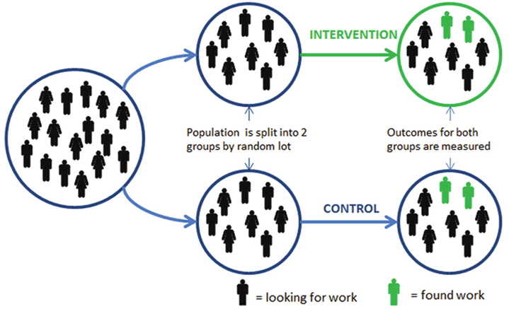
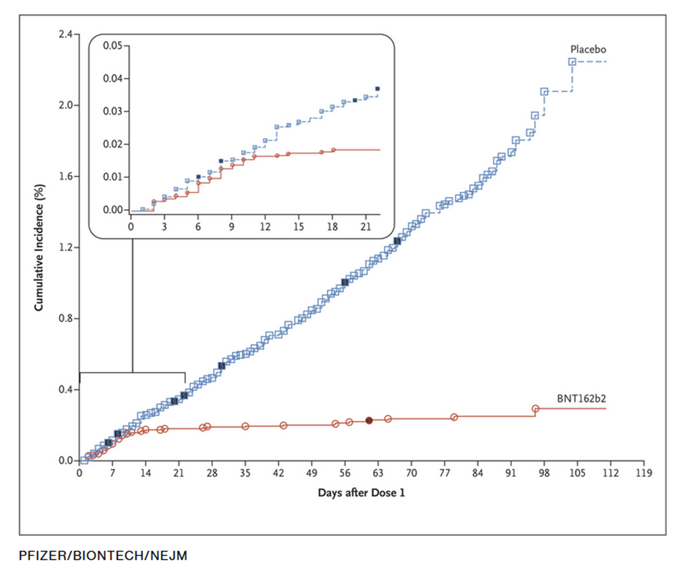
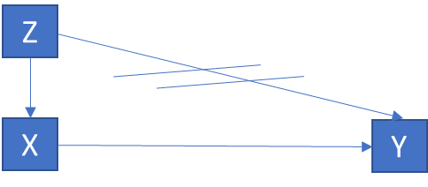

```{=html}
<style type="text/css">
h1 { font-size: 140%; }
h2 { font-size: 130%; }
h3 { font-size: 120%; }
</style>
```

```{r setup, include=FALSE}
knitr::opts_chunk$set(echo = TRUE)
knitr::opts_chunk$set(eval= TRUE)
```

# General information

-   Courses take place from 9.15-12 and from 13.15-16 in room HAL 230

    -   For group work

        -   Thursday 9th: HAL 224a, 225, 226, 228, 229, 131

        -   Friday 10th: HAL 224a, 225, 226, 228, 229, 131

-   [Carefully study the module description](https://moodle.bfh.ch/mod/resource/view.php?id=2243627)

-   [Here you find the group list (group membership, coaching times, time of final presentation)](https://drive.switch.ch/index.php/s/SUuh1Pqy65CJshk)

## Welcome Email

Dear students,

A warm welcome to the module Data skills for social work professionals!

I would like to give you some important information on the course:

1.  Physical presence in the course is not mandatory except for the last day (Jan 17), but I strongly urge you to participate in the course during the first four days. For those who do work part-time: please schedule your work accordingly.

2.  I it is imperative that you have first experiences with R and RStudio and make sure it runs on your computer. Please follow the instructions in the "Installation of R and R-Studio" guide ([SWITCHdrive](https://drive.switch.ch/index.php/s/E6GFHoP2p9jNo2N)), and if necessary, refer to the linked instructions on YouTube. If you have any questions, please feel free to contact us via email. Please use Copilot with the prompt below to guide you through the installation, explain the software to you in easy language and show you what you can do with it.

3.  Enroll on the moodle page (Kurs: Data skills for social work professionals (in English) - HS24 \| BFH Moodle – Die Lernplattform der Berner Fachhochschule) with the following key: HS24-bsc. At least a week before the course you will find a link to the script of the course as well as the relevant literature that you need to prepare and other relevant information. We wish you a successful preparation period and look forward to meeting you in person soon. Please let us know should you have any questions.

Kind regards

Dorian Kessler

------------------------------------------------------------------------

Text to enter into Co-Pilot ein (Microsoft Copilot in Bing; important: verwenden Sie den Unterhaltungsstil «im höheren Masse kreativ/creative mode» (Schaltflaeche in der Mitte des Bildschirms)): Als Studierende(r) der Sozialen Arbeit möchte ich die Grundlagen der Programmiersprache R lernen, um statistische Datenanalysen für Projekte in der Sozialen Arbeit durchführen zu können. Ich habe keine Vorkenntnisse in Statistik oder Programmierung. Kannst du mir bitte eine schrittweise Einführung geben? Bitte beginne mit der Frage ob ich R und Rstudio installiert habe und wenn nein, unterstütze mich bei der Installation von R und RStudio. Zeige mir dann die grundlegenden Befehle und Funktionen von R. Ich würde ich gerne lernen, wie man einfache Datenanalysen durchführt (z.B. Mittelwertsvergleiche mit dplyr), Daten visualisiert (mit ggplot2) und Ergebnisse interpretiert. Folgende Dinge sind zu beachten:

-   Waehle ein schrittweises Vorgehen. Erzaehle mir erst von dem naechsten Schritt, wenn ein Schritt abgeschlossen ist. Frage nach jedem Schritt nach, ob ich diesen erfolgreich abschliessen konnte, um sicherzustellen, dass ich alles richtig gemacht habe.

-   Sage mir als ersten Schritt genau wie ich mich visuell in RStudio orientieren kann und wo ich Eingaben machen muss. Wo befindet sich die Konsole/Skript/Datenübersicht/Dateienübersicht in RStudio?

-   Erklaere mir, was die Konsole ist und was ein R-Skript ist, wie man ein R-Skript erstellt und abspeichert und was der Zweck von Skripten ist. Arbeite mit mir mit einem R-Skript und sage mir, wie ich Befehle ausführen kann.

-   Bitte führe mich durch praktische Übungen und gebe mir Aufgaben, um das Gelernte zu festigen.

-   Biete mir Unterstützung bei Unklarheiten.

-   Arbeite mit Beispielen, welche für die Soziale Arbeit relevant sind. Erfinde relevante Daten aus den Bereichen Sozialhilfe oder Kindes- und Erwachsenenschutz.

-   Kommentiere den Code Zeile-für-Zeile detailliert aus, so dass ich ihn genau verstehe.

-   Biete mir am Schluss weitere Übungen an, falls ich Lust habe. Mache Vorschlaege für Übungen.

-   Du bist eine R-Expert:in, weisst aber auch, dass angehende Sozialarbeiter:in in Sachen Programmierung wenig Wissen haben und das technische Begriffe eine alltagssprachliche Erklaerung benötigen.

-   Danke für deine motivierte Unterstützung und Hilfsbereitschaft als persönliche Tutorin! Du hilfst mir bedarfsgerecht R zu lernen und dieses Wissen für Klient:innen einzusetzen.

-   Wichtige Details:

-   Bitte lasse das «print()» weg, falls nicht nötig.

-   Ergaenze bei Strg jeweils Ctrl, falls gewisse Personen englische Windows Tastaturen haben.

# General Introduction

## Course plan

-   [See module description](https://moodle.bfh.ch/mod/resource/view.php?id=2243627)

## Learning Goals

-   People gain awareness of data science tools and how they could be used for social work.

-   People learn how to critically evaluate data science products.

-   People learn how to do data science with R.

    

## What is data science?

-   Term that emerged ca. 10 years ago. Predecessors: Statistics, Data analysis.

-   The science of creating valuable information from data

-   Practice-oriented science

-   Combines technical and field expertise

## Datafication or why data science is becoming more important in the future

```{r annualdata,echo=FALSE,eval=TRUE}

library(ggplot2)

data <- data.frame(
  Year = 2010:2028,
  DataVolume = c(2, 5, 6.5, 9, 12.5, 15.5, 18, 26, 33, 41, 64, 81, 101, 123, 149, 182, 221, 291, 394),
  Type = c(rep("Actual", 14), rep("Forecast", 5))
)

# Remove NA values
data <- na.omit(data)

# Create the bar plot using ggplot2
ggplot(data, aes(x = factor(Year), y = DataVolume, fill = Type)) +
  geom_bar(stat = "identity", width = 0.7) +
  geom_text(aes(label = DataVolume), vjust = -0.5, size = 3) +
  scale_fill_manual(values = c("Actual" = "#3b82f6", "Forecast" = "#1f2937")) +
  labs(
    title = "Volume of Data/Information Created, Captured, Copied, and Consumed Worldwide\n(2010-2028, in zettabytes)",
    x = "Year",
    y = "Data Volume in Zettabytes",
    fill = "Data Type",
    caption = "Source: https://www.statista.com/statistics/871513/worldwide-data-created/"
  ) +
  theme_minimal() +
  theme(
    axis.text.x = element_text(angle = 45, hjust = 1),
    panel.grid.major.y = element_line(color = "gray90", linetype = "dotted"),
    panel.grid.minor = element_blank()
  )

```

-   [Data is the new oil](https://www.economist.com/leaders/2017/05/06/the-worlds-most-valuable-resource-is-no-longer-oil-but-data).

-   Data contains information on human behavior = **helps us better understand the human world and solve human problems.**

-   In the era of AI, "[data literacy](https://de.wikipedia.org/wiki/Datenkompetenz)" becomes a key skill in all areas of life, including social work –\> it should be a basic competence

    -   Awareness of data and knowing how to use them

    -   Skills to interpret data science products

    -   Skills to analyze data correctly

## How does data science benefit social work?

-   [Use cases in social work](https://drive.switch.ch/index.php/s/r3FcksvmwvSodpY)

## Data sources that are relevant for social work

### Public statistics

-   [BFS - Überblick](https://www.bfs.admin.ch/bfs/de/home/statistiken.html)
-   [Stattab (personalisierte Tabellen)](https://www.pxweb.bfs.admin.ch/pxweb/de/)
-   [Kantonale Datenplattformen](https://data.bs.ch/explore/dataset/100226/table/?disjunctive.publikationsjahr&disjunctive.indikator_name&sort=indikator_label)
-   [Amstat.ch](https://www.amstat.ch)

### Regular social surveys

-   [Swiss household panel](https://www.swissubase.ch/en/catalogue/studies/6097/18255/datasets/932/2358/files/document/19477/11791/physicalFile)
-   [Survey on health, aging and retirement](https://share-eric.eu/)
-   [Survey on income and living conditions](https://www.bfs.admin.ch/bfs/en/home/statistics/economic-social-situation-population/surveys/silc.html)
-   [Swiss Health Survey](https://www.bfs.admin.ch/bfs/de/home/statistiken/gesundheit/erhebungen/sgb.html)
-   [Swiss Mental Health Survey](https://www.obsan.admin.ch/de/publikationen/2023-psychische-gesundheit-erhebung-herbst-2022)
-   [European Social Survey](https://www.europeansocialsurvey.org/)
-   [World Values Survey](https://www.worldvaluessurvey.org/WVSContents.jsp)

### Found data

-   [Data not explicitly generated for research](https://www.bitbybitbook.com/)
-   Always on
-   Numbers, text, images, audio, video
-   Data from
    -   Online activity (digital communication etc.)
    -   Smartphone usage (calling, filming, walking etc.)
    -   Administrative registries
    -   Payments
    -   Smart devices
    -   Video surveillance


-   Publicly owned individual data

-   Can be linked using social security numbers


## Exercise

-   Develop an idea how data science could be used in social work based on the file "[Use cases in social work](https://drive.switch.ch/index.php/s/r3FcksvmwvSodpY)" together with Copilot/ChatGPT
-   Use the following prompt:

*You are a highly experienced data science expert and consultant specializing in applications for social organizations. Your task is to help me design a clear, impactful, and practical example of how data science could be applied in social work, tailored to my specific interests, expertise, and work context. Use the file by Dorian Kessler on potential use cases (ask me to upload it) as a reference and engage with me through targeted questions to fully understand my context before developing the application idea. The goal is to create a solution that is actionable, highly beneficial, and easy to present to colleagues.*

*Conversation Steps:*

***Step 1: Understand the Context***

*Ask me targeted questions to build a clear picture of my work environment and challenges:*

1.  *"Are you currently working in social work? If not, what field or area interests you most?"*

2.  *"Who are the clients or groups you work with, or aim to serve?"*

3.  *"What are the most common tasks or processes in this field?"*

4.  *"What are the most pressing challenges or problems you encounter in this area?"*

5.  *"What data is currently available, or could realistically be collected, to improve workflows or solve these challenges?"*

***Step 2: Suggest Solutions***

*Using the information I provide and the reference material, propose **three realistic examples** where data science could address challenges or improve processes. Each example should:*

-   *Clearly outline the concept and how it works.*

-   *Highlight specific benefits for the field of social work.*

-   *Address the potential feasibility and required resources.*

***Step 3: Get Feedback and Refine***

-   *Ask for feedback: "Do these ideas seem relevant and practical for your field? How could they be adjusted to better fit your needs or constraints?"*

-   *Refine the ideas based on my input, providing more specific or adapted examples if needed.*

-   *Help me select the most promising application to share with my peers, ensuring it’s polished and well-presented.*

*Throughout the process, aim to keep the ideas practical and impactful, while guiding me in envisioning how they could be implemented effectively in the social work domain.*

-   Select the best of the three suggested applications and present it to your group members.
-   Agree on one use case that is most convincing and post it on this [padlet](https://padlet.com/doriank1986/data-skills-2x8f5clm7anao11g). You will then present it in class.

# Measuring the effects of social work

## Why is it important to measure the effects of social work?

Improving practice with better knowledge

-   Understanding whether and how social work interventions and offers reach their goals (evaluation)

    -   Knowing the most effective interventions and offers

    -   Exercise

        -   [What conclusions would you draw from this paper for counseling clients thinking about gender affirmative surgery?](https://pubmed.ncbi.nlm.nih.gov/38699117/)

-   Legitimizing social work

    -   Gaining political support for social work

    -   Example:

        -   [Winterthur](https://www.buerobass.ch/fileadmin/Files/2021/2021_Reduktion_Falllast_Winterthur_Schlussbericht_DE.pdf)

-   Digitalization strongly facilitates measuring the effects of social work

    -   More outcome data (e.g. use of services)

    -   Easier randomization (e.g. changing formulations on a website to see whether it affects service usage)

## What is an effect and what not?

-   Effect = difference in the result with influencing variable versus without influencing variable (= **counterfactual** situation)

-   What is the **counterfactual** situation?

    -   The fictional world in which the influencing variable was not present.

-   Exercise

    -   Talk to the person sitting next to you.
        -   What was the most important event in your life (e.g. family, education, work, health, social relationships)?
        -   What areas of your life have been affected by this event?
        -   What would these areas be like if the event had not happened (in terms of strong facts)?

-   Example of effect measures in social work

[](https://www.nber.org/papers/w30405)

-   Caution: "Wirkungsziele" are often not actual measures of "effects":

    -   [Federal Council guidelines for the labor market integration of persons with protection status S for cantons: 40% should have a job until the end of 2024](https://www.blick.ch/politik/40-prozent-sollen-stelle-haben-der-bundesrat-will-dass-mehr-ukrainerinnen-arbeiten-id19105587.html)
        -   Why does a canton (not) reaching the goal of 40% not say much about the effects of its measures?

## How can we measure the effects of social work with quantitative data?

### Asking experts

-   Asking individuals about the subjectively measured effect

-   Example: "On a scale from 0 to 10, how much does one daily glass of wine affect your health?"

-   Advantages

    -   Easy to measure: one question

    -   Subjective expertise: we know a lot about effects (e.g. pain killers)

-   Disadvantages

    -   We are unaware of the counterfactual

    -   Social desirability bias: we want to please the researcher

### Assessing correlations

-   Is there a systematic relationship between two dimensions?

-   Example: [wine consumption and dementia](https://pubmed.ncbi.nlm.nih.gov/9296132/)

-   Advantages

    -   Easy to measure: few questions
        -   Wine consumption
        -   Dementia symptoms

-   Disadvantages

    -   Often: correlation is not equal to causation
    -   Why do frequent wine drinkers have less dementia?


### Experiments - the gold standard

-   Gold standard: best way to measure effects

-   [Let's run an experiment](https://www.youtube.com/watch?v=hLhXCo2jQkg)

    -   Design

        -   2 (or more) randomly constituted groups

        -   one receives treatment, the other doesn't

        -   2 measurements: before versus after treatment

    [](https://www.researchgate.net/figure/Illustration-of-a-randomised-controlled-trial-RCT-to-test-a-new-back-to-work_fig2_256031307)

    -   Examples:

        -   [A helping hand goes a long way](https://www.nber.org/papers/w30405){.uri}

[](https://www.technologyreview.com/2020/12/10/1013914/pfizer-biontech-vaccine-chart-covid-19/)

-   **Advantages:**

    -   Secure statements on causality

    -   Control over treatment

-   **Disadvantages:**

    -   Ethical problems

    -   High financial and administrative burden

    -   Often limited generalizability

    -   Low variance (often only two manifestations: treatment vs. no treatment)

    -   Social desirability (except in double-blind studies with placebo)

### Natural experiments

-   A random event/dimension (Z) influences independent variable (X) but not the outcome (Y)



-   Examples

    -   [Closing of youth clubs due to cuts in public budget (Z), less beneficial effects of youth clubs (X) and crime rates](https://www.dropbox.com/scl/fi/8euuwc937v67blc7w5k7x/Youth_Centres_CVL.pdf?rlkey=98zwrgouwvlk7c3g2eu5dku10&e=2&st=6nxfy7sx&dl=0) (Y)

    -   [Reduction/Variation in minimum income for asylum seekers (Z), financial stress (X), crime rates (Y)](https://papers.ssrn.com/sol3/papers.cfm?abstract_id=4793907)

    -   [Unemployment insurance reform (Z), financial stress (X) and birth weight](https://journals.plos.org/plosone/article?id=10.1371/journal.pone.0264544) (Y)

    -   [Lockdowns in football stadiums (Z), racist climate (X) and black player performance (Y)](https://www.unil.ch/files/live/sites/de/files/working-papers/21.12.pdf)

-   Advantages:

    -   Statements on causality (!)

    -   Practically relevant

    -   No distortion due to deliberate manipulation

-   **Disadvantages:**

    -   Limited samples: Reproducability?

    -   Randomness hard to prove

### Exercise

-   Form four groups: one for each method to measure effects

-   Imagine this: you want to find out how meetings with social workers affect client well-being

-   Please define a research design according to your method of effect measurement

    -   What data would you analyze?

    -   What numbers would you calculate to measure the effect?

# Kompetenznachweis

-   See [module description](https://moodle.bfh.ch/pluginfile.php/3161090/mod_resource/content/5/MB_Data%20skills%20for%20social%20work%20professionals.pdf?forcedownload=1).

-   You will analyze one of the following (or your own) data sets and research questions

    -   [European Social Survey](https://www.europeansocialsurvey.org/)
        -   Biannual survey in more than 30 countries
        -   [Data](https://drive.switch.ch/index.php/s/vSytsi7wl1H1yf3)
        -   [Variables](https://drive.switch.ch/index.php/s/PvHOlINAPMoTOWN)
        -   Research question: Who are Social Workers? Sociodemographic and Socioeconomic Characteristics of Social Workers and their Well-Being in Europe
    -   [Data from youth centers Burgdorf](https://jugend.burgdorf.ch/jubu/index.php)
        -   [Gender composition before and after introducing mixed-gender youth center](https://drive.switch.ch/index.php/s/LoJjPR0XAVZWFYx)
            -   Research question: What was the effect of switching to a mixed-gender youth center on boys' and girls' attendance?
        -   [Gender and age composition before and after shifting from "Jugendbüro" to "offene Turnhalle"](https://drive.switch.ch/index.php/s/JCaEawuJWM63KyR)
            -   Research question: What was the effect of switching to "offene Turnhalle" on boys' and girls' attendance in different age categories?
    -   [Fokus Arbeit](https://www.biel-bienne.ch/de/fokusarbeit.html/2897)
        -   [Data and Variables](https://drive.switch.ch/index.php/s/eatQbxi4RjEFXKC)
        -   Research question: What was the effect of Fokus Arbeit on individuals vitality, perspectives, mastery, social support and which personal characteristics increased the effect of Fokus Arbeit?
        -   Also see [Regionaljournal](https://www.srf.ch/news/schweiz/hoechste-sozialhilfequote-nach-pilotprojekt-biel-zieht-durchzogene-bilanz) for a deeper understanding of what was done in the project

-   Form: presentation and discussion on final day

# Introduction to R

## General Information about R

-   R is free and open source.

-   R has an array of powerful statistical methods.

-   All additional tools can freely downloaded, installed and loaded as so called packages.

-   With `ggplot2` R allows you to create beautiful figures.

-   With the `tidyverse` and `dplyr`, R has the simplest and most intuitive language for data preparation and analysis.

-   R is more than just statistical software (cf. `shiny`).

-   R is well known by ChatGPT. Disclaimer: we will focus on the most necessary tools for working the data you have.

-   RStudio Environment

    -   Console Window
    -   Source Editor (Syntax window)
    -   File Window, Plot Window
    -   Environment Window, History Window

## Data science workflow from A to Z

```{r Example: Basic workflow, echo=T, eval=F}
# Install required packages if they are not already installed
required_packages <- c("readxl", "dplyr", "tidyr", "ggplot2", "officer", "flextable")
installed_packages <- installed.packages()

for(pkg in required_packages){
  if(!(pkg %in% rownames(installed_packages))){
    install.packages(pkg)
  }
}

# Load the packages
library(readxl)
library(tidyverse)
library(ggplot2)
library(officer)
library(flextable)

# Set the working directory
setwd("C:/Users/kld1/Downloads/")

# 1. Download Excel file
# https://www.pxweb.bfs.admin.ch/pxweb/de/px-x-1304030000_134/-/px-x-1304030000_134.px/table/tableViewLayout2/

url <- "https://www.pxweb.bfs.admin.ch/sq/ecfd5274-e21f-4d26-9bcf-5326af3edc9a"
destfile <- "sozialhilfe.xlsx"

download.file(url, destfile, mode = "wb")

# 2. Read and process data

# Read the Excel sheet (if multiple sheets exist, choose the correct one)
# Assuming the data is in the first sheet
raw_data <- read_excel(destfile, sheet = 1, skip = 2)  # Skip the first 2 rows containing metadata

# Process the data: Select columns, rename, filter rows
data <- raw_data %>%
  select(Kanton='...2', contains("20")) %>%
  filter(Kanton %in% c("Bern / Berne", "Zürich", "Basel-Stadt", "Genève"))

# Transform the data from wide to long format
long_data <- data %>%
  pivot_longer(
    cols = `2010`:`2023`,
    names_to = "Year",
    values_to = "Count"
  ) %>%
  mutate(Year = as.integer(Year),
         Count = as.numeric(Count))

# 3. Create a plot with ggplot2

# Create a nice ggplot graphic
plot <- ggplot(long_data, aes(x = Year, y = Count, color = Kanton)) +
  geom_line(size = 1) +
  theme_minimal() +
  labs(
    title = "Number of Social Assistance Recipients per Canton (2010-2023)",
    x = "Year",
    y = "Number of Recipients",
    color = "Canton"
  ) +
  theme(
    plot.title = element_text(hjust = 0.5, size = 16, face = "bold"),
    axis.text = element_text(size = 10),
    axis.title = element_text(size = 12),
    legend.title = element_text(size = 12),
    legend.text = element_text(size = 10)
  )

# Save the plot as an image to insert into Word
ggsave("sozialhilfe_plot.png", plot = plot, width = 12, height = 8, dpi = 300)

# 4. Insert the plot into a Word document

# Create a new Word document
doc <- read_docx()

# Add a title
doc <- doc %>%
  body_add_par("Number of Social Assistance Recipients per Canton (2009-2022)", style = "heading 1")

# Add the plot
doc <- doc %>%
  body_add_img(src = "sozialhilfe_plot.png", width = 6, height = 4, style = "centered")

# Optional: Add a table with the data
# Create an example table (here the first 10 rows)
table_data <- long_data %>%
  filter(Kanton %in% c("Bern / Berne", "Zürich", "Basel-Stadt", "Genève"))  

ft <- flextable(table_data) %>%
  # Automatically adjust column widths to fit content
  autofit() %>%
  # Set table width to 100% of the document width
  width(j = 1:3, width = 1.5) %>%  # Adjust individual column widths if necessary
  set_table_properties(width = 1, layout = "autofit") %>%
  # Optional: Enhance table aesthetics
  theme_box() %>%
  fontsize(size = 10, part = "all") %>%
  bold(part = "header")  # Bold the header row

# Add the table
doc <- doc %>%
  body_add_par("Example Table of the Data", style = "heading 2") %>%
  body_add_flextable(ft)

# Save the Word document
print(doc, target = "Social_Assistance_Report.docx")

```

## AI coding assistants

-   ChatGPT and other frontier Large Language Models know R pretty well (Copilot also works, but the [newest models](https://huggingface.co/spaces/lmarena-ai/chatbot-arena-leaderboard) are more able)

-   After you ask a question, tell ChatGPT how your data look like.

-   If you have no sensitive data, just paste the data in to show ChatGPT the structure. If you have sensitive data, just paste the header (= variable names). With Copilot, data protection issues are smaller.

-   Paste the resulting code back into the R-Script and run the code

-   If you have errors, paste the error (from the console) back into ChatGPT and tell it to solve the problem.

-   Tell ChatGPT to only give you relevant code, if you adapt parts your overall code.

-   If it doesn't comment code, ask to comment and explain what each piece of code does.

-   [Example: transforming the above code into an interactive app with one prompt.](https://chatgpt.com/c/6745d657-4c0c-8006-9382-0912ad62d4cb)

### Exercise: throwing you in at the deep end

-   Open a new R script, copy the above code into it and save it

-   Copy the code above into [ChatGPT](https://chatgpt.com/) or [Copilot](https://copilot.cloud.microsoft/?fromcode=cmc&redirectid=EA5A38658CDC4AD29387F73CD32353C6&auth=2)

-   Ask it to assist you while giving helpful and targeted advice, i.e. that it should tell you how to change the code. Try the following tasks:

    -   Exercise 1: Add Luzern and Waadt to the plot and table
    -   Exercise 2: Make the plot more beautiful by adding dots to the lines and by making sure every year is displayed on the x-Axis
    -   Exercise 3: Develop a bar chart that displays the number of social assistance recipients for each canton for the year 2022 ordered by number of recipients. Ensure the chart includes appropriate titles and axis labels. Also ask it to label the bars with the values (with vertical alignment). Save the bar chart as a PNG file.

## Reading in data

-   R allows you to read in data in all formats, including directly from the internet (see package `rvest`).

-   The most common data storage format are Excel tables. You can open them with the `readxl` package.

-   The most universal data storage format is csv (comma separated values).

-   The best way to deal with large data are the `data.table` (to read in large csv-data-files) and the `arrow` packages (to save and read in large data).

```{r readindata,eval=FALSE,echo=TRUE}

#Set the working directory. Here we use the download folder

setwd("C:/Users/kld1/Downloads/")

#Download data to the folder by hand

#Büro: https://drive.switch.ch/index.php/s/gdNYHopxWDCV9hr
#Turnhalle: https://drive.switch.ch/index.php/s/am1T36ehPL24QuQ

#Install and load excel package
install.packages("readxl")
library(readxl)

#Read in data from the working directory

Buero <- read_excel("OJAOffice_Statistikdaten_Jugendbüro Oberburg 23.xlsx",sheet="Statistikdaten 2024")
Turnhalle<- read_excel("OJAOffice_Statistikdaten_offene Turnhalle 24.xlsx",sheet="Statistikdaten 2024")

#Explain objects, observations and variables
#Explain range und col_names = FALSE

```

### Looking at data

-   RStudio allows you to manually scroll through data

-   This helps you better understand what is going on

```{r lookingatdata,eval=FALSE,echo=TRUE}
#Explain what rows (observations) and columns (variables) are.
#You can either click on the object or...

#use View()
View(Buero)
View(Turnhalle)

#Or even fix data (never do this!)
fix(Buero)

```

### Exercise: reading in data and looking at it

1.  Goal: read in data necessary for measuring the change of gender composition after introduction of mixed gender youth club in Summer 2023 ([Data](https://drive.switch.ch/index.php/s/LoJjPR0XAVZWFYx)).
2.  For each file, what are the column names under which you find information on the date of the attendance, the number of attendees and the age and gender composition of the attendees?

```{r tabelledaten, echo=FALSE, results='asis'}
library(knitr)
data <- data.frame(
  `Object name data should be saved with` = c("Maedels_22", "Maedels_23", "Jungs_22", "Jungs_23", "JuBu_23", "JuBu_24"),
  Year = c(2022, 2023, 2022, 2023, 2023, 2024),
  `Sheet to Read and Additional Restrictions` = c(
    "Statistikdaten 2024", 
    "Moditraeff", 
    "Gieletraeff", 
    "Gieletraeff, range=\"A11:B11\", col_names=FALSE", 
    "JuBU Traeff 5&6", 
    "Statistikdaten 2024"
  ),
  `File` = c(
    "OJAOffice_Statistikdaten_Moditrff.xlsx", 
    "Statistik OJA Angebote Burgdorf 2023.xlsx", 
    "OJAOffice_Statistikdaten_Gieltrff.xlsx", 
    "Statistik OJA Angebote Burgdorf 2023.xlsx", 
    "Statistik OJA Angebote Burgdorf 2023.xlsx", 
    "Copy of OJAOffice_Statistikdaten_Mittelstufentreff 24.xlsx"
  )
)
kable(data, format = "markdown", align = "c")
```

### Solution: reading in data and looking at it

```{r solutionreadin,echo=FALSE,eval=FALSE}

#data: https://drive.switch.ch/index.php/s/LoJjPR0XAVZWFYx


Maedels_22 <- read_excel("OJAOffice_Statistikdaten_Moditrff.xlsx")
Maedels_23 <- read_excel("Statistik OJA Angebote Burgdorf 2023.xlsx",sheet = "Moditraeff")
Jungs_22 <- read_excel("OJAOffice_Statistikdaten_Gieltrff.xlsx")
Jungs_23 <- read_excel("Statistik OJA Angebote Burgdorf 2023.xlsx",sheet = "Gielaetraeff",
                       range = "A1:B11",#Welche Daten aus dem Excel brauchen wir; Spalte A, Zeile 1 is Spalte B Zeile 11
                       col_names = FALSE)#die erste Zeile enthaelt nicht die Spaltennamen sondern Messwerte
JuBu_23 <- read_excel("Statistik OJA Angebote Burgdorf 2023.xlsx",sheet = "JuBU Traeff 5&6")
JuBu_24 <- read_excel("Copy of OJAOffice_Statistikdaten_Mittelstufentreff 24.xlsx",sheet = "Statistikdaten 2024")


View(Maedels_22)


```

## Simple data manipulation with dplyr

### General

-   package [dplyr](http://blog.rstudio.org/2014/01/17/introducing-dplyr/) by [Hadley Wickham](https://twitter.com/hadleywickham)/[Romain Francois](https://twitter.com/romain_francois) offers a toolset for data preparation
-   See [the dplyr vignette](http://cran.rstudio.com/web/packages/dplyr/vignettes/introduction.html) and the [Data Wrangling Cheat Sheet](http://www.rstudio.com/resources/cheatsheets/) for a very good overview
-   `filter()`: selects a subset of rows (see also `slice()`).
    -   Use logical operators to set the filter condition:
        -   bigger than: `>`
        -   smaller than: `<`
        -   equals: `==`
        -   not equal to: `!=`
        -   not: `!`
        -   or: `|`
        -   is element of: `%in%`
        -   is missing: `is.na(x)`
        -   is infinite: `is.inf()`
-   `select()`: selects columns
-   `mutate()`: creates new columns
-   `group_by()`: defines subgroups in the data so that `mutate()` and `summarize()` can be applied separately per group.
-   `summarize()`: aggregates (collapses) data to individual data points
-   `arrange()`: sorts
-   `distinct()`: removes duplicate values
-   dplyr can be used very well together with so-called piping, i.e. the data object is passed from function to function by `%>%`, which makes the code much easier to read and more compact.

### Example: Package dplyr

```{r Example: Package dplyr2,eval=FALSE}
#install package

#install.packages("dplyr")

#load package
library(dplyr)
#https://drive.switch.ch/index.php/s/eatQbxi4RjEFXKC

setwd("C:/Users/kld1/switchdrive/BFH/Wichtige Dokumente/Lehre/Data skills for social work professionals/BFH/Daten/Fokus Arbeit/")
focarb <- read.csv("FokusArbeit_Wirkung.csv")

#Select: select the variables Vitality1 (=measurement of vitality before the intervention), Vitality2 (=measurement of vitality before the intervention) and intervention (did the person participate in Fokus Arbeit or recieve standard counseling)
focarb <- focarb %>%
  select(Vitality1,Vitality2,Interventionsgruppe)%>%
#Filter: out observations that have a missing value (NA = not available) on the measurement before the intervention. 
  filter(!is.na(Vitality1))%>%
#Mutate: calculate a new variable that measures the change in vitality before versus after
  mutate(Change_Vitality=Vitality2-Vitality1)

```

### Exercise: simple data manipulation with dplyr

-   Goal: find out the share of social workers among the working population in Europe and in Switzerland.

-   Read in [data from the European Social Survey](https://drive.switch.ch/index.php/s/vSytsi7wl1H1yf3) with the following steps:

    -   Use the password to download the data

    -   Relocate the working directory (using `setwd()`) to your download folder or move the data to your working directory

    -   Make sure you have the `arrow` package installed (otherwise use `install.packages("arrow")`).

    -   Read in the data with the `read_parquet()` command.

    -   Save it into the object `ess`.

-   Find out which variables measure the country of origin and the occupation of the respondent using the variable list. Hint 1: start searching from the top. Hint 2: Occuption is measured with the ISCO08 classification. For earlier years, it is the ISCO88 classification, but the data is reduced to years with the isco08 classification (after 2010). Use the [variable list](https://drive.switch.ch/index.php/s/PvHOlINAPMoTOWN) to find the exact variable names and labels.

-   Reduce the data frame to those two variables: country, ISCO08.

-   Filter out observations of individuals where information on ISCO08 is missing. The following values should be excluded:

    |       |                  |
    |-------|------------------|
    | 66666 | Not applicable\* |
    | 77777 | Refusal\*        |
    | 88888 | Don't know\*     |
    | 99999 | No answer\*      |

-   Create a new variable `socialworker` that measures whether someone is a social worker or not (click on the variable to know which numbers stand for social workers). Use the `ifelse(isco==NUMBERFORSOCIALWORKERS,"Yes","No")` function to define the variable.

-   Check the number of individuals (i.e. rows) in the total data frame using `nrow(data.frame)`. Store it into an object. Filter out individuals that are social workers and check number of individuals again. What is the proportion of social workers in Europe? And in Switzerland?

### Solution: simple data manipulation with dplyr

```{r solution dplyr, echo=FALSE,eval=FALSE}
library(arrow)
library(dplyr)
#Set working directory to your download folder
setwd("C:/Users/kld1/switchdrive/BFH/Wichtige Dokumente/Lehre/Data skills for social work professionals/BFH/Daten/European Social Survey/")
#https://drive.switch.ch/index.php/s/vSytsi7wl1H1yf3
#Load in data
ess <- read_parquet("ESS.parquet")

#Select variables with information on country and occupation

ess <- ess%>%
  select(cntry,isco08)

#Filter out people with no information on job

ess <- ess%>%
  filter(isco08<10000)

#Is someone a social worker
ess <- ess %>%
  mutate(socialworker= ifelse(isco08 == 2635, "Yes","No"))

total<-nrow(ess)

socialworkers<-nrow(ess%>%filter(socialworker=="Yes"))

socialworkers/total

total.CH<-nrow(ess%>%filter(cntry=="CH"))

socialworkers.CH<-nrow(ess%>%filter(socialworker=="Yes"&cntry=="CH"))

socialworkers.CH/total.CH

```

## Binding and merging data

-   R allows for easy combinations of multiple data frames

-   There are two ways to combine data:

    -   Just glue them together using `rbind(dataframe1,dataframe2)` and `cbind(dataframe1,dataframe2)`

        -   `rbind`: bind together rows when columns are the same in the two data frames

        -   `cbind`: bind together columns when rows are the same in the two data frames

    -   Row-wise linkage using an identifier variable with `merge(dataframe1,dataframe2, identifier variable)`.

        -   Useful when data are not sorted in the same order or when some rows in data frame 1 are not present in data frame 2.

```{r binding,echo=TRUE,eval=FALSE}
library(arrow)
library(dplyr)
#data: https://drive.switch.ch/index.php/s/vSytsi7wl1H1yf3
setwd("C:/Users/kld1/switchdrive/BFH/Wichtige Dokumente/Lehre/Data skills for social work professionals/BFH/Daten/European Social Survey/")

#Load in data
ess <- read_parquet("ESS.parquet")

#Rbind
Swiss<-ess%>%
  filter(cntry=="CH")

Germans<-ess%>%
  filter(cntry=="DE")

Austrians<-ess%>%
  filter(cntry=="AT")

DACH<-rbind(Swiss,Germans,Austrians)

#Cbind and merge

#Data frame 1
ess1 <- ess%>%
  filter(essround==11)%>%
  select(idno,isco08)

ess2 <- ess%>%
  filter(essround==11)%>%
  select(idno,happy)

ess3 <- cbind(ess1,ess2)

ess2b <-ess%>%
  filter(essround==11)%>%
  select(idno,happy)%>%
  arrange(happy)

ess4 <- merge(ess1,ess2b,by="idno")
```

### Exercise: binding data

-   Read in the data sets from Jugendarbeit Burgdorf and Oberdorf (Data Oberdorf: [Büro](https://drive.switch.ch/index.php/s/gdNYHopxWDCV9hr){.uri}, [Turnhalle](https://drive.switch.ch/index.php/s/am1T36ehPL24QuQ){.uri}; Data Burgdorf: see [here](https://drive.switch.ch/index.php/s/LoJjPR0XAVZWFYx)).

-   Create a `gesamttabelle_oberdorf` including the two data frames from Oberdorf and a `gesamttabelle_burgdorf` including the five data frames from Burgdorf. Create and select three variables: `Datum` (from `'Erfasst am'` ), Anzahl, and Gruppe (from `'Statistikfeld'`).

-   Check the data sets and bind them together with the correct command.

### Solution: binding data

```{r bindingsolution,echo=FALSE,eval=FALSE}

setwd("C:/Users/kld1/switchdrive/BFH/Wichtige Dokumente/Lehre/Data skills for social work professionals/BFH/Daten/Burgdorf/Turnhalle/")

library(readxl)
Buero <- read_excel("OJAOffice_Statistikdaten_Jugendbüro Oberburg 23.xlsx",sheet="Statistikdaten 2024")

Turnhalle<- read_excel("OJAOffice_Statistikdaten_offene Turnhalle 24.xlsx",sheet="Statistikdaten 2024")

gesamttabelle_oberdorf <- rbind(Buero,Turnhalle)%>%
  select(Datum="Erfasst am",Anzahl, Gruppe=Statistikfeld)

setwd("C:/Users/kld1/switchdrive/BFH/Wichtige Dokumente/Lehre/Data skills for social work professionals/BFH/Daten/Burgdorf/Zusammenlegung/")


Maedels_22 <- read_excel("OJAOffice_Statistikdaten_Moditrff.xlsx")
Maedels_23 <- read_excel("Statistik OJA Angebote Burgdorf 2023.xlsx",sheet = "Moditraeff")
Jungs_22 <- read_excel("OJAOffice_Statistikdaten_Gieltrff.xlsx")
Jungs_23 <- read_excel("Statistik OJA Angebote Burgdorf 2023.xlsx",sheet = "Gielaetraeff",
                       range = "A1:B11",#Welche Daten aus dem Excel brauchen wir; Spalte A, Zeile 1 is Spalte B Zeile 11
                       col_names = FALSE)#die erste Zeile enthaelt nicht die Spaltennamen sondern Messwerte
JuBu_23 <- read_excel("Statistik OJA Angebote Burgdorf 2023.xlsx",sheet = "JuBU Traeff 5&6")
JuBu_24 <- read_excel("Copy of OJAOffice_Statistikdaten_Mittelstufentreff 24.xlsx",sheet = "Statistikdaten 2024")


gesamttabelle_burgdorf <- rbind(Maedels_22 %>%
  select(Datum='Erfasst am', Anzahl, Gruppe=Statistikfeld),
 Maedels_23 %>%
  select(Datum='Erfasst am', Anzahl, Gruppe=Statistikfeld),
Jungs_22 %>%
  select(Datum='Erfasst am', Anzahl, Gruppe=Statistikfeld),
Jungs_23 %>%
  select(Datum=...1, Anzahl=...2)%>%
  mutate(Gruppe="Jungs")%>%select(Datum, Anzahl, Gruppe),
JuBu_23 %>%
  select(Datum='Erfasst am', Anzahl, Gruppe=Statistikfeld),
JuBu_24 %>%
  select(Datum='Erfasst am', Anzahl, Gruppe=Statistikfeld))

```

## Dealing with special data formats

### Dealing with text: regular expressions

-   The two most frequently used operations with text variables are searching for text patterns within cells (`grepl`) and replacing text-parts from a cell (`gsub`).

    -   Regular expressions enable "wildcards" and other elements to define a search pattern.

    -   A selection of metacharacters:

        -   Wildcards
            -   `.`: matches any character.
            -   `[a-z]`: lowercase `a` to `z`.
            -   `[A-Z]`: uppercase `A` to `Z`.
            -   `[a-zA-Z]`: lowercase `a` to `z` and uppercase `A` to `Z`.
            -   `[0-9]`: digits.
        -   Quantifiers
            -   `*`: matches at least 0 times.
            -   `+`: matches at least 1 time.
            -   `?`: matches at most 1 time.
            -   `{n}`: matches exactly `n` times.
            -   `{n,}`: matches at least `n` times.
            -   `{n,m}`: matches between `n` and `m` times.
        -   Position
            -   `^`: matches at the beginning of the string.
            -   `$`: matches at the end of the string.
        -   Extracting specific parts
            -   `()`
        -   There are many more metacharacters, see for example: <https://stat.ethz.ch/R-manual/R-devel/library/base/html/regex.html>

    -   Use ChatGPT for creating regular expressions. E.g. give me a regular expression that is true when the 3rd last character is a an "a".

```{r regularexpression,echo=TRUE,eval=FALSE}
#https://drive.switch.ch/index.php/s/LoJjPR0XAVZWFYx

library(dplyr)
library(readxl)
setwd("C:/Users/kld1/switchdrive/BFH/Wichtige Dokumente/Lehre/Data skills for social work professionals/BFH/Daten/Burgdorf/Zusammenlegung/")


Maedels_22 <- read_excel("OJAOffice_Statistikdaten_Moditrff.xlsx")
Maedels_23 <- read_excel("Statistik OJA Angebote Burgdorf 2023.xlsx",sheet = "Moditraeff")
Jungs_22 <- read_excel("OJAOffice_Statistikdaten_Gieltrff.xlsx")
Jungs_23 <- read_excel("Statistik OJA Angebote Burgdorf 2023.xlsx",sheet = "Gielaetraeff",
                       range = "A1:B11",#Welche Daten aus dem Excel brauchen wir; Spalte A, Zeile 1 is Spalte B Zeile 11
                       col_names = FALSE)#die erste Zeile enthaelt nicht die Spaltennamen sondern Messwerte
JuBu_23 <- read_excel("Statistik OJA Angebote Burgdorf 2023.xlsx",sheet = "JuBU Traeff 5&6")
JuBu_24 <- read_excel("Copy of OJAOffice_Statistikdaten_Mittelstufentreff 24.xlsx",sheet = "Statistikdaten 2024")


gesamttabelle_burgdorf <- rbind(Maedels_22 %>%
  select(Datum='Erfasst am', Anzahl, Gruppe=Statistikfeld),
 Maedels_23 %>%
  select(Datum='Erfasst am', Anzahl, Gruppe=Statistikfeld),
Jungs_22 %>%
  select(Datum='Erfasst am', Anzahl, Gruppe=Statistikfeld),
Jungs_23 %>%
  select(Datum=...1, Anzahl=...2)%>%
  mutate(Gruppe="Jungs")%>%select(Datum, Anzahl, Gruppe),
JuBu_23 %>%
  select(Datum='Erfasst am', Anzahl, Gruppe=Statistikfeld),
JuBu_24 %>%
  select(Datum='Erfasst am', Anzahl, Gruppe=Statistikfeld))

gesamttabelle_burgdorf <-gesamttabelle_burgdorf%>%
  mutate(Geschlecht=ifelse(grepl("Mädels",Gruppe, useBytes = TRUE),"Girls","Boys"))%>%#useBytes needed because of ä
  mutate(Geschlecht2=gsub("[0-9]+-[0-9]+","",Statistikfeld))


```

-   ChatGPT can also be used to convert text into numeric data. *Not only to extract physical information*, but also to extract *meaning* between the lines.

    -   Example: Please give me a number from 0 to 10 how happy these statements are c("Bähhh","Juhuu","Näää", "Yes!"). Make R Code to store it into a vector.

### Dates and times

-   R handles dates and times using the POSIX standard, widely used in computing.

-   Dates are stored as numeric values, representing the number of days since the "epoch" (January 1, 1970).

    -   For example, **`as.Date("1970-01-02")`** equals `1`, as it is one day after the epoch.

-   When times are included, R uses seconds since the epoch.

    -   For example, **`as.POSIXct("1970-01-01 00:01:00")`** equals `60`, representing 60 seconds after the epoch.

-   **This system allows for efficient calculations, such as finding time differences, sorting dates and times or extracting simpler representations of time.**

-   To transform character strings into date or POSIX formats, use the following:

    -   **`as.Date()`** with a specified format, such as **`as.Date("04.12.2024", format = "%d.%m.%Y")`** for European-style dates.

    -   **`as.POSIXct()`** for date-times, e.g., **`as.POSIXct("04-12-2024 14:30", format = "%d-%m-%Y %H:%M")`**.

-   Format strings are key to parsing correctly:

    -   **`%Y`**: 4-digit year, **`%m`**: month, **`%d`**: day.

    -   **`%H`**: hour (24-hour format), **`%M`**: minute, **`%S`**: second.

-   To extract only parts of a date or time, use the **`format()`** function.

    -   For example, to reduce `"2022-04-01 15:21:03"` to `"2022-04-01"`, you can use:

        ```{r dates and times, eval=FALSE,echo=TRUE}
        datetime <- as.Date("2022-04-01")
        format(datetime, "%Y-%m-%d")
        format(datetime, "%Y-%m")
        format(datetime, "%Y")

        ```

    -   **`as.POSIXct()`** / `as.Date()` converts the character string into a date-time/date object, and **`format()`** extracts the desired components using format codes.

### Exercise text, dates and times

-   Load in the data of Oberdorf ([Büro](https://drive.switch.ch/index.php/s/gdNYHopxWDCV9hr){.uri}, [Turnhalle](https://drive.switch.ch/index.php/s/am1T36ehPL24QuQ){.uri}) and bind them together.

-   Create a variable `age_group` from the variable `Statistikfeld`. Use either `gsub()` or `grepl()` to extract the relevant information.

-   Create a variable `months_since_jan24` from the variable `'Erfasst am'` that indicates the number of months between the current date and the introduction of the Turnhalle offer. Do it with the following steps:

    -   Define the reference date in `as.POSIXct()` format and store it into an object (see example above).

    -   Rename the variable `'Erfasst am'` into a new one called `erfassungsdatum`. It is possible to work with variables that have a space, but unhandy (you always have to use back ticks).

    -   Calculate the difference with the following formula:

        `(as.numeric(format(erfassungsdatum, "%Y")) - as.numeric(format(reference_date, "%Y"))) * 12 +(as.numeric(format(erfassungsdatum, "%m")) - as.numeric(format(reference_date, "%m"))`

### Solution text, dates and times

```{r solutiontextdates,echo=FALSE,eval=FALSE}
#Download data to the folder by hand

#Büro: https://drive.switch.ch/index.php/s/gdNYHopxWDCV9hr
#Turnhalle: https://drive.switch.ch/index.php/s/am1T36ehPL24QuQ

#Load packages

library(readxl)
library(dplyr)

#Read in data

setwd("C:/Users/kld1/switchdrive/BFH/Wichtige Dokumente/Lehre/Data skills for social work professionals/BFH/Daten/Burgdorf/Turnhalle/")

Buero <- read_excel("OJAOffice_Statistikdaten_Jugendbüro Oberburg 23.xlsx",sheet="Statistikdaten 2024")
Turnhalle<- read_excel("OJAOffice_Statistikdaten_offene Turnhalle 24.xlsx",sheet="Statistikdaten 2024")

#Bind together
gesamttabelle <- rbind(Buero,Turnhalle)

#Create variable age_group

gesamttabelle <- gesamttabelle %>%
  mutate(age_group = gsub("^(Jungs|Mädels) ", "", Statistikfeld))


#Create a variable months_since_jan24

# Reference date
reference_date <- as.Date("2024-01-01")

# Calculate months difference
gesamttabelle <- gesamttabelle %>%
  mutate(erfassungsdatum=`Erfasst am`)%>%
  mutate(
    months_since_jan_2024 = (as.numeric(format(erfassungsdatum, "%Y")) - 
                               as.numeric(format(reference_date, "%Y"))) * 12 +
      (as.numeric(format(erfassungsdatum, "%m")) - as.numeric(format(reference_date, "%m"))
         )
  )

library(ggplot2)
gesamttabelle%>%
  group_by(months_since_jan_2024)%>%
  summarise(meanAnzahl=mean(Anzahl))%>%
  ggplot(.,aes(x=months_since_jan_2024,y=meanAnzahl))+
  geom_bar(stat="identity",position = "dodge")


```

## Summarizing data: describing normality and diversity of single characteristics (univariate statistics)

### Summarizing variables: frequency of categories

-   Use **`count(x)`** to count how often each value occurs in your variable. Such frequency tables are the most universal strategy to summarize your data. It is applicable to all data types (remember from [introduction to quantitative social research](https://de.wikipedia.org/wiki/Skalenniveau): nominal, ordinal, numeric).

```{r table,echo=TRUE,eval=FALSE}

#With real data
library(arrow)
library(dplyr)
setwd("C:/Users/kld1/switchdrive/BFH/Wichtige Dokumente/Lehre/Data skills for social work professionals/BFH/Daten/European Social Survey/")

#data: https://drive.switch.ch/index.php/s/vSytsi7wl1H1yf3

#Load in data
ess <- read_parquet("ESS.parquet")

ess%>%
  count(cntry)

#Add percentages
ess%>%
    count(cntry)%>%
    mutate(Percentages=n/sum(n)*100)#show round
```

### Summarizing variables into one number: mean and variance

-   Data can be summarized using the `summarise()` function.

-   If numeric, single variables can be described with a single number, so called distributional parameters.

-   Distributional parameters allow to quantify the central tendency of a single variable

    -   Calculate the mean using `mean(x)` to find the central tendency, or simply the "average" value. The median - a sometimes better measure for the central tendency of data - is calculated using `median(x)`.

-   Distributional parameters allow to quantify the variability of a single variable

    -   Use the minimum `min(x)` and maximum `max(x)` to measure the range of data.

    -   Use the **standard deviation** with `sd(x)` to measure how much the data varies from the mean.

```{r distrparam,echo=TRUE,eval=FALSE}

library(arrow)
setwd("C:/Users/kld1/switchdrive/BFH/Wichtige Dokumente/Lehre/Data skills for social work professionals/BFH/Daten/European Social Survey/")

#data: https://drive.switch.ch/index.php/s/vSytsi7wl1H1yf3

#Load in data
ess <- read_parquet("ESS.parquet")

ess%>%summarise(Average_Happiness=mean(happy),
                Minimum_Happiness=min(happy),
                Maximum_Happiness=max(happy),
                SD_Happiness=sd(happy))
```

### Exercise: summarizing single variables

-   Read in data of [Fokus Arbeit](#https://drive.switch.ch/index.php/s/eatQbxi4RjEFXKC).

-   Remove observations from the control group and missing values (definition control group: `Interventionsgruppe == 0`).

-   What percentage of participants are women? What percentage are long-term recipients (more than 12 months of receipt?

-   Calculate mean and standard deviation for both the measurements before and after the intervention for vitality (`Vitality`), social support (`Sozial)`. Measurements before the intervention end with a 1, measurements after the intervention end with a 2. Bind the data together into one large data.frame. Hint for more efficient code: ask ChatGPT to write the code with the `across` function. This allows you perform the same functions (pre-defined functions such as `mean()`, but also own functions) on multiple variables.

-   Which aspects changed the most? Which distributional parameters changed most? Do you observe changes in variability of measurements?

### Solution: summarizing single variables

```{r solutionsummary,eval=FALSE,echo=FALSE}
#load package
library(dplyr)

#load data: #https://drive.switch.ch/index.php/s/eatQbxi4RjEFXKC
setwd("C:/Users/kld1/switchdrive/BFH/Wichtige Dokumente/Lehre/Data skills for social work professionals/BFH/Daten/Fokus Arbeit/")

focarb <- read.csv("FokusArbeit_Wirkung.csv")

focarb%>%count(Weiblich)

focarb%>%
  mutate(Langzeit=Bezugsdauer>12)%>%#Definition of long-term recipients
  count(Langzeit)%>%#Frequencies
  mutate(Prop=round(n/sum(n)*100)) #Percentages

#By hand
table<-focarb%>%
  filter(Interventionsgruppe==1, !is.na(Vitality1)) %>%
  summarise(Average_Happiness=mean(Vitality1),
                SD_Happiness=sd(Vitality1),
                Average_Happiness2=mean(Vitality2),
                SD_Happiness2=sd(Vitality2))
#More efficient
table<-focarb %>%
  filter(Interventionsgruppe == 1, !is.na(Vitality1)) %>%
  summarise(
    across(
      c(Vitality1, Vitality2, Sozial1, Sozial2),
      list(
        Average = mean,
        SD = sd
      ),
      .names = "{.col}_{.fn}"
    )
  )

```

## Analyzing associations (bivariate statistics)

### Grouped means

-   Grouped means tables are a universal and straightforward method for analyzing associations. They display the mean value of the [dependent variable](https://en.wikipedia.org/wiki/Dependent_and_independent_variables) by categories of the independent variable.

-   The dependent variable can either be continuous or have two categories coded as 0 and 1. In the latter case, it displays the proportion of the individuals with a 1 by category of the independent variable. Multiply times 100 and you have percentages.

-   The independent variable has at least two categories.

-   Grouped means tables are universally applicable to all types of data since all variable types can be coded into this format.

-   It is calculated using the `group_by(independent_variable)` command before `summarise(name=mean(dependent_variable).`

```{r groupedmean, echo=TRUE,eval=FALSE}

library(arrow)
library(dplyr)
#Set working directory to your download folder
setwd("C:/Users/kld1/switchdrive/BFH/Wichtige Dokumente/Lehre/Data skills for social work professionals/BFH/Daten/European Social Survey/")
#https://drive.switch.ch/index.php/s/vSytsi7wl1H1yf3
#Load in data
ess <- read_parquet("ESS.parquet")

#Select variables with information on country and occupation

ess <- ess%>%
  select(cntry,isco08)

#Filter out people with no information on job

ess <- ess%>%
  filter(isco08<10000)

#Is someone a social worker
ess <- ess %>%
  mutate(socialworker= as.numeric(isco08 == 2635))

#Add on: What is the country with the highest share of social workers?

ranking<-ess%>%
  group_by(cntry)%>%
  summarise(sharesw=mean(socialworker=="Social Worker"))%>%
  arrange(sharesw)
```

#### Exercise: grouped means

1.  Read in the data from Jugendarbeit Oberdorf ([Büro](https://drive.switch.ch/index.php/s/gdNYHopxWDCV9hr){.uri}, [Turnhalle](https://drive.switch.ch/index.php/s/am1T36ehPL24QuQ){.uri}).
2.  Create the `gesamttabelle` and add a variable before versus after January 2024.
3.  Summarize the `Anzahl` data into one row per date. We want to have data on the total number of visitors per day. Use `group_by(erfassungsdatum)%>%summarise(Totalvisits=sum(Anzahl)`.
4.  Create a grouped mean table on whether numbers were, on average, higher before versus after January 2024. Was it higher or lower after the "Jugendbüro" was replaced by the "Turnhalle"?

#### Solution: grouped means

```{r excercise grouped mean, echo=FALSE,eval=FALSE}

library(readxl)
library(dplyr)
#https://drive.switch.ch/index.php/s/gdNYHopxWDCV9hr
#https://drive.switch.ch/index.php/s/am1T36ehPL24QuQ
#Read in data

setwd("C:/Users/kld1/switchdrive/BFH/Wichtige Dokumente/Lehre/Data skills for social work professionals/BFH/Daten/Burgdorf/Turnhalle/")

Buero <- read_excel("OJAOffice_Statistikdaten_Jugendbüro Oberburg 23.xlsx",sheet="Statistikdaten 2024")
Turnhalle<- read_excel("OJAOffice_Statistikdaten_offene Turnhalle 24.xlsx",sheet="Statistikdaten 2024")

#Bind together
gesamttabelle <- rbind(Buero,Turnhalle)%>%
  mutate(erfassungsdatum=`Erfasst am`,
         after=erfassungsdatum>as.Date("2024-01-01"))%>%
  group_by(erfassungsdatum)%>%
  summarise(Totalvisits=sum(Anzahl))

#Grouped mean
gesamttabelle%>%
  group_by(after)%>%
  summarise(mean(Totalvisits))
```

### Controlled differences: OLS

-   There might be situations where we not only want to know whether there is a difference between two groups but were we

    -   A. want to explore the reasons for differences or

    -   B. want to see whether the differences hold while accounting for third variables.

-   Examples:

    -   We want to know whether women earn less than men irrespective of the types of jobs they have.

    -   We not only want to know whether social workers are happier with their lives compared to health care workers but also whether this is due to differences in the number of work hours.

-   In this case, linear regression or **Ordinary Least Squares** (usually called OLS) is the tool of choice. It can be used in the situation where the dependent variable is continuous or has two categories (e.g. 0 for "Not poor" and 1 for "Poor"), and for all types of independent variables.

-   The command looks the following: `lm(dependent_variable ~ independent_variable + third_variable, name_of_dataframe)`.

    -   Usually you would store the output of the model calculations into an object, e.g. like this `model<-lm(dependent_variable ~ independent_variable + third_variable, name_of_dataframe)`

    -   Then you get the most relevant results nicely presented using `huxreg(model)` from the `huxtable` package.

    -   Relevant for the interpretation are the coefficients (number without brackets) and the test of the statistical significance (stars). You will get two types of coefficients:

        -   Coefficients for *continuous* independent variables. They tell you how much the dependent variable increases for each unit increase of the independent variable.

        -   Coefficients for *categorical* independent variables. They tell you the difference in the dependent variable between the category of interest (0 in case of a 0/1, so called dummy, variable) and the reference category (0 in case of a dummy variable).

        -   As soon as you add third variables, these coefficients are "independent" of the levels of third variables. Comparing the coefficients in models without versus with third variables gives you an idea of the importance of these third variables.

```{r ols, echo=TRUE,eval=FALSE}

#With real data
library(arrow)
library(dplyr)
library(huxtable)
setwd("C:/Users/kld1/switchdrive/BFH/Wichtige Dokumente/Lehre/Data skills for social work professionals/BFH/Daten/European Social Survey/")

#data: https://drive.switch.ch/index.php/s/vSytsi7wl1H1yf3
# Read the data back from the Parquet file
data <- read_parquet("ESS.parquet")

# Select the relevant columns
selected_data <- as.data.frame(data) %>% select(isco08,happy,wkhct,essround)

# Recode job satisfaction values as numeric and set specific values to NA
selected_data <- selected_data %>%
  mutate(
    happy = case_when(
      as.numeric(happy) %in% c(66, 77, 88, 99) ~ NA_real_,
      TRUE ~ as.numeric(happy)
    ),
    wkhct = case_when(
      as.numeric(wkhct) %in% c(66, 77, 88, 99) ~ NA_real_,
      TRUE ~ as.numeric(wkhct)
    )
  )

# Define ISCO codes for occupations
social_worker_codes_08 <- c(2635)
health_care_worker_codes_08 <- c(2221, 2222, 3221)


# Create occupation column and filter rows with NA in occupation
selected_data <- selected_data %>%
  mutate(
    occupation = case_when(
      isco08 %in% social_worker_codes_08  ~ "Social Worker",
      isco08 %in% health_care_worker_codes_08 ~ "Health Care Workers",
      TRUE ~ NA_character_
    )
  ) %>%
  filter(!is.na(occupation))


# Run the linear regression
model <- lm(happy ~ occupation, selected_data)

#Differences in work hours
selected_data%>%group_by(occupation)%>%summarize(mean(wkhct,na.rm=T))

model_controlled <- lm(happy ~ occupation + wkhct, selected_data)

huxreg(model,model_controlled)

```

#### Exercise: controlled differences

-   Read in data of [Fokus Arbeit](#https://drive.switch.ch/index.php/s/eatQbxi4RjEFXKC).

-   Calculate a variable that measures the change in vitality (e.g. `changevit`) from the time point before versus after the intervention (formula: `vitatlity2-vitality1`).

-   Run a regression model with `changevit` as the dependent variable and `Interventionsgruppe` as the independent variable.

-   Run a second model include age, gender and duration of benefit receipt. Do these factors influence whether vitality has changed between the two measurements? Does accounting for these factors alter the association between `Interventionsgruppe` and vitality? Do differences in these dimensions explain why vitality has changed more in the intervention group?

#### Solution: controlled differences

```{r OLSexercise,echo=FALSE,eval=FALSE}
library(huxtable)
library(dplyr)

#load data: #https://drive.switch.ch/index.php/s/eatQbxi4RjEFXKC
setwd("C:/Users/kld1/switchdrive/BFH/Wichtige Dokumente/Lehre/Data skills for social work professionals/BFH/Daten/Fokus Arbeit/")

focarb <- read.csv("FokusArbeit_Wirkung.csv")

focarb <- focarb%>%
  mutate(changevit=Vitality2-Vitality1)

model <- lm(changevit~Interventionsgruppe,focarb)
model2 <- lm(changevit~Interventionsgruppe+Alter+Weiblich+Bezugsdauer,focarb)

huxreg(model,model2)
```

## Presentation of results

-   The presentation of results is crucial for their impact.

-   R is very versatile in terms of data preparation and analysis but, unfortunately, raw console output from R is hard to read.

-   However, there are several powerful packages (`huxtable,ggplot2,officer,flextable`) that help you create nice tables and figures from within R.

-   Generally, you should try to keep table and graph creation within R. This takes time. However, it allows you to automate the data preparation and analysis process thus saving you a lot of time if your data changes (e.g. because of an update) or when you want the change the way you analyze your data. Specifically, you can save your tables or figures and link them into the document you are creating and automatically update them within your document when needed.

-   Generally, table and graph creation is nitty-gritty work requiring a lot of detail knowledge. So we won't go into it further here. However, ChatGPT is very good at this. Use it extensively for these tasks.

### Nice tables: huxtable

-   The `huxtable` package allows you to control many aspects of the aesthetic design of a table and to save it into a output file in a handy format (such as Word or PDF). For example, you can tell it which cells should have bold font and which rows and columns should be underlined.

-   However, before you get to the point of changing the looks of the table, the data must be in correct shape. The `tidyr` package brings two important functions:

    -   **`pivot_longer()`**: Transforms a **wide** dataset (with multiple columns) into a **long** dataset, where values from multiple columns are combined into a single column, and another column is created to label those values.

        -   Useful when you want to analyze or plot data with repeated measures or categories.

    -   **`pivot_wider()`**: Transforms a **long** dataset (with multiple rows for the same observation) into a **wide** dataset, where unique values in a column become new columns, and the data is spread across these columns.

        -   Useful when you want a compact summary or reshape data for specific analyses.

```{r nicetables,echo=TRUE,eval=FALSE}
#load package
library(dplyr)
library(tidyr)
setwd("C:/Users/kld1/switchdrive/BFH/Wichtige Dokumente/Lehre/Data skills for social work professionals/BFH/Daten/Fokus Arbeit/")

focarb <- read.csv("FokusArbeit_Wirkung.csv")

table<-focarb %>%
  filter(Interventionsgruppe == 1, !is.na(Vitality1)) %>%
  summarise(
    across(
      c(Vitality1, Vitality2, Sozial1, Sozial2),
      list(
        Average = mean,
        SD = sd
      ),
      .names = "{.col}_{.fn}"
    )
  )%>%
  pivot_longer(#Put it into nice format; this is why we need tidyr; unfortunately not so simple; but ChatGPT helps you well
    cols = everything(),
    names_to = c("Variable", "Statistic"),
    names_sep = "_",
    values_to = "Value"
  ) %>%
  pivot_wider(
    names_from = Statistic,
    values_from = Value
  )


# Create a huxtable
ht <- as_hux(table) %>%
  set_bold(1, everywhere, TRUE) %>% # Bold the header
  set_align(everywhere, 2:3, "center") %>% # Center align numeric columns
  set_number_format(2:nrow(table) + 1, 2:3, "%.2f") %>% # Format numbers to 2 decimals
  set_caption("Descriptive Statistics Table") %>% # Add a caption
  set_width(0.7) 

# Print the table
ht

#Save it

quick_docx(ht,"Table.docx")
```

### Nice graphs: ggplot2

-   A powerful R package for creating high-quality data visualizations is `ggplot2`. Built around the "grammar of graphics," it allows you to construct plots step-by-step, starting with data and mappings, and then adding layers, scales, labels, and themes.

    -   Grammar of Graphics Approach: Every plot is a combination of data, geometric objects (such as points or bars), and aesthetic mappings (like color or size), making it easy to customize and iterate.

    -   Flexible Customization: You can adjust virtually any aspect of your visualization, including colors, shapes, line types, and backgrounds, ensuring that the final plot is both informative and visually appealing.

    -   Data-Ready Visualizations: Like with tables, having data in the correct format is crucial. By using tidyr functions (such as `pivot_longer()` and `pivot_wider()`), you ensure that your dataset is tidy before you start plotting, thereby simplifying the creation of clear and insightful graphs.

    -   Consistency and Reproducibility: Through a structured and layered approach, ggplot2 enables consistent styling and easy updates, making it well-suited for reproducible research—an important aspect for data analysis projects in Switzerland.

```{r ggplot,echo=TRUE,eval=FALSE}
library(readxl)
library(dplyr)
library(ggplot2)
#Read in data

setwd("C:/Users/kld1/switchdrive/BFH/Wichtige Dokumente/Lehre/Data skills for social work professionals/BFH/Daten/Burgdorf/Turnhalle/")

Buero <- read_excel("OJAOffice_Statistikdaten_Jugendbüro Oberburg 23.xlsx",sheet="Statistikdaten 2024")
Turnhalle<- read_excel("OJAOffice_Statistikdaten_offene Turnhalle 24.xlsx",sheet="Statistikdaten 2024")

#Bind together and calculate average visitors by months difference to january 2024
plotdata <- rbind(Buero,Turnhalle)%>%
  mutate(erfassungsdatum=`Erfasst am`,
    months_since_jan_2024 = (as.numeric(format(erfassungsdatum, "%Y")) - 
                               as.numeric(format(as.Date("2024-01-01"), "%Y"))) * 12 +
      (as.numeric(format(erfassungsdatum, "%m")) - as.numeric(format(as.Date("2024-01-01"), "%m"))))%>%
  group_by(months_since_jan_2024)%>%
  summarise(totalvisits=sum(Anzahl))

#Plot data
ggplot(plotdata,aes(x=months_since_jan_2024,y=totalvisits))+
  geom_point()

ggsave("Figure.pdf",height=7,width=8)
```

#### Exercise: ggplot2

-   Use ESS data to calculate a variable whether someone is a social worker (see [Solution: simple data manipulation with dplyr]).

-   Calculate the percentage of social workers in each country in the data using grouped mean.

-   Make a bar chart with `ggplot2` where bars are sorted (put `reorder(cntry,share)` as the X-aesthetic). Use `+geom_bar(stat="identity")` to create bars. Save it.

-   Extra taks: create a graph for changes over time (hint: `essround` measures the year of data collection; 6 =2011/2012). Are there more or less social workers?

#### Solution: ggplot2

```{r ggplotsolution,echo=FALSE,eval=FALSE}

library(arrow)
library(dplyr)
#Set working directory to your download folder
setwd("C:/Users/kld1/switchdrive/BFH/Wichtige Dokumente/Lehre/Data skills for social work professionals/BFH/Daten/European Social Survey/")
#https://drive.switch.ch/index.php/s/vSytsi7wl1H1yf3
#Load in data
ess <- read_parquet("ESS.parquet")

#Select variables with information on country and occupation

ess <- ess%>%
  select(cntry,isco08,essround)

#Filter out people with no information on job

ess <- ess%>%
  filter(isco08<10000)

#Is someone a social worker
ess <- ess %>%
  mutate(socialworker= ifelse(isco08 == 2635, "Yes","No"))

#Plot
ess%>%
  group_by(cntry)%>%
  summarise(sharesw=100*mean(socialworker=="Yes"))%>%
  ggplot(.,aes(x=reorder(cntry,-sharesw),sharesw))+
  geom_bar(stat = "identity")+
  labs(x="Land",y="Anteil Sozialarbeitende an der gesamten Arbeitsbevölkerung")
ess%>%
  group_by(essround)%>%
  summarise(sharesw=100*mean(socialworker=="Yes"))%>%
  ggplot(.,aes(x=essround,sharesw))+
  geom_bar(stat = "identity")+
  labs(x="Jahr",y="Anteil Sozialarbeitende an der gesamten Arbeitsbevölkerung")

```
